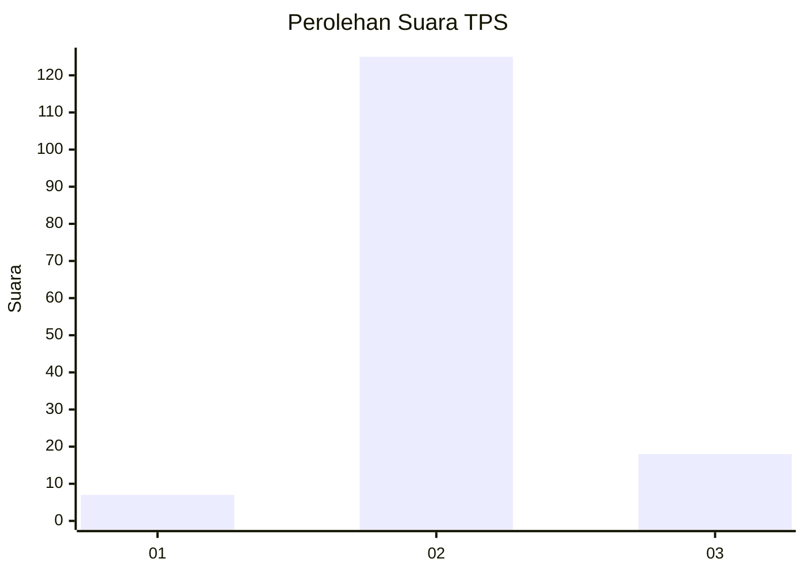
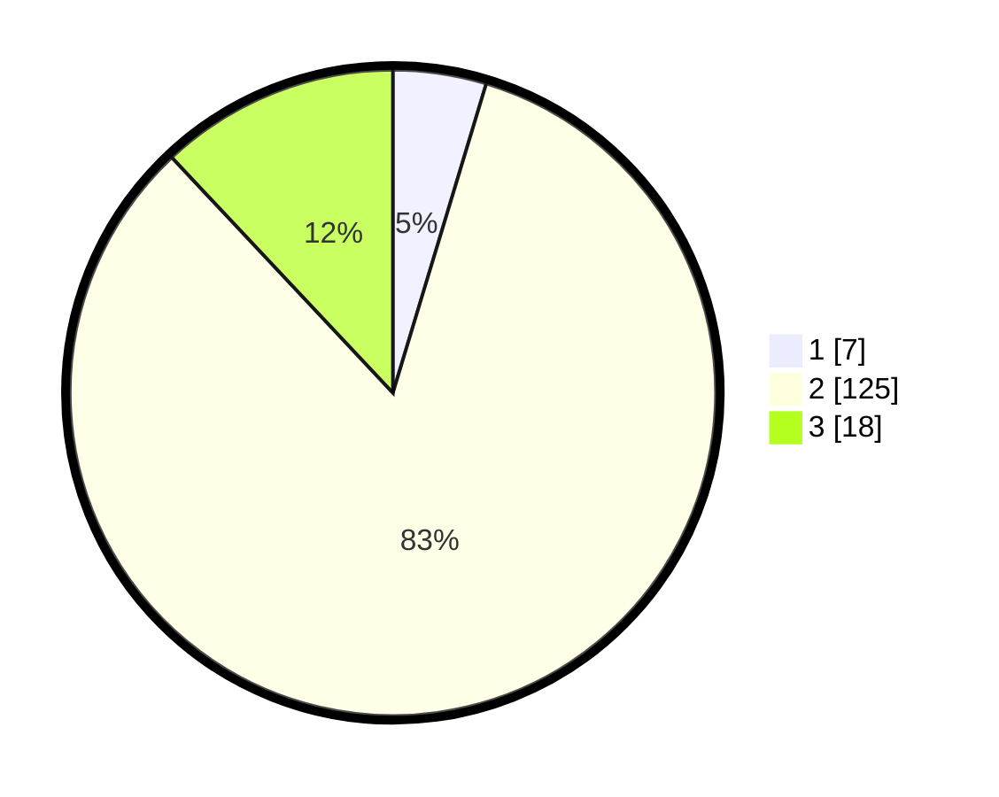

# Hasil

## Grafik

## Tabel

| No. | Nama Paslon    | Suara | Suara (raw) | Persentase |
|:--- |:-------------- | -----:| -----------:| ----------:|
| 1   | ANIES MUHAIMIN | 7     | [7][p-1]    | 4,67       |
| 2   | PRABOWO GIBRAN | 125   | [125][p-2]  | 83,33      |
| 3   | GANJAR MAHFUD  | 18    | [18][p-3]   | 12,00      |

[p-1]: https://github.com/gigit-pemilu/pemilu-2024/blob/main/pilpres/hitung-suara/sub/35-jawa-timur/sub/08-lumajang/sub/03-candipuro/sub/2009-kloposawit/sub/006-tps/sub/paslon-1.txt
[p-2]: https://github.com/gigit-pemilu/pemilu-2024/blob/main/pilpres/hitung-suara/sub/35-jawa-timur/sub/08-lumajang/sub/03-candipuro/sub/2009-kloposawit/sub/006-tps/sub/paslon-2.txt
[p-3]: https://github.com/gigit-pemilu/pemilu-2024/blob/main/pilpres/hitung-suara/sub/35-jawa-timur/sub/08-lumajang/sub/03-candipuro/sub/2009-kloposawit/sub/006-tps/sub/paslon-3.txt

## Foto C Plano

https://sirekap-obj-formc.kpu.go.id/e510/pemilu/ppwp/35/08/03/20/09/3508032009006-20240215-013420--83f36eb4-4709-479e-be1a-ac50a5fa09fb.jpg

https://sirekap-obj-formc.kpu.go.id/e510/pemilu/ppwp/35/08/03/20/09/3508032009006-20240215-013456--0a30d919-ef55-446d-b6b2-9f82f1e29f2b.jpg

https://sirekap-obj-formc.kpu.go.id/e510/pemilu/ppwp/35/08/03/20/09/3508032009006-20240215-013526--f193492d-6a95-486f-a806-d15cd734e405.jpg

## Metadata

| Key        | Value               |
| ---------- | ------------------- |
| Time Stamp | 2024-02-15 17:00:25 |

