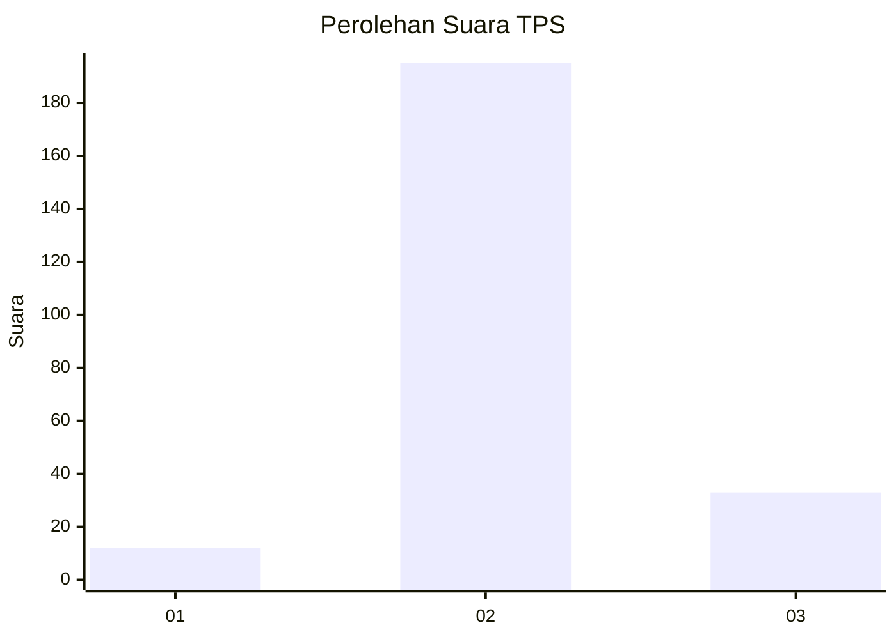
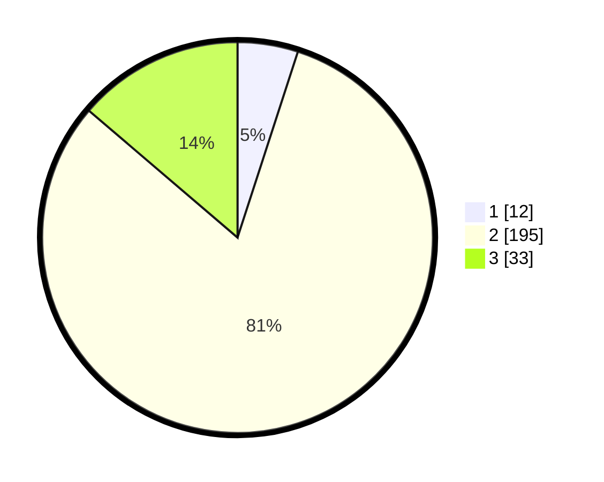

# Hasil

## Grafik

## Tabel

| No. | Nama Paslon    | Suara | Suara (raw) | Persentase |
|:--- |:-------------- | -----:| -----------:| ----------:|
| 1   | ANIES MUHAIMIN | 12    | [12][p-1]   | 5,00       |
| 2   | PRABOWO GIBRAN | 195   | [195][p-2]  | 81,25      |
| 3   | GANJAR MAHFUD  | 33    | [33][p-3]   | 13,75      |

[p-1]: https://github.com/gigit-pemilu/pemilu-2024/blob/main/pilpres/hitung-suara/sub/35-jawa-timur/sub/08-lumajang/sub/03-candipuro/sub/2010-tumpeng/sub/007-tps/sub/paslon-1.txt
[p-2]: https://github.com/gigit-pemilu/pemilu-2024/blob/main/pilpres/hitung-suara/sub/35-jawa-timur/sub/08-lumajang/sub/03-candipuro/sub/2010-tumpeng/sub/007-tps/sub/paslon-2.txt
[p-3]: https://github.com/gigit-pemilu/pemilu-2024/blob/main/pilpres/hitung-suara/sub/35-jawa-timur/sub/08-lumajang/sub/03-candipuro/sub/2010-tumpeng/sub/007-tps/sub/paslon-3.txt

## Foto C Plano

https://sirekap-obj-formc.kpu.go.id/5d07/pemilu/ppwp/35/08/03/20/10/3508032010007-20240214-235844--4446cef1-e549-45f8-8f0f-d9e5641bb1ed.jpg

https://sirekap-obj-formc.kpu.go.id/5d07/pemilu/ppwp/35/08/03/20/10/3508032010007-20240215-000034--99ef36bd-323d-40a5-8835-e6fcc2a1ac93.jpg

https://sirekap-obj-formc.kpu.go.id/5d07/pemilu/ppwp/35/08/03/20/10/3508032010007-20240215-000257--ac4bba74-3379-4e1f-91e4-f45986f0bced.jpg

## Metadata

| Key        | Value               |
| ---------- | ------------------- |
| Time Stamp | 2024-02-15 17:00:25 |

