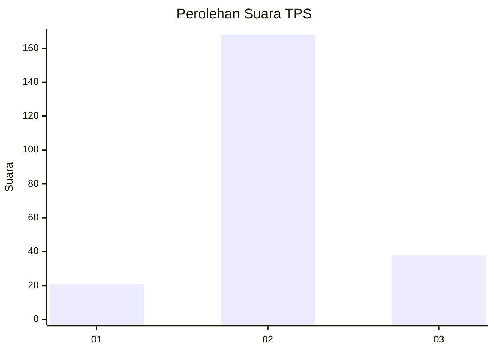
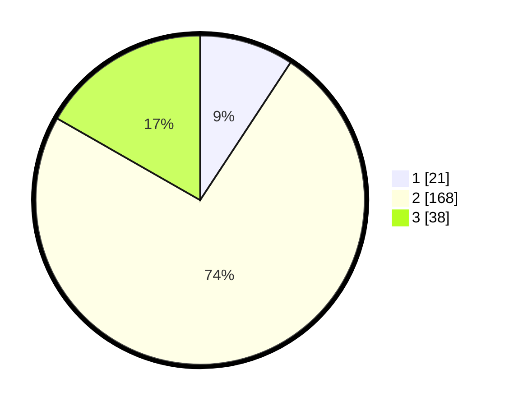

# Hasil

## Grafik

## Tabel

| No. | Nama Paslon    | Suara | Suara (raw) | Persentase |
|:--- |:-------------- | -----:| -----------:| ----------:|
| 1   | ANIES MUHAIMIN | 21    | [21][p-1]   | 9,25       |
| 2   | PRABOWO GIBRAN | 168   | [168][p-2]  | 74,01      |
| 3   | GANJAR MAHFUD  | 38    | [38][p-3]   | 16,74      |

[p-1]: https://github.com/gigit-pemilu/pemilu-2024/blob/main/pilpres/hitung-suara/sub/35-jawa-timur/sub/08-lumajang/sub/04-pasirian/sub/2001-gondoruso/sub/002-tps/sub/paslon-1.txt
[p-2]: https://github.com/gigit-pemilu/pemilu-2024/blob/main/pilpres/hitung-suara/sub/35-jawa-timur/sub/08-lumajang/sub/04-pasirian/sub/2001-gondoruso/sub/002-tps/sub/paslon-2.txt
[p-3]: https://github.com/gigit-pemilu/pemilu-2024/blob/main/pilpres/hitung-suara/sub/35-jawa-timur/sub/08-lumajang/sub/04-pasirian/sub/2001-gondoruso/sub/002-tps/sub/paslon-3.txt

## Foto C Plano

https://sirekap-obj-formc.kpu.go.id/4c0c/pemilu/ppwp/35/08/04/20/01/3508042001002-20240226-123954--91e3bdec-a5ce-4528-ad39-2c6b8152c869.jpg

https://sirekap-obj-formc.kpu.go.id/4c0c/pemilu/ppwp/35/08/04/20/01/3508042001002-20240226-124005--2d287895-e82a-4f42-9029-917084b89c71.jpg

https://sirekap-obj-formc.kpu.go.id/4c0c/pemilu/ppwp/35/08/04/20/01/3508042001002-20240226-124015--e013da0d-0c06-48f2-8022-ec7aed02e207.jpg

## Metadata

| Key        | Value               |
| ---------- | ------------------- |
| Time Stamp | 2024-02-26 13:00:00 |

