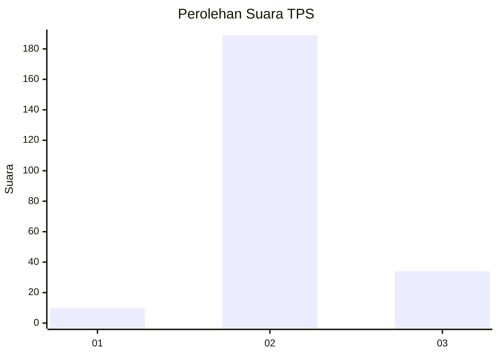

# Hasil

## Grafik

## Tabel

| No. | Nama Paslon    | Suara | Suara (raw) | Persentase |
|:--- |:-------------- | -----:| -----------:| ----------:|
| 1   | ANIES MUHAIMIN | 10    | [10][p-1]   | 4,29       |
| 2   | PRABOWO GIBRAN | 189   | [189][p-2]  | 81,12      |
| 3   | GANJAR MAHFUD  | 34    | [34][p-3]   | 14,59      |

[p-1]: https://github.com/gigit-pemilu/pemilu-2024/blob/main/pilpres/hitung-suara/sub/35-jawa-timur/sub/08-lumajang/sub/04-pasirian/sub/2001-gondoruso/sub/005-tps/sub/paslon-1.txt
[p-2]: https://github.com/gigit-pemilu/pemilu-2024/blob/main/pilpres/hitung-suara/sub/35-jawa-timur/sub/08-lumajang/sub/04-pasirian/sub/2001-gondoruso/sub/005-tps/sub/paslon-2.txt
[p-3]: https://github.com/gigit-pemilu/pemilu-2024/blob/main/pilpres/hitung-suara/sub/35-jawa-timur/sub/08-lumajang/sub/04-pasirian/sub/2001-gondoruso/sub/005-tps/sub/paslon-3.txt

## Foto C Plano

https://sirekap-obj-formc.kpu.go.id/2b3b/pemilu/ppwp/35/08/04/20/01/3508042001005-20240215-041215--e08cbc20-3886-41a0-9876-f60a3a06ca89.jpg

https://sirekap-obj-formc.kpu.go.id/2b3b/pemilu/ppwp/35/08/04/20/01/3508042001005-20240215-041327--2c7ff564-fd15-4e7a-8fbd-6ca8819d4bbf.jpg

https://sirekap-obj-formc.kpu.go.id/2b3b/pemilu/ppwp/35/08/04/20/01/3508042001005-20240215-041504--311ea5a4-5923-44ed-a0d5-f20e71ad8473.jpg

## Metadata

| Key        | Value               |
| ---------- | ------------------- |
| Time Stamp | 2024-02-16 08:30:27 |

