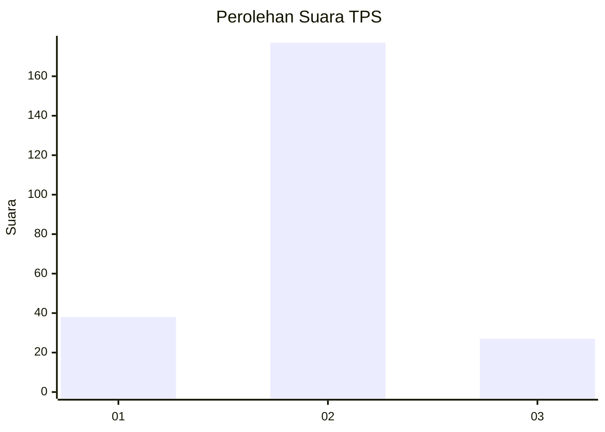
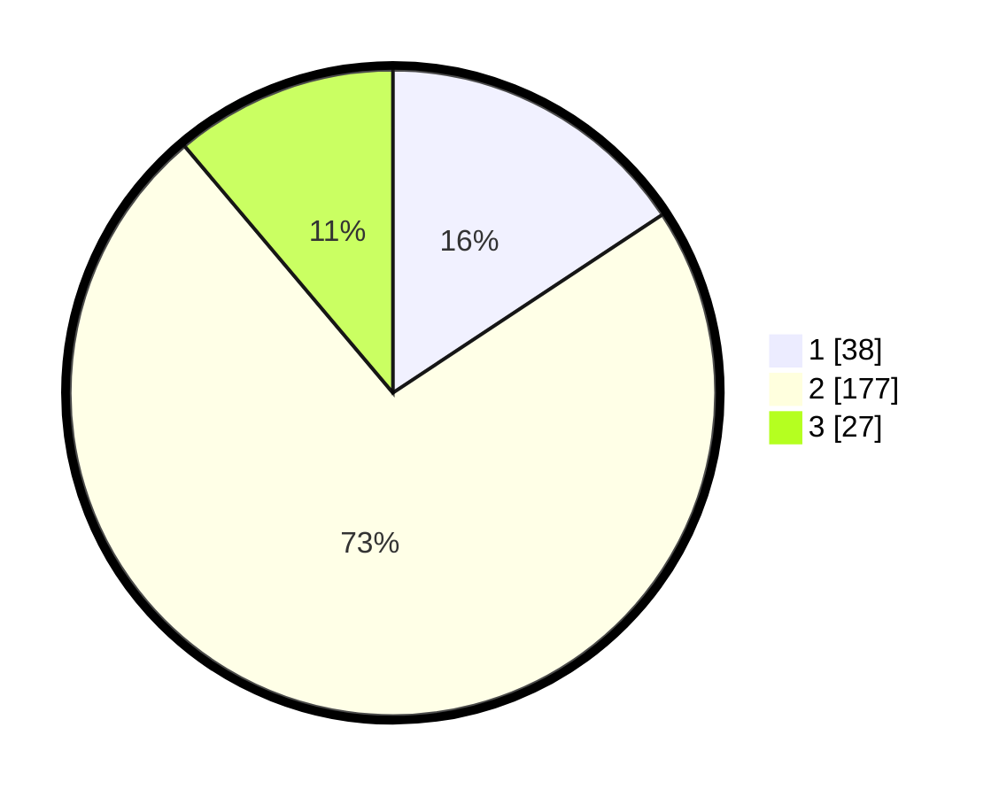

# Hasil

## Grafik

## Tabel

| No. | Nama Paslon    | Suara | Suara (raw) | Persentase |
|:--- |:-------------- | -----:| -----------:| ----------:|
| 1   | ANIES MUHAIMIN | 38    | [38][p-1]   | 15,70      |
| 2   | PRABOWO GIBRAN | 177   | [177][p-2]  | 73,14      |
| 3   | GANJAR MAHFUD  | 27    | [27][p-3]   | 11,16      |

[p-1]: https://github.com/gigit-pemilu/pemilu-2024/blob/main/pilpres/hitung-suara/sub/35-jawa-timur/sub/08-lumajang/sub/04-pasirian/sub/2002-kalibendo/sub/017-tps/sub/paslon-1.txt
[p-2]: https://github.com/gigit-pemilu/pemilu-2024/blob/main/pilpres/hitung-suara/sub/35-jawa-timur/sub/08-lumajang/sub/04-pasirian/sub/2002-kalibendo/sub/017-tps/sub/paslon-2.txt
[p-3]: https://github.com/gigit-pemilu/pemilu-2024/blob/main/pilpres/hitung-suara/sub/35-jawa-timur/sub/08-lumajang/sub/04-pasirian/sub/2002-kalibendo/sub/017-tps/sub/paslon-3.txt

## Foto C Plano

https://sirekap-obj-formc.kpu.go.id/3d1e/pemilu/ppwp/35/08/04/20/02/3508042002017-20240214-203216--c335c1de-7b30-4f27-837f-3976cbac8502.jpg

https://sirekap-obj-formc.kpu.go.id/3d1e/pemilu/ppwp/35/08/04/20/02/3508042002017-20240214-202601--5276d5b9-cedc-478b-a205-67708192d1df.jpg

https://sirekap-obj-formc.kpu.go.id/3d1e/pemilu/ppwp/35/08/04/20/02/3508042002017-20240214-201211--0b28c185-c13f-4dad-9741-b748129fd78f.jpg

## Metadata

| Key        | Value               |
| ---------- | ------------------- |
| Time Stamp | 2024-02-15 12:00:28 |

