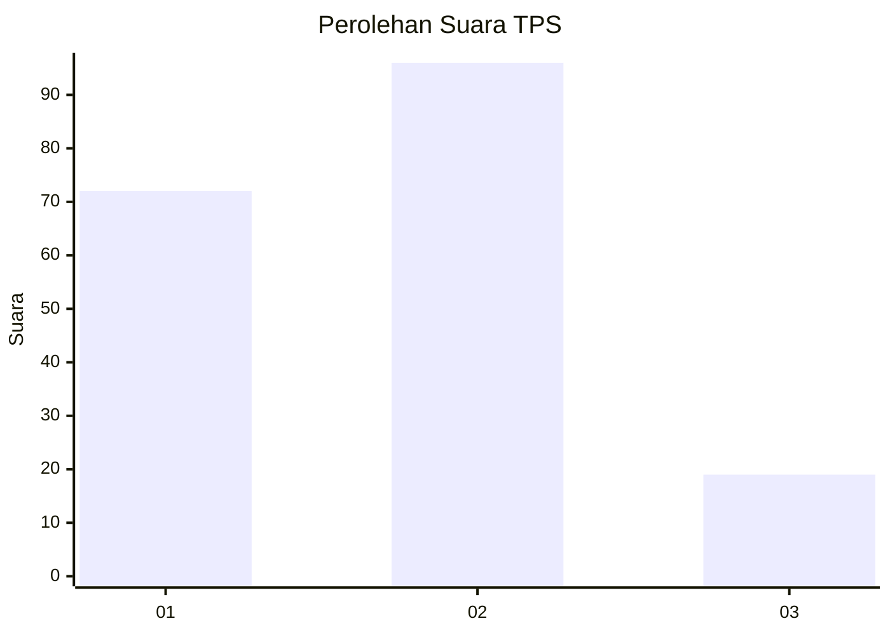
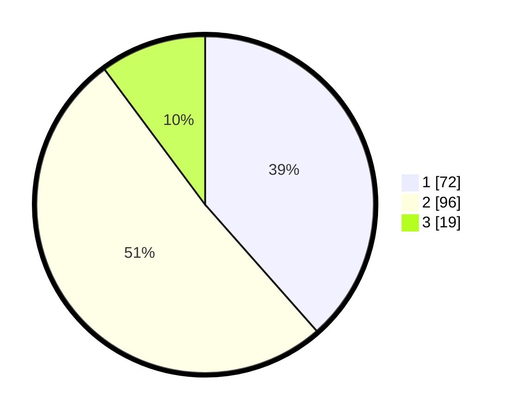

# Hasil

## Grafik

## Tabel

| No. | Nama Paslon    | Suara | Suara (raw) | Persentase |
|:--- |:-------------- | -----:| -----------:| ----------:|
| 1   | ANIES MUHAIMIN | 72    | [72][p-1]   | 38,50      |
| 2   | PRABOWO GIBRAN | 96    | [96][p-2]   | 51,34      |
| 3   | GANJAR MAHFUD  | 19    | [19][p-3]   | 10,16      |

[p-1]: https://github.com/gigit-pemilu/pemilu-2024/blob/main/pilpres/hitung-suara/sub/35-jawa-timur/sub/08-lumajang/sub/04-pasirian/sub/2003-bades/sub/018-tps/sub/paslon-1.txt
[p-2]: https://github.com/gigit-pemilu/pemilu-2024/blob/main/pilpres/hitung-suara/sub/35-jawa-timur/sub/08-lumajang/sub/04-pasirian/sub/2003-bades/sub/018-tps/sub/paslon-2.txt
[p-3]: https://github.com/gigit-pemilu/pemilu-2024/blob/main/pilpres/hitung-suara/sub/35-jawa-timur/sub/08-lumajang/sub/04-pasirian/sub/2003-bades/sub/018-tps/sub/paslon-3.txt

## Foto C Plano

https://sirekap-obj-formc.kpu.go.id/5a3c/pemilu/ppwp/35/08/04/20/03/3508042003018-20240226-131154--2041abed-8668-4030-b361-e3e7e9af91a2.jpg

https://sirekap-obj-formc.kpu.go.id/5a3c/pemilu/ppwp/35/08/04/20/03/3508042003018-20240226-131204--ad49a2b9-93ea-414d-8d96-8fbdc18b94f5.jpg

https://sirekap-obj-formc.kpu.go.id/5a3c/pemilu/ppwp/35/08/04/20/03/3508042003018-20240226-131213--bada5181-874e-47a1-80f7-56a7899aec7e.jpg

## Metadata

| Key        | Value               |
| ---------- | ------------------- |
| Time Stamp | 2024-02-26 14:00:00 |

