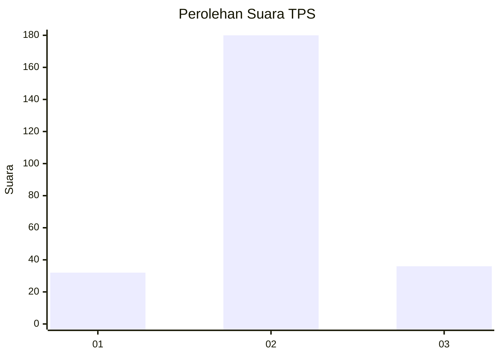
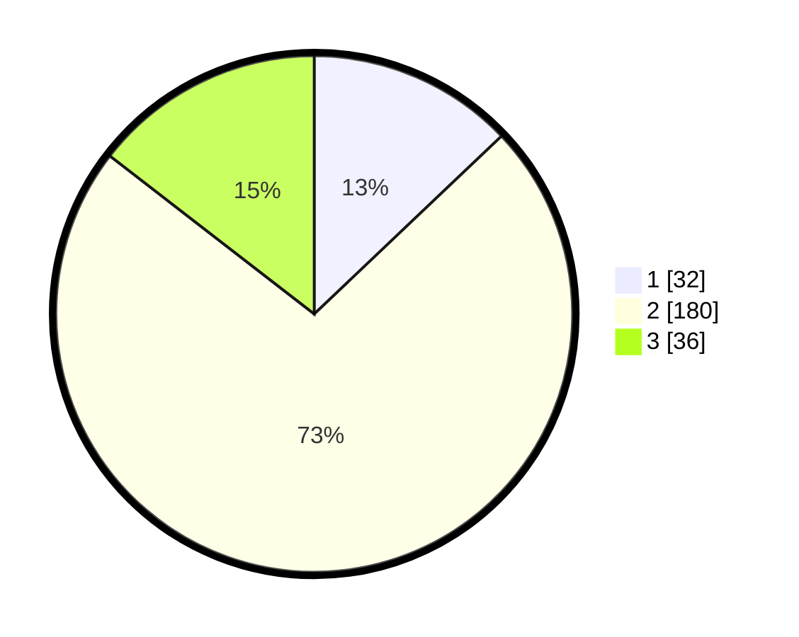

# Hasil

## Grafik

## Tabel

| No. | Nama Paslon    | Suara | Suara (raw) | Persentase |
|:--- |:-------------- | -----:| -----------:| ----------:|
| 1   | ANIES MUHAIMIN | 32    | [32][p-1]   | 12,90      |
| 2   | PRABOWO GIBRAN | 180   | [180][p-2]  | 72,58      |
| 3   | GANJAR MAHFUD  | 36    | [36][p-3]   | 14,52      |

[p-1]: https://github.com/gigit-pemilu/pemilu-2024-35-jawa-timur/blob/main/pilpres/hitung-suara/sub/35-jawa-timur/sub/08-lumajang/sub/04-pasirian/sub/2005-selok-awar-awar/sub/006-tps/sub/paslon-1.txt
[p-2]: https://github.com/gigit-pemilu/pemilu-2024-35-jawa-timur/blob/main/pilpres/hitung-suara/sub/35-jawa-timur/sub/08-lumajang/sub/04-pasirian/sub/2005-selok-awar-awar/sub/006-tps/sub/paslon-2.txt
[p-3]: https://github.com/gigit-pemilu/pemilu-2024-35-jawa-timur/blob/main/pilpres/hitung-suara/sub/35-jawa-timur/sub/08-lumajang/sub/04-pasirian/sub/2005-selok-awar-awar/sub/006-tps/sub/paslon-3.txt

## Foto C Plano

https://sirekap-obj-formc.kpu.go.id/f55b/pemilu/ppwp/35/08/04/20/05/3508042005006-20240214-221215--b0c5aaa6-9674-40a7-9b93-f2ad7e97a75c.jpg

https://sirekap-obj-formc.kpu.go.id/f55b/pemilu/ppwp/35/08/04/20/05/3508042005006-20240214-220707--7bdcc450-6711-4607-a3b0-85a0f13dc225.jpg

https://sirekap-obj-formc.kpu.go.id/f55b/pemilu/ppwp/35/08/04/20/05/3508042005006-20240214-220756--03f3b1c8-f65e-41e4-b215-62bed0141d02.jpg

## Metadata

| Key        | Value               |
| ---------- | ------------------- |
| Time Stamp | 2024-02-15 21:30:27 |

