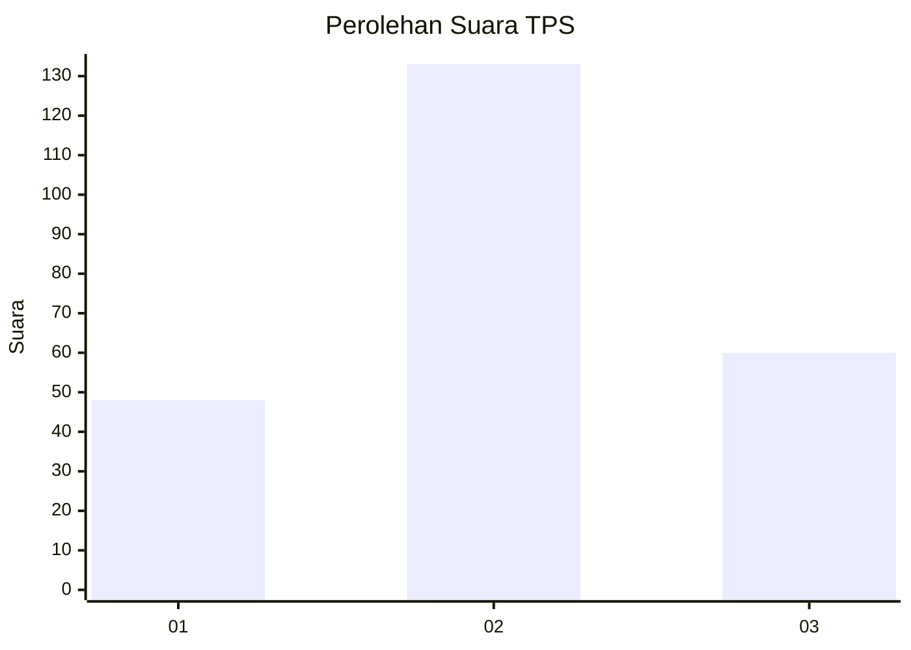
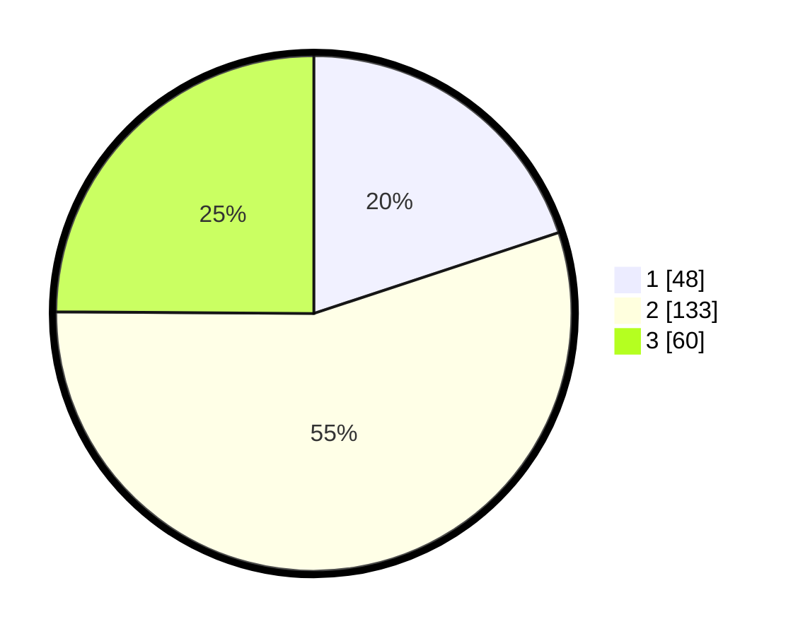

# Hasil

## Grafik

## Tabel

| No. | Nama Paslon    | Suara | Suara (raw) | Persentase |
|:--- |:-------------- | -----:| -----------:| ----------:|
| 1   | ANIES MUHAIMIN | 48    | [48][p-1]   | 19,92      |
| 2   | PRABOWO GIBRAN | 133   | [133][p-2]  | 55,19      |
| 3   | GANJAR MAHFUD  | 60    | [60][p-3]   | 24,90      |

[p-1]: https://github.com/gigit-pemilu/pemilu-2024-35-jawa-timur/blob/main/pilpres/hitung-suara/sub/35-jawa-timur/sub/08-lumajang/sub/04-pasirian/sub/2006-condro/sub/003-tps/sub/paslon-1.txt
[p-2]: https://github.com/gigit-pemilu/pemilu-2024-35-jawa-timur/blob/main/pilpres/hitung-suara/sub/35-jawa-timur/sub/08-lumajang/sub/04-pasirian/sub/2006-condro/sub/003-tps/sub/paslon-2.txt
[p-3]: https://github.com/gigit-pemilu/pemilu-2024-35-jawa-timur/blob/main/pilpres/hitung-suara/sub/35-jawa-timur/sub/08-lumajang/sub/04-pasirian/sub/2006-condro/sub/003-tps/sub/paslon-3.txt

## Foto C Plano

https://sirekap-obj-formc.kpu.go.id/178d/pemilu/ppwp/35/08/04/20/06/3508042006003-20240215-001822--ed7850fa-ecee-42a5-89f0-cba0766a97b4.jpg

https://sirekap-obj-formc.kpu.go.id/178d/pemilu/ppwp/35/08/04/20/06/3508042006003-20240214-222017--57a0efd5-8be1-4cd6-9bb5-26857b5de723.jpg

https://sirekap-obj-formc.kpu.go.id/178d/pemilu/ppwp/35/08/04/20/06/3508042006003-20240215-002843--cd2cdf21-4f3e-4c71-bd1f-e469aef633c1.jpg

## Metadata

| Key        | Value               |
| ---------- | ------------------- |
| Time Stamp | 2024-02-15 21:30:27 |

