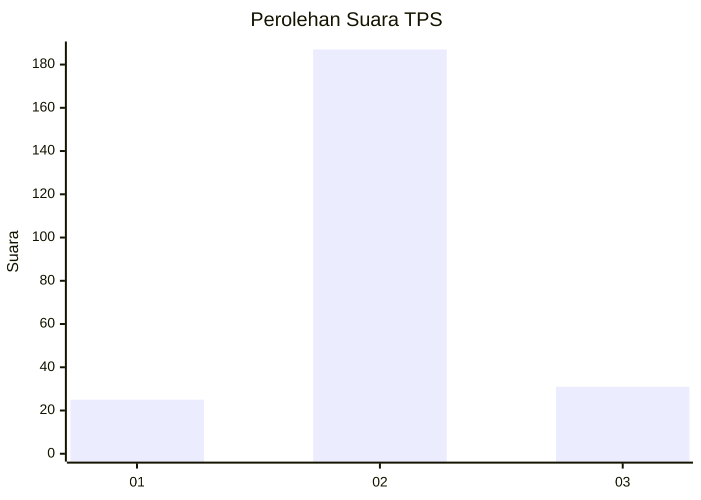
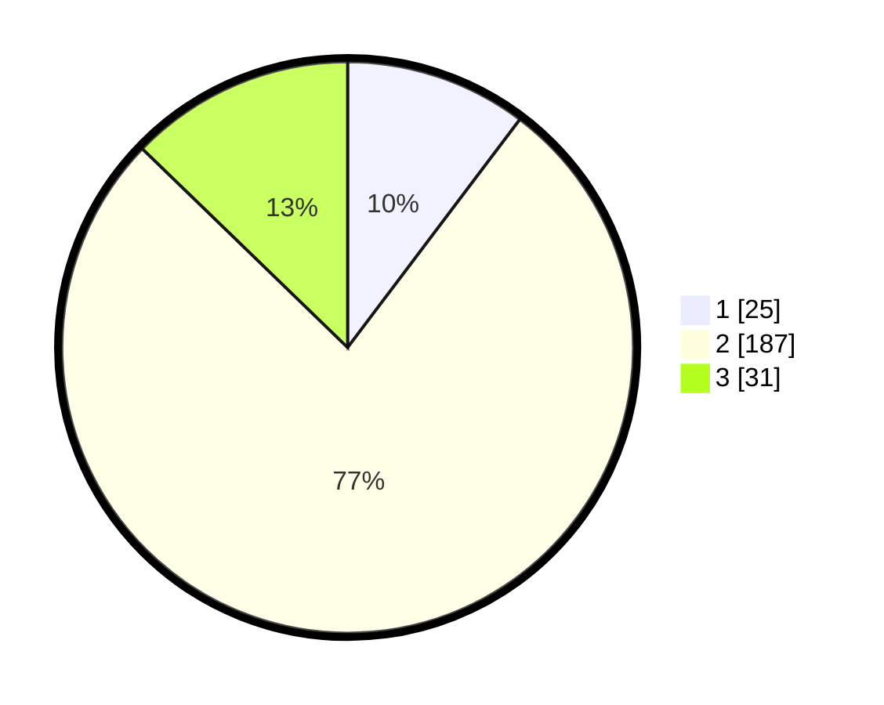

# Hasil

## Grafik

## Tabel

| No. | Nama Paslon    | Suara | Suara (raw) | Persentase |
|:--- |:-------------- | -----:| -----------:| ----------:|
| 1   | ANIES MUHAIMIN | 25    | [25][p-1]   | 10,29      |
| 2   | PRABOWO GIBRAN | 187   | [187][p-2]  | 76,95      |
| 3   | GANJAR MAHFUD  | 31    | [31][p-3]   | 12,76      |

[p-1]: https://github.com/gigit-pemilu/pemilu-2024-35-jawa-timur/blob/main/pilpres/hitung-suara/sub/35-jawa-timur/sub/08-lumajang/sub/04-pasirian/sub/2006-condro/sub/004-tps/sub/paslon-1.txt
[p-2]: https://github.com/gigit-pemilu/pemilu-2024-35-jawa-timur/blob/main/pilpres/hitung-suara/sub/35-jawa-timur/sub/08-lumajang/sub/04-pasirian/sub/2006-condro/sub/004-tps/sub/paslon-2.txt
[p-3]: https://github.com/gigit-pemilu/pemilu-2024-35-jawa-timur/blob/main/pilpres/hitung-suara/sub/35-jawa-timur/sub/08-lumajang/sub/04-pasirian/sub/2006-condro/sub/004-tps/sub/paslon-3.txt

## Foto C Plano

https://sirekap-obj-formc.kpu.go.id/96ff/pemilu/ppwp/35/08/04/20/06/3508042006004-20240215-012309--807c2dcc-fd09-492d-9015-da4d2dbe6585.jpg

https://sirekap-obj-formc.kpu.go.id/96ff/pemilu/ppwp/35/08/04/20/06/3508042006004-20240215-012413--b29f0d3b-6c7e-41d6-a59f-a2c268b2bd66.jpg

https://sirekap-obj-formc.kpu.go.id/96ff/pemilu/ppwp/35/08/04/20/06/3508042006004-20240215-012525--4e6e6599-2728-4202-b04b-9f89543cd3ad.jpg

## Metadata

| Key        | Value               |
| ---------- | ------------------- |
| Time Stamp | 2024-02-15 21:30:27 |

