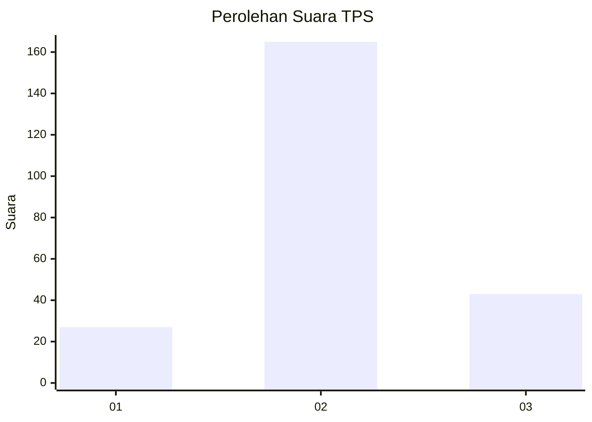
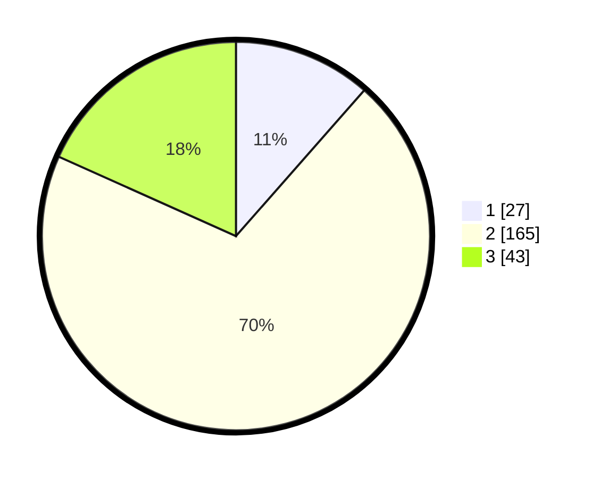

# Hasil

## Grafik

## Tabel

| No. | Nama Paslon    | Suara | Suara (raw) | Persentase |
|:--- |:-------------- | -----:| -----------:| ----------:|
| 1   | ANIES MUHAIMIN | 27    | [27][p-1]   | 11,49      |
| 2   | PRABOWO GIBRAN | 165   | [165][p-2]  | 70,21      |
| 3   | GANJAR MAHFUD  | 43    | [43][p-3]   | 18,30      |

[p-1]: https://github.com/gigit-pemilu/pemilu-2024/blob/main/pilpres/hitung-suara/sub/35-jawa-timur/sub/08-lumajang/sub/04-pasirian/sub/2006-condro/sub/011-tps/sub/paslon-1.txt
[p-2]: https://github.com/gigit-pemilu/pemilu-2024/blob/main/pilpres/hitung-suara/sub/35-jawa-timur/sub/08-lumajang/sub/04-pasirian/sub/2006-condro/sub/011-tps/sub/paslon-2.txt
[p-3]: https://github.com/gigit-pemilu/pemilu-2024/blob/main/pilpres/hitung-suara/sub/35-jawa-timur/sub/08-lumajang/sub/04-pasirian/sub/2006-condro/sub/011-tps/sub/paslon-3.txt

## Foto C Plano

https://sirekap-obj-formc.kpu.go.id/1416/pemilu/ppwp/35/08/04/20/06/3508042006011-20240214-212633--5bfc8b36-79af-4a8e-8aee-b6c044fa8cc1.jpg

https://sirekap-obj-formc.kpu.go.id/1416/pemilu/ppwp/35/08/04/20/06/3508042006011-20240222-132324--c4baa207-7580-4260-9e23-06fa7535f4a1.jpg

https://sirekap-obj-formc.kpu.go.id/1416/pemilu/ppwp/35/08/04/20/06/3508042006011-20240215-012003--2d7bbd55-ef2c-49ea-b586-6594057dbb31.jpg

## Metadata

| Key        | Value               |
| ---------- | ------------------- |
| Time Stamp | 2024-02-22 14:00:00 |

