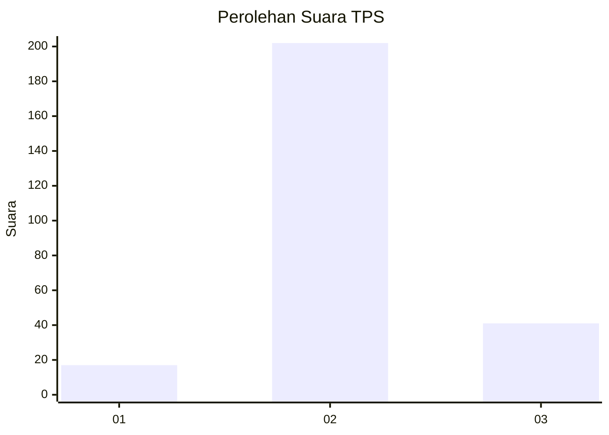
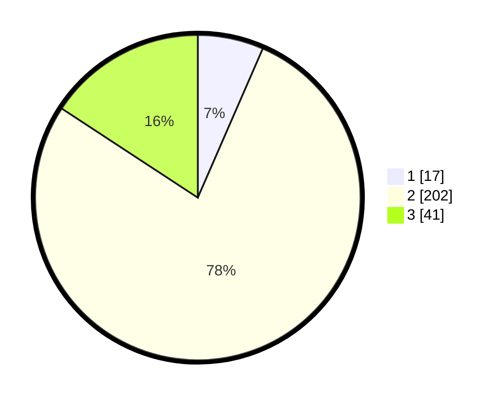

# Hasil

## Grafik

## Tabel

| No. | Nama Paslon    | Suara | Suara (raw) | Persentase |
|:--- |:-------------- | -----:| -----------:| ----------:|
| 1   | ANIES MUHAIMIN | 17    | [17][p-1]   | 6,54       |
| 2   | PRABOWO GIBRAN | 202   | [202][p-2]  | 77,69      |
| 3   | GANJAR MAHFUD  | 41    | [41][p-3]   | 15,77      |

[p-1]: https://github.com/gigit-pemilu/pemilu-2024-35-jawa-timur/blob/main/pilpres/hitung-suara/sub/35-jawa-timur/sub/08-lumajang/sub/04-pasirian/sub/2008-pasirian/sub/041-tps/sub/paslon-1.txt
[p-2]: https://github.com/gigit-pemilu/pemilu-2024-35-jawa-timur/blob/main/pilpres/hitung-suara/sub/35-jawa-timur/sub/08-lumajang/sub/04-pasirian/sub/2008-pasirian/sub/041-tps/sub/paslon-2.txt
[p-3]: https://github.com/gigit-pemilu/pemilu-2024-35-jawa-timur/blob/main/pilpres/hitung-suara/sub/35-jawa-timur/sub/08-lumajang/sub/04-pasirian/sub/2008-pasirian/sub/041-tps/sub/paslon-3.txt

## Foto C Plano

https://sirekap-obj-formc.kpu.go.id/8299/pemilu/ppwp/35/08/04/20/08/3508042008041-20240223-093404--4b2ceb40-c89d-4c5a-88bf-50acbe77ccd9.jpg

https://sirekap-obj-formc.kpu.go.id/8299/pemilu/ppwp/35/08/04/20/08/3508042008041-20240223-093437--a36b8e2c-62f4-4982-9215-1e5f13bbd4cf.jpg

https://sirekap-obj-formc.kpu.go.id/8299/pemilu/ppwp/35/08/04/20/08/3508042008041-20240223-093545--af2360fc-8cd2-45ff-bba1-b62319272daa.jpg

## Metadata

| Key        | Value               |
| ---------- | ------------------- |
| Time Stamp | 2024-02-24 22:31:28 |

