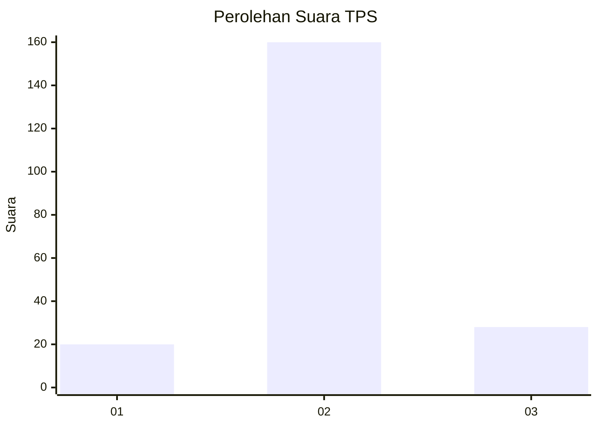
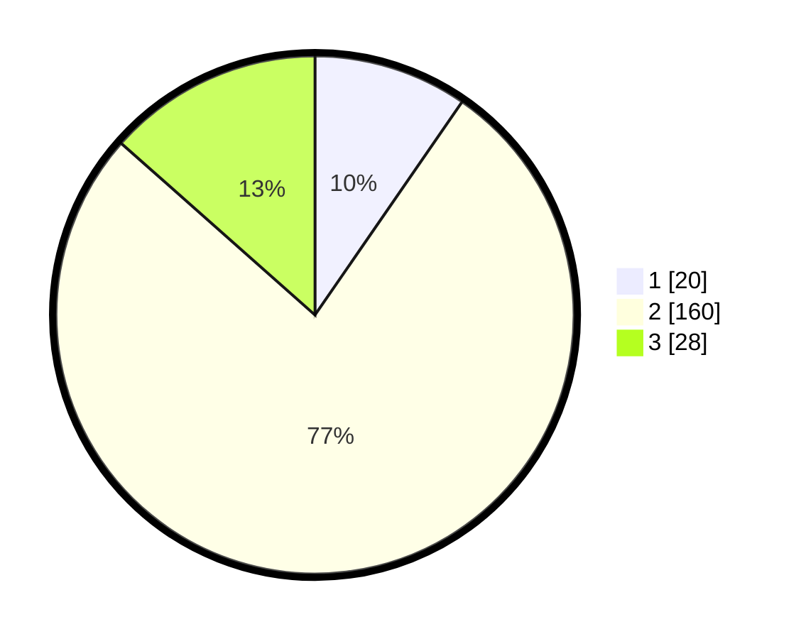

# Hasil

## Grafik

## Tabel

| No. | Nama Paslon    | Suara | Suara (raw) | Persentase |
|:--- |:-------------- | -----:| -----------:| ----------:|
| 1   | ANIES MUHAIMIN | 20    | [20][p-1]   | 9,62       |
| 2   | PRABOWO GIBRAN | 160   | [160][p-2]  | 76,92      |
| 3   | GANJAR MAHFUD  | 28    | [28][p-3]   | 13,46      |

[p-1]: https://github.com/gigit-pemilu/pemilu-2024/blob/main/pilpres/hitung-suara/sub/35-jawa-timur/sub/08-lumajang/sub/04-pasirian/sub/2009-sememu/sub/008-tps/sub/paslon-1.txt
[p-2]: https://github.com/gigit-pemilu/pemilu-2024/blob/main/pilpres/hitung-suara/sub/35-jawa-timur/sub/08-lumajang/sub/04-pasirian/sub/2009-sememu/sub/008-tps/sub/paslon-2.txt
[p-3]: https://github.com/gigit-pemilu/pemilu-2024/blob/main/pilpres/hitung-suara/sub/35-jawa-timur/sub/08-lumajang/sub/04-pasirian/sub/2009-sememu/sub/008-tps/sub/paslon-3.txt

## Foto C Plano

https://sirekap-obj-formc.kpu.go.id/7091/pemilu/ppwp/35/08/04/20/09/3508042009008-20240215-034401--90f58e3e-2044-4271-b9a0-52b6aebdcf27.jpg

https://sirekap-obj-formc.kpu.go.id/7091/pemilu/ppwp/35/08/04/20/09/3508042009008-20240215-034510--d3d45da0-d29a-4ff4-8090-b9cde205351a.jpg

https://sirekap-obj-formc.kpu.go.id/7091/pemilu/ppwp/35/08/04/20/09/3508042009008-20240215-034604--0cb3533e-fdbc-4cca-a03f-80f7bb3a3f24.jpg

## Metadata

| Key        | Value               |
| ---------- | ------------------- |
| Time Stamp | 2024-02-15 22:00:27 |

