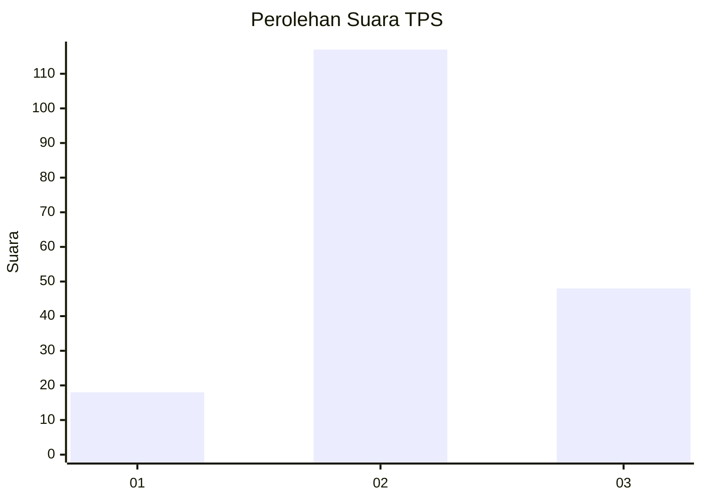
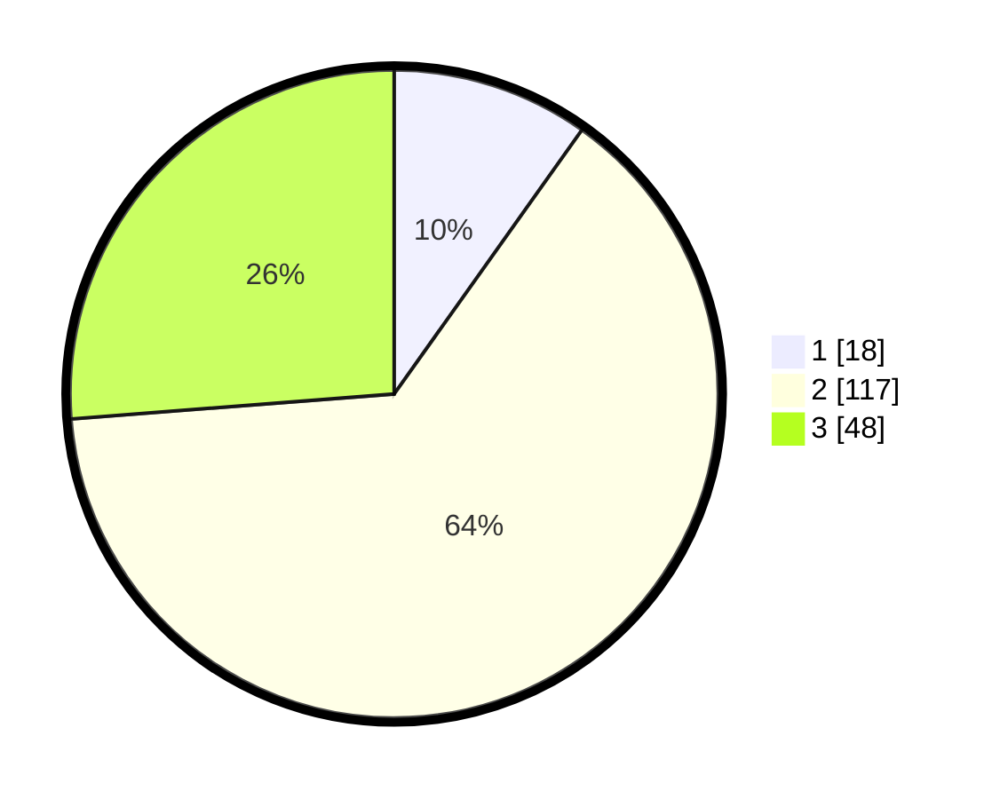

# Hasil

## Grafik

## Tabel

| No. | Nama Paslon    | Suara | Suara (raw) | Persentase |
|:--- |:-------------- | -----:| -----------:| ----------:|
| 1   | ANIES MUHAIMIN | 18    | [18][p-1]   | 9,84       |
| 2   | PRABOWO GIBRAN | 117   | [117][p-2]  | 63,93      |
| 3   | GANJAR MAHFUD  | 48    | [48][p-3]   | 26,23      |

[p-1]: https://github.com/gigit-pemilu/pemilu-2024/blob/main/pilpres/hitung-suara/sub/35-jawa-timur/sub/08-lumajang/sub/04-pasirian/sub/2009-sememu/sub/011-tps/sub/paslon-1.txt
[p-2]: https://github.com/gigit-pemilu/pemilu-2024/blob/main/pilpres/hitung-suara/sub/35-jawa-timur/sub/08-lumajang/sub/04-pasirian/sub/2009-sememu/sub/011-tps/sub/paslon-2.txt
[p-3]: https://github.com/gigit-pemilu/pemilu-2024/blob/main/pilpres/hitung-suara/sub/35-jawa-timur/sub/08-lumajang/sub/04-pasirian/sub/2009-sememu/sub/011-tps/sub/paslon-3.txt

## Foto C Plano

https://sirekap-obj-formc.kpu.go.id/d3f6/pemilu/ppwp/35/08/04/20/09/3508042009011-20240214-230822--a1bc051a-7dc3-4b8e-8f0d-896c6c88ecfa.jpg

https://sirekap-obj-formc.kpu.go.id/d3f6/pemilu/ppwp/35/08/04/20/09/3508042009011-20240214-231109--4cb41a0c-3f38-4ce4-ae8b-c416fd36635b.jpg

https://sirekap-obj-formc.kpu.go.id/d3f6/pemilu/ppwp/35/08/04/20/09/3508042009011-20240214-231149--a6b12b17-470f-4f94-8319-bc273e5d6a78.jpg

## Metadata

| Key        | Value               |
| ---------- | ------------------- |
| Time Stamp | 2024-02-15 22:00:27 |

