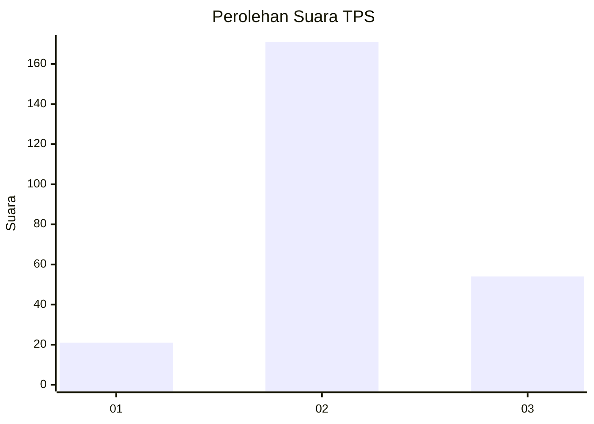
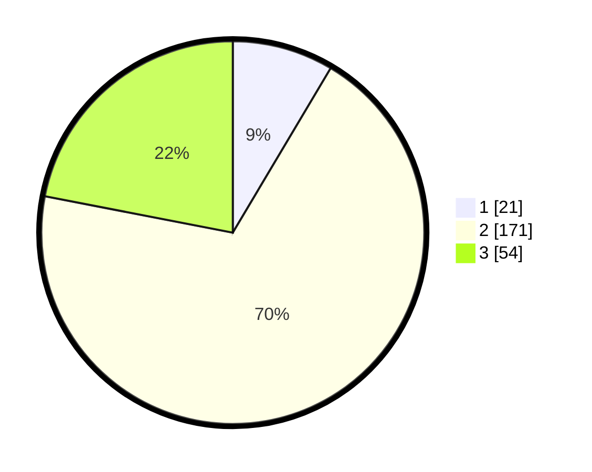

# Hasil

## Grafik

## Tabel

| No. | Nama Paslon    | Suara | Suara (raw) | Persentase |
|:--- |:-------------- | -----:| -----------:| ----------:|
| 1   | ANIES MUHAIMIN | 21    | [21][p-1]   | 8,54       |
| 2   | PRABOWO GIBRAN | 171   | [171][p-2]  | 69,51      |
| 3   | GANJAR MAHFUD  | 54    | [54][p-3]   | 21,95      |

[p-1]: https://github.com/gigit-pemilu/pemilu-2024-35-jawa-timur/blob/main/pilpres/hitung-suara/sub/35-jawa-timur/sub/08-lumajang/sub/04-pasirian/sub/2009-sememu/sub/019-tps/sub/paslon-1.txt
[p-2]: https://github.com/gigit-pemilu/pemilu-2024-35-jawa-timur/blob/main/pilpres/hitung-suara/sub/35-jawa-timur/sub/08-lumajang/sub/04-pasirian/sub/2009-sememu/sub/019-tps/sub/paslon-2.txt
[p-3]: https://github.com/gigit-pemilu/pemilu-2024-35-jawa-timur/blob/main/pilpres/hitung-suara/sub/35-jawa-timur/sub/08-lumajang/sub/04-pasirian/sub/2009-sememu/sub/019-tps/sub/paslon-3.txt

## Foto C Plano

https://sirekap-obj-formc.kpu.go.id/7273/pemilu/ppwp/35/08/04/20/09/3508042009019-20240214-234316--67075a22-35a7-4863-9b25-779e5091ef49.jpg

https://sirekap-obj-formc.kpu.go.id/7273/pemilu/ppwp/35/08/04/20/09/3508042009019-20240214-201846--4669094c-93af-480d-a5d5-675a11cb6412.jpg

https://sirekap-obj-formc.kpu.go.id/7273/pemilu/ppwp/35/08/04/20/09/3508042009019-20240214-202350--52f743dc-65dc-40b5-8ad6-25128c194fd3.jpg

## Metadata

| Key        | Value               |
| ---------- | ------------------- |
| Time Stamp | 2024-02-15 22:00:27 |

