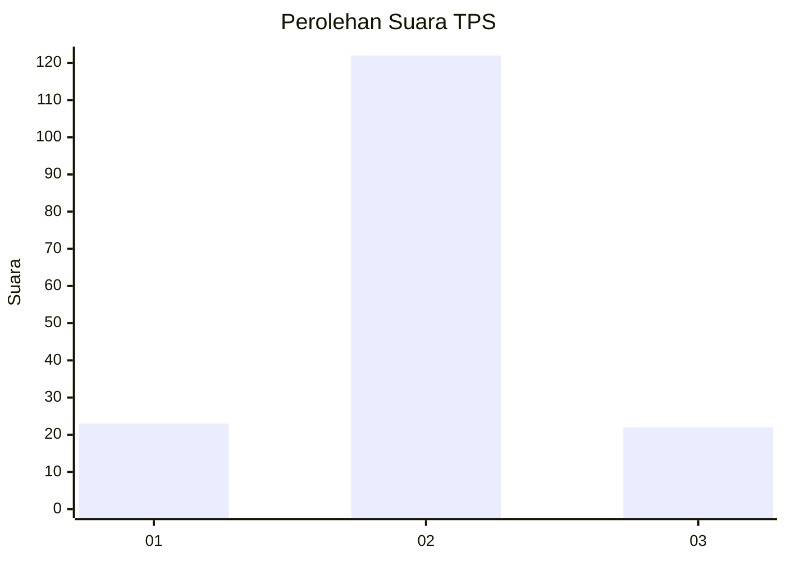
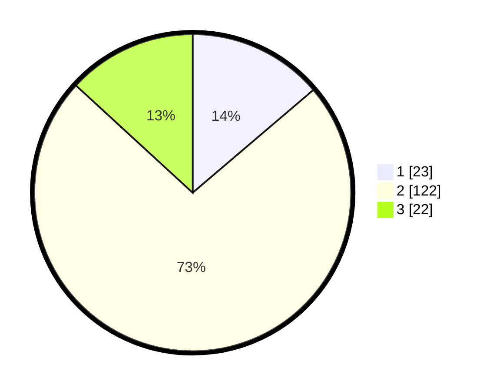

# Hasil

## Grafik

## Tabel

| No. | Nama Paslon    | Suara | Suara (raw) | Persentase |
|:--- |:-------------- | -----:| -----------:| ----------:|
| 1   | ANIES MUHAIMIN | 23    | [23][p-1]   | 13,77      |
| 2   | PRABOWO GIBRAN | 122   | [122][p-2]  | 73,05      |
| 3   | GANJAR MAHFUD  | 22    | [22][p-3]   | 13,17      |

[p-1]: https://github.com/gigit-pemilu/pemilu-2024-35-jawa-timur/blob/main/pilpres/hitung-suara/sub/35-jawa-timur/sub/08-lumajang/sub/04-pasirian/sub/2009-sememu/sub/020-tps/sub/paslon-1.txt
[p-2]: https://github.com/gigit-pemilu/pemilu-2024-35-jawa-timur/blob/main/pilpres/hitung-suara/sub/35-jawa-timur/sub/08-lumajang/sub/04-pasirian/sub/2009-sememu/sub/020-tps/sub/paslon-2.txt
[p-3]: https://github.com/gigit-pemilu/pemilu-2024-35-jawa-timur/blob/main/pilpres/hitung-suara/sub/35-jawa-timur/sub/08-lumajang/sub/04-pasirian/sub/2009-sememu/sub/020-tps/sub/paslon-3.txt

## Foto C Plano

https://sirekap-obj-formc.kpu.go.id/8c41/pemilu/ppwp/35/08/04/20/09/3508042009020-20240214-213649--aa3ee553-2347-4b64-a638-e6cae1ddfdcd.jpg

https://sirekap-obj-formc.kpu.go.id/8c41/pemilu/ppwp/35/08/04/20/09/3508042009020-20240214-213806--a0eff035-5fa3-4d4d-9444-2fbc5a0c28ed.jpg

https://sirekap-obj-formc.kpu.go.id/8c41/pemilu/ppwp/35/08/04/20/09/3508042009020-20240214-213911--d2dbeb36-0565-45e8-aae8-bf3de796d4b6.jpg

## Metadata

| Key        | Value               |
| ---------- | ------------------- |
| Time Stamp | 2024-02-15 22:00:27 |

