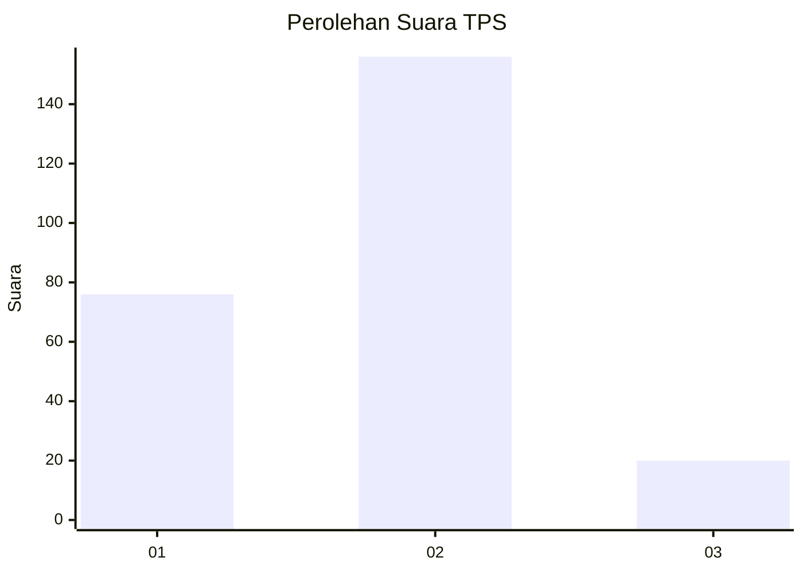
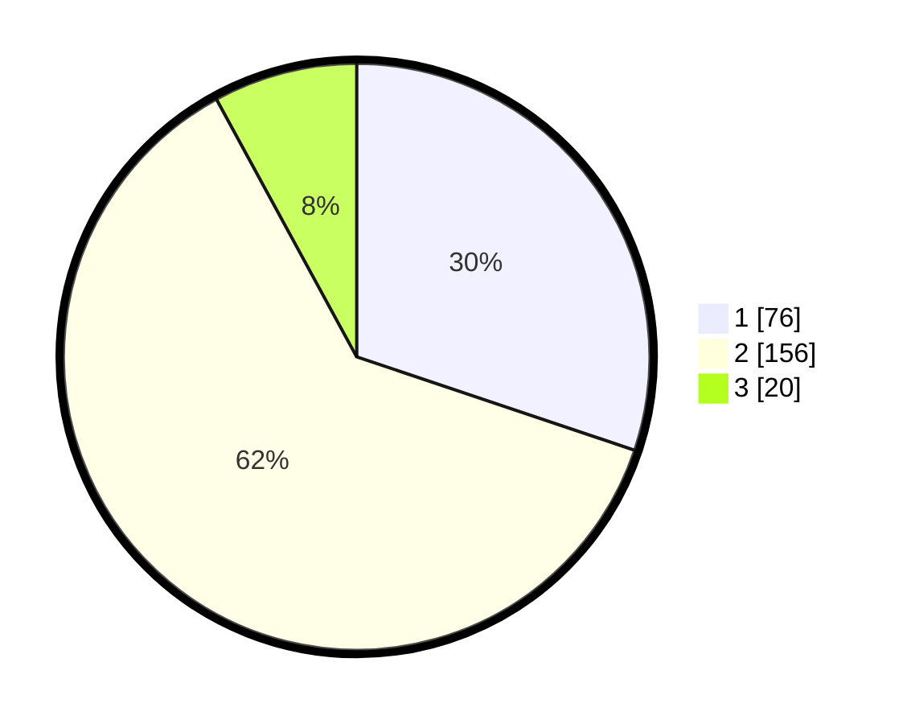

# Hasil

## Grafik

## Tabel

| No. | Nama Paslon    | Suara | Suara (raw) | Persentase |
|:--- |:-------------- | -----:| -----------:| ----------:|
| 1   | ANIES MUHAIMIN | 76    | [76][p-1]   | 30,16      |
| 2   | PRABOWO GIBRAN | 156   | [156][p-2]  | 61,90      |
| 3   | GANJAR MAHFUD  | 20    | [20][p-3]   | 7,94       |

[p-1]: https://github.com/gigit-pemilu/pemilu-2024-35-jawa-timur/blob/main/pilpres/hitung-suara/sub/35-jawa-timur/sub/08-lumajang/sub/04-pasirian/sub/2011-selokanyar/sub/010-tps/sub/paslon-1.txt
[p-2]: https://github.com/gigit-pemilu/pemilu-2024-35-jawa-timur/blob/main/pilpres/hitung-suara/sub/35-jawa-timur/sub/08-lumajang/sub/04-pasirian/sub/2011-selokanyar/sub/010-tps/sub/paslon-2.txt
[p-3]: https://github.com/gigit-pemilu/pemilu-2024-35-jawa-timur/blob/main/pilpres/hitung-suara/sub/35-jawa-timur/sub/08-lumajang/sub/04-pasirian/sub/2011-selokanyar/sub/010-tps/sub/paslon-3.txt

## Foto C Plano

https://sirekap-obj-formc.kpu.go.id/9e90/pemilu/ppwp/35/08/04/20/11/3508042011010-20240214-224407--50f8e8c0-feba-4019-853f-06efaad87d14.jpg

https://sirekap-obj-formc.kpu.go.id/9e90/pemilu/ppwp/35/08/04/20/11/3508042011010-20240214-224153--a082f487-b62e-49c6-bf11-d7eeeca6fe36.jpg

https://sirekap-obj-formc.kpu.go.id/9e90/pemilu/ppwp/35/08/04/20/11/3508042011010-20240214-223952--7e4fedf5-e455-4141-b9d4-45811cc44522.jpg

## Metadata

| Key        | Value               |
| ---------- | ------------------- |
| Time Stamp | 2024-02-15 22:00:27 |

