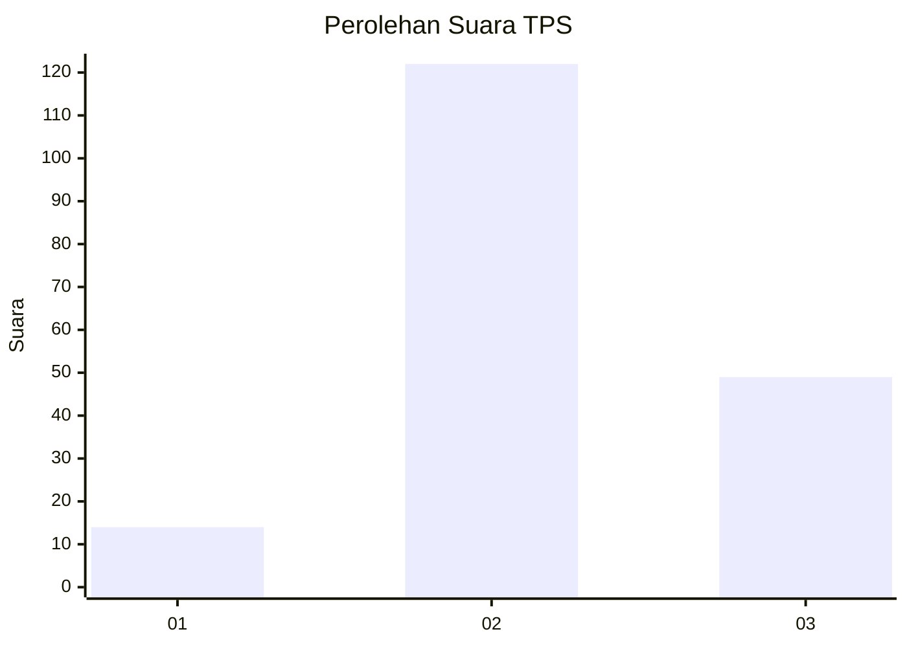

# Hasil

## Grafik

## Tabel

| No. | Nama Paslon    | Suara | Suara (raw) | Persentase |
|:--- |:-------------- | -----:| -----------:| ----------:|
| 1   | ANIES MUHAIMIN | 14    | [14][p-1]   | 7,57       |
| 2   | PRABOWO GIBRAN | 122   | [122][p-2]  | 65,95      |
| 3   | GANJAR MAHFUD  | 49    | [49][p-3]   | 26,49      |

[p-1]: https://github.com/gigit-pemilu/pemilu-2024/blob/main/pilpres/hitung-suara/sub/35-jawa-timur/sub/08-lumajang/sub/05-tempeh/sub/2003-tempeh-kidul/sub/005-tps/sub/paslon-1.txt
[p-2]: https://github.com/gigit-pemilu/pemilu-2024/blob/main/pilpres/hitung-suara/sub/35-jawa-timur/sub/08-lumajang/sub/05-tempeh/sub/2003-tempeh-kidul/sub/005-tps/sub/paslon-2.txt
[p-3]: https://github.com/gigit-pemilu/pemilu-2024/blob/main/pilpres/hitung-suara/sub/35-jawa-timur/sub/08-lumajang/sub/05-tempeh/sub/2003-tempeh-kidul/sub/005-tps/sub/paslon-3.txt

## Foto C Plano

https://sirekap-obj-formc.kpu.go.id/170d/pemilu/ppwp/35/08/05/20/03/3508052003005-20240214-220617--2618975d-6482-4e29-a5cf-0b9f2c758ed6.jpg

https://sirekap-obj-formc.kpu.go.id/170d/pemilu/ppwp/35/08/05/20/03/3508052003005-20240214-220936--3460472f-2e5b-4a7a-9616-fefd0b5aa4e1.jpg

https://sirekap-obj-formc.kpu.go.id/170d/pemilu/ppwp/35/08/05/20/03/3508052003005-20240214-221134--0c9f9ce5-0b06-454c-80a9-873e0d1acc07.jpg

## Metadata

| Key        | Value               |
| ---------- | ------------------- |
| Time Stamp | 2024-02-17 16:36:25 |

