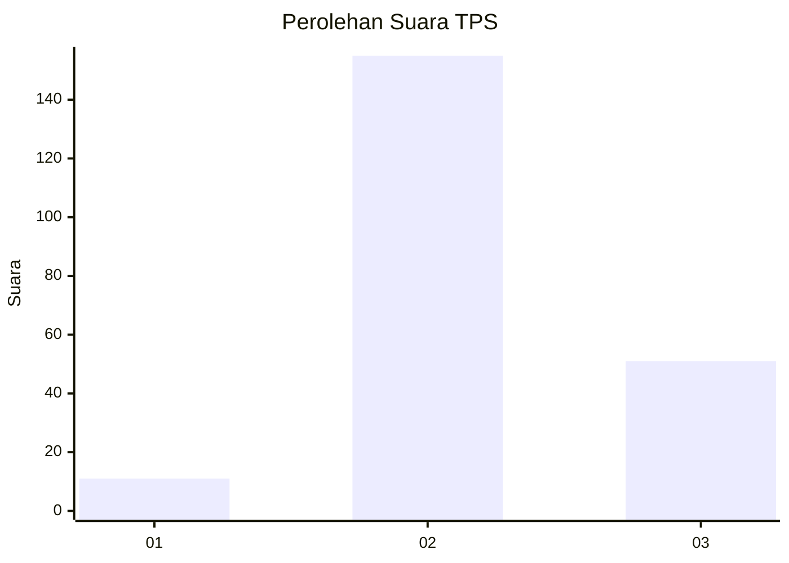
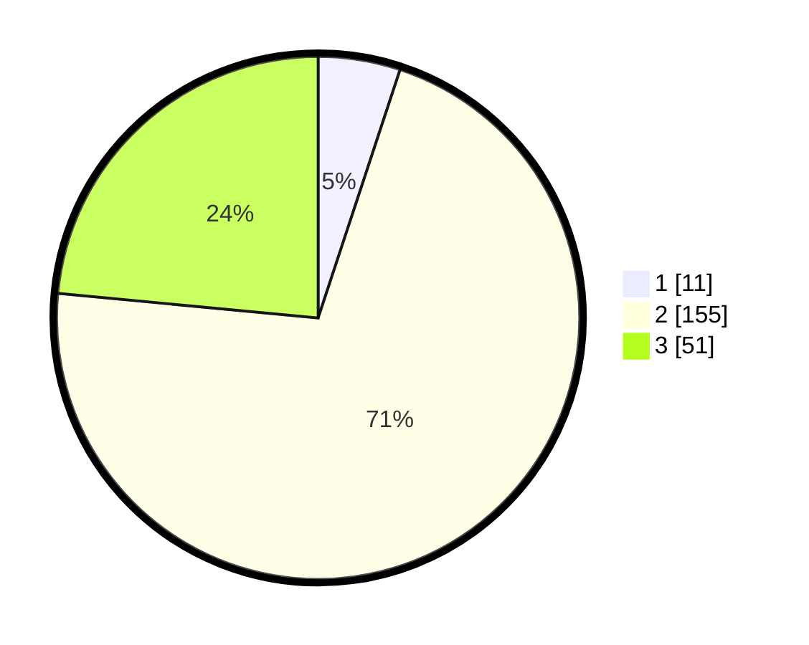

# Hasil

## Grafik

## Tabel

| No. | Nama Paslon    | Suara | Suara (raw) | Persentase |
|:--- |:-------------- | -----:| -----------:| ----------:|
| 1   | ANIES MUHAIMIN | 11    | [11][p-1]   | 5,07       |
| 2   | PRABOWO GIBRAN | 155   | [155][p-2]  | 71,43      |
| 3   | GANJAR MAHFUD  | 51    | [51][p-3]   | 23,50      |

[p-1]: https://github.com/gigit-pemilu/pemilu-2024/blob/main/pilpres/hitung-suara/sub/35-jawa-timur/sub/08-lumajang/sub/05-tempeh/sub/2004-lempeni/sub/002-tps/sub/paslon-1.txt
[p-2]: https://github.com/gigit-pemilu/pemilu-2024/blob/main/pilpres/hitung-suara/sub/35-jawa-timur/sub/08-lumajang/sub/05-tempeh/sub/2004-lempeni/sub/002-tps/sub/paslon-2.txt
[p-3]: https://github.com/gigit-pemilu/pemilu-2024/blob/main/pilpres/hitung-suara/sub/35-jawa-timur/sub/08-lumajang/sub/05-tempeh/sub/2004-lempeni/sub/002-tps/sub/paslon-3.txt

## Foto C Plano

https://sirekap-obj-formc.kpu.go.id/1581/pemilu/ppwp/35/08/05/20/04/3508052004002-20240215-033221--2126f9fc-3709-4a10-9334-5e88ca64eecd.jpg

https://sirekap-obj-formc.kpu.go.id/1581/pemilu/ppwp/35/08/05/20/04/3508052004002-20240217-202241--014cfc85-945a-4a0f-8800-21371b17aa50.jpg

https://sirekap-obj-formc.kpu.go.id/1581/pemilu/ppwp/35/08/05/20/04/3508052004002-20240215-033231--bad92e97-e1a9-4cbb-8c4b-a1ddf493bd51.jpg

## Metadata

| Key        | Value               |
| ---------- | ------------------- |
| Time Stamp | 2024-02-19 06:16:00 |

