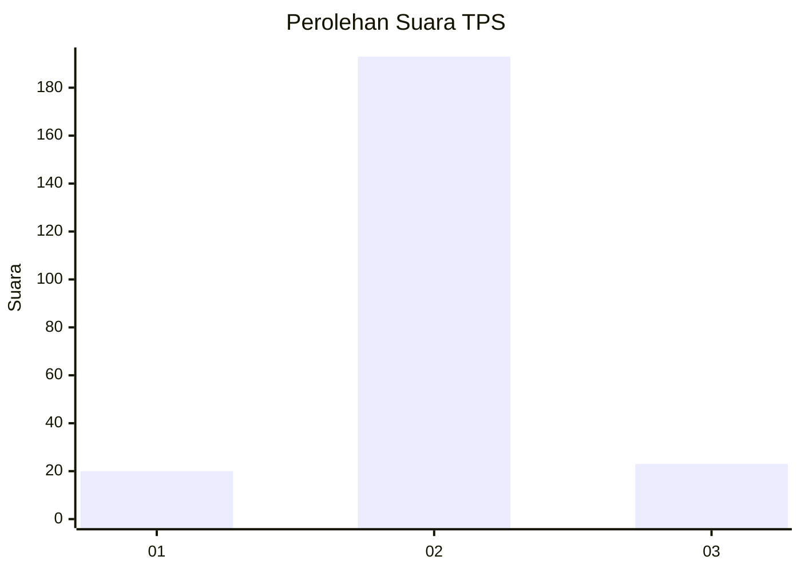
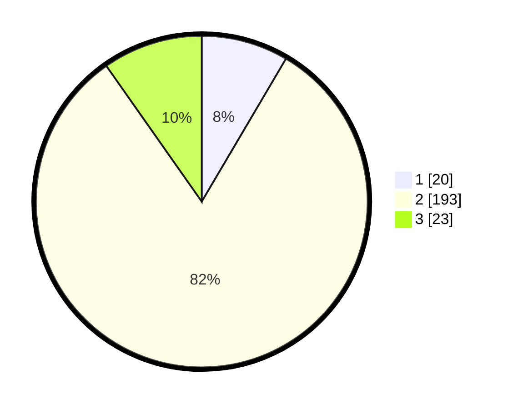

# Hasil

## Grafik

## Tabel

| No. | Nama Paslon    | Suara | Suara (raw) | Persentase |
|:--- |:-------------- | -----:| -----------:| ----------:|
| 1   | ANIES MUHAIMIN | 20    | [20][p-1]   | 8,47       |
| 2   | PRABOWO GIBRAN | 193   | [193][p-2]  | 81,78      |
| 3   | GANJAR MAHFUD  | 23    | [23][p-3]   | 9,75       |

[p-1]: https://github.com/gigit-pemilu/pemilu-2024/blob/main/pilpres/hitung-suara/sub/35-jawa-timur/sub/08-lumajang/sub/05-tempeh/sub/2004-lempeni/sub/012-tps/sub/paslon-1.txt
[p-2]: https://github.com/gigit-pemilu/pemilu-2024/blob/main/pilpres/hitung-suara/sub/35-jawa-timur/sub/08-lumajang/sub/05-tempeh/sub/2004-lempeni/sub/012-tps/sub/paslon-2.txt
[p-3]: https://github.com/gigit-pemilu/pemilu-2024/blob/main/pilpres/hitung-suara/sub/35-jawa-timur/sub/08-lumajang/sub/05-tempeh/sub/2004-lempeni/sub/012-tps/sub/paslon-3.txt

## Foto C Plano

https://sirekap-obj-formc.kpu.go.id/c572/pemilu/ppwp/35/08/05/20/04/3508052004012-20240219-092413--d34bdc21-1c06-4ca6-b826-d18cc8fb61b2.jpg

https://sirekap-obj-formc.kpu.go.id/c572/pemilu/ppwp/35/08/05/20/04/3508052004012-20240219-092421--bb38d185-dac0-4950-96c5-09c5b58adb83.jpg

https://sirekap-obj-formc.kpu.go.id/c572/pemilu/ppwp/35/08/05/20/04/3508052004012-20240219-092626--685350dd-b804-4441-af68-660e15a0349d.jpg

## Metadata

| Key        | Value               |
| ---------- | ------------------- |
| Time Stamp | 2024-02-27 17:00:00 |

