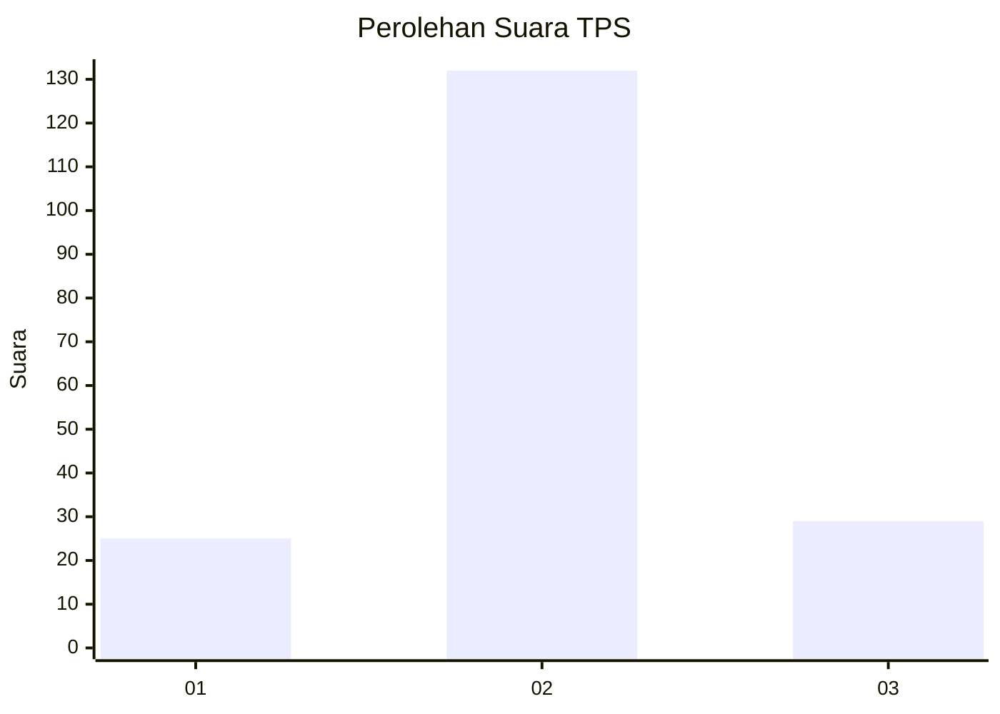

# Hasil

## Grafik

## Tabel

| No. | Nama Paslon    | Suara | Suara (raw) | Persentase |
|:--- |:-------------- | -----:| -----------:| ----------:|
| 1   | ANIES MUHAIMIN | 25    | [25][p-1]   | 13,44      |
| 2   | PRABOWO GIBRAN | 132   | [132][p-2]  | 70,97      |
| 3   | GANJAR MAHFUD  | 29    | [29][p-3]   | 15,59      |

[p-1]: https://github.com/gigit-pemilu/pemilu-2024-35-jawa-timur/blob/main/pilpres/hitung-suara/sub/35-jawa-timur/sub/08-lumajang/sub/05-tempeh/sub/2007-tempeh-lor/sub/029-tps/sub/paslon-1.txt
[p-2]: https://github.com/gigit-pemilu/pemilu-2024-35-jawa-timur/blob/main/pilpres/hitung-suara/sub/35-jawa-timur/sub/08-lumajang/sub/05-tempeh/sub/2007-tempeh-lor/sub/029-tps/sub/paslon-2.txt
[p-3]: https://github.com/gigit-pemilu/pemilu-2024-35-jawa-timur/blob/main/pilpres/hitung-suara/sub/35-jawa-timur/sub/08-lumajang/sub/05-tempeh/sub/2007-tempeh-lor/sub/029-tps/sub/paslon-3.txt

## Foto C Plano

https://sirekap-obj-formc.kpu.go.id/089d/pemilu/ppwp/35/08/05/20/07/3508052007029-20240217-091430--b27b5ca6-3fac-44f6-b043-75308e2ba66e.jpg

https://sirekap-obj-formc.kpu.go.id/089d/pemilu/ppwp/35/08/05/20/07/3508052007029-20240214-191104--99ccd252-19d9-4883-89a5-ea55cdc9ba0e.jpg

https://sirekap-obj-formc.kpu.go.id/089d/pemilu/ppwp/35/08/05/20/07/3508052007029-20240217-090900--c11747f2-0578-40c4-a5fd-480a5fd9e162.jpg

## Metadata

| Key        | Value               |
| ---------- | ------------------- |
| Time Stamp | 2024-02-17 09:30:03 |

