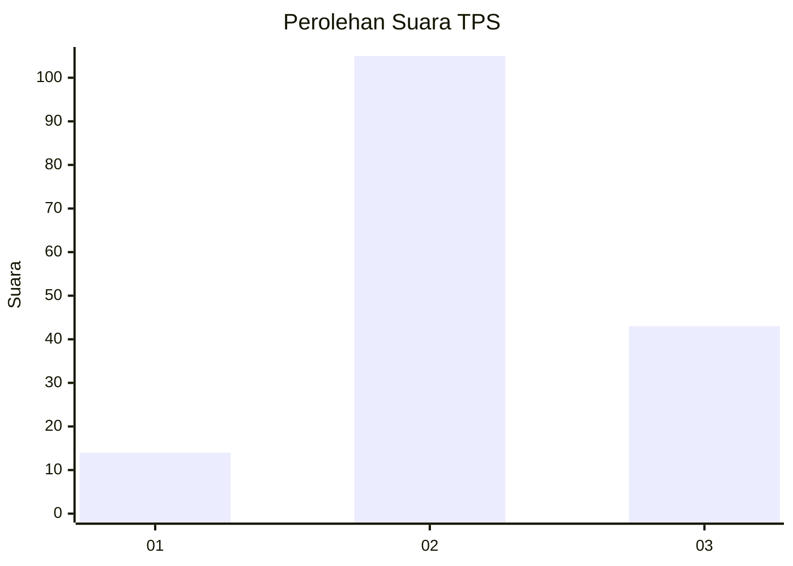
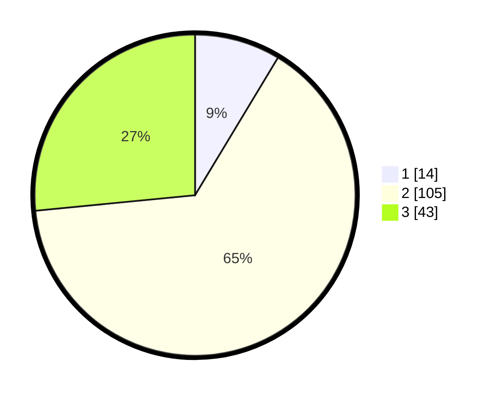

# Hasil

## Grafik

## Tabel

| No. | Nama Paslon    | Suara | Suara (raw) | Persentase |
|:--- |:-------------- | -----:| -----------:| ----------:|
| 1   | ANIES MUHAIMIN | 14    | [14][p-1]   | 8,64       |
| 2   | PRABOWO GIBRAN | 105   | [105][p-2]  | 64,81      |
| 3   | GANJAR MAHFUD  | 43    | [43][p-3]   | 26,54      |

[p-1]: https://github.com/gigit-pemilu/pemilu-2024/blob/main/pilpres/hitung-suara/sub/35-jawa-timur/sub/08-lumajang/sub/05-tempeh/sub/2010-pulo/sub/024-tps/sub/paslon-1.txt
[p-2]: https://github.com/gigit-pemilu/pemilu-2024/blob/main/pilpres/hitung-suara/sub/35-jawa-timur/sub/08-lumajang/sub/05-tempeh/sub/2010-pulo/sub/024-tps/sub/paslon-2.txt
[p-3]: https://github.com/gigit-pemilu/pemilu-2024/blob/main/pilpres/hitung-suara/sub/35-jawa-timur/sub/08-lumajang/sub/05-tempeh/sub/2010-pulo/sub/024-tps/sub/paslon-3.txt

## Foto C Plano

https://sirekap-obj-formc.kpu.go.id/ca65/pemilu/ppwp/35/08/05/20/10/3508052010024-20240214-141125--e01d2740-5e79-4f36-bd6f-e605c210ed37.jpg

https://sirekap-obj-formc.kpu.go.id/ca65/pemilu/ppwp/35/08/05/20/10/3508052010024-20240214-141307--ed10a377-2717-41fe-8a6e-f1dca2633875.jpg

https://sirekap-obj-formc.kpu.go.id/ca65/pemilu/ppwp/35/08/05/20/10/3508052010024-20240215-031959--1fdad739-a69c-478a-9a0c-d06748d44dbe.jpg

## Metadata

| Key        | Value               |
| ---------- | ------------------- |
| Time Stamp | 2024-02-15 04:00:24 |

