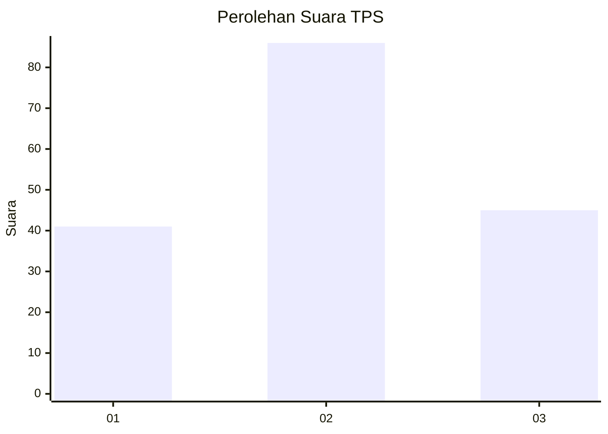
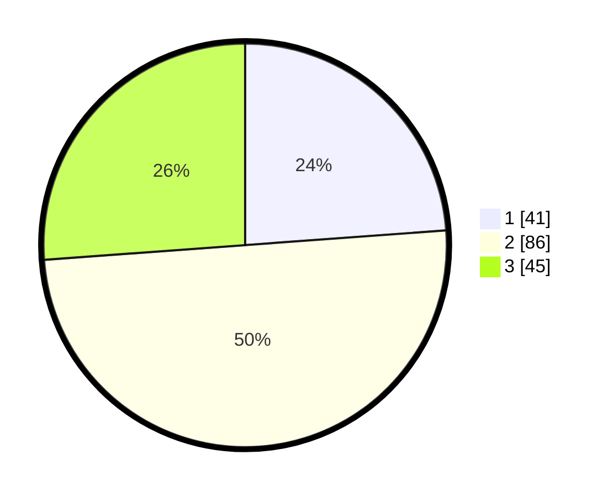

# Hasil

## Grafik

## Tabel

| No. | Nama Paslon    | Suara | Suara (raw) | Persentase |
|:--- |:-------------- | -----:| -----------:| ----------:|
| 1   | ANIES MUHAIMIN | 41    | [41][p-1]   | 23,84      |
| 2   | PRABOWO GIBRAN | 86    | [86][p-2]   | 50,00      |
| 3   | GANJAR MAHFUD  | 45    | [45][p-3]   | 26,16      |

[p-1]: https://github.com/gigit-pemilu/pemilu-2024/blob/main/pilpres/hitung-suara/sub/35-jawa-timur/sub/08-lumajang/sub/07-yosowilangun/sub/2002-kraton/sub/004-tps/sub/paslon-1.txt
[p-2]: https://github.com/gigit-pemilu/pemilu-2024/blob/main/pilpres/hitung-suara/sub/35-jawa-timur/sub/08-lumajang/sub/07-yosowilangun/sub/2002-kraton/sub/004-tps/sub/paslon-2.txt
[p-3]: https://github.com/gigit-pemilu/pemilu-2024/blob/main/pilpres/hitung-suara/sub/35-jawa-timur/sub/08-lumajang/sub/07-yosowilangun/sub/2002-kraton/sub/004-tps/sub/paslon-3.txt

## Foto C Plano

https://sirekap-obj-formc.kpu.go.id/56d5/pemilu/ppwp/35/08/07/20/02/3508072002004-20240214-203516--85fcb6f7-c811-4d58-9232-935aaa9ae28b.jpg

https://sirekap-obj-formc.kpu.go.id/56d5/pemilu/ppwp/35/08/07/20/02/3508072002004-20240214-203734--7437c14a-eeee-44b7-bc47-28a53034ec83.jpg

https://sirekap-obj-formc.kpu.go.id/56d5/pemilu/ppwp/35/08/07/20/02/3508072002004-20240214-203808--2fcab1a6-5f7e-4c50-9ed4-2310e7a58c4b.jpg

## Metadata

| Key        | Value               |
| ---------- | ------------------- |
| Time Stamp | 2024-02-15 20:30:46 |

