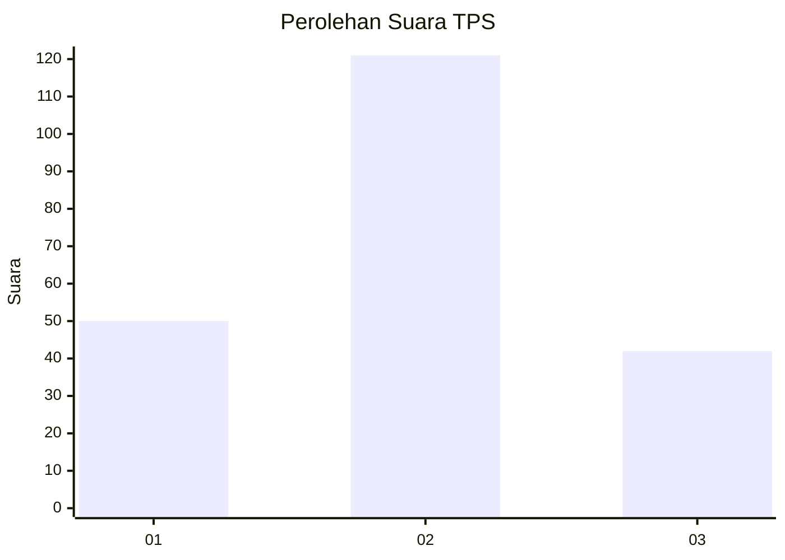
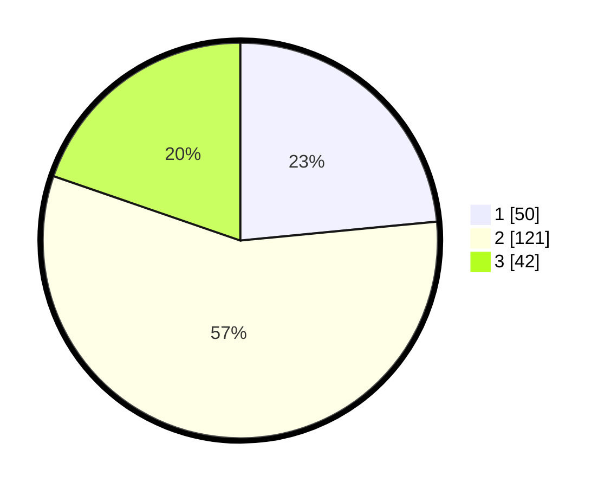

# Hasil

## Grafik

## Tabel

| No. | Nama Paslon    | Suara | Suara (raw) | Persentase |
|:--- |:-------------- | -----:| -----------:| ----------:|
| 1   | ANIES MUHAIMIN | 50    | [50][p-1]   | 23,47      |
| 2   | PRABOWO GIBRAN | 121   | [121][p-2]  | 56,81      |
| 3   | GANJAR MAHFUD  | 42    | [42][p-3]   | 19,72      |

[p-1]: https://github.com/gigit-pemilu/pemilu-2024/blob/main/pilpres/hitung-suara/sub/35-jawa-timur/sub/08-lumajang/sub/07-yosowilangun/sub/2006-yosowilangun-lor/sub/010-tps/sub/paslon-1.txt
[p-2]: https://github.com/gigit-pemilu/pemilu-2024/blob/main/pilpres/hitung-suara/sub/35-jawa-timur/sub/08-lumajang/sub/07-yosowilangun/sub/2006-yosowilangun-lor/sub/010-tps/sub/paslon-2.txt
[p-3]: https://github.com/gigit-pemilu/pemilu-2024/blob/main/pilpres/hitung-suara/sub/35-jawa-timur/sub/08-lumajang/sub/07-yosowilangun/sub/2006-yosowilangun-lor/sub/010-tps/sub/paslon-3.txt

## Foto C Plano

https://sirekap-obj-formc.kpu.go.id/a365/pemilu/ppwp/35/08/07/20/06/3508072006010-20240217-091124--6d713e9d-39b4-4255-bb88-c195e9aedd2d.jpg

https://sirekap-obj-formc.kpu.go.id/a365/pemilu/ppwp/35/08/07/20/06/3508072006010-20240217-091827--2ecf08c8-f794-4783-ba14-a5b03c127c51.jpg

https://sirekap-obj-formc.kpu.go.id/a365/pemilu/ppwp/35/08/07/20/06/3508072006010-20240217-092203--db7ecfb1-3aac-4920-8d31-4888c1f1e77b.jpg

## Metadata

| Key        | Value               |
| ---------- | ------------------- |
| Time Stamp | 2024-02-17 11:30:03 |

