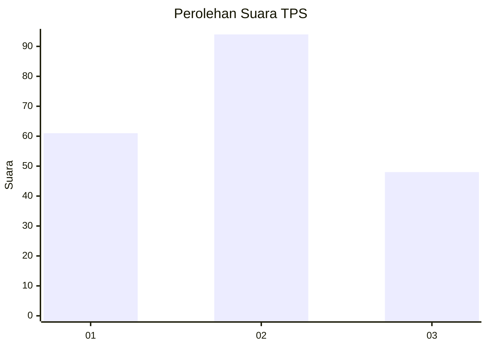
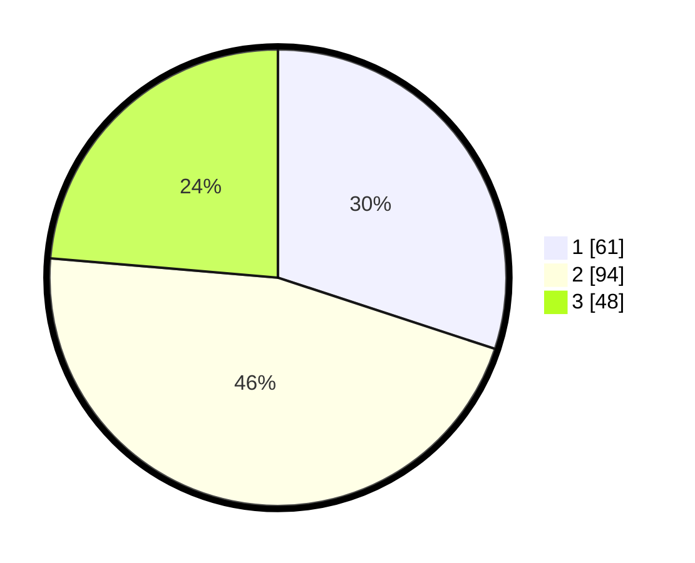

# Hasil

## Grafik

## Tabel

| No. | Nama Paslon    | Suara | Suara (raw) | Persentase |
|:--- |:-------------- | -----:| -----------:| ----------:|
| 1   | ANIES MUHAIMIN | 61    | [61][p-1]   | 30,05      |
| 2   | PRABOWO GIBRAN | 94    | [94][p-2]   | 46,31      |
| 3   | GANJAR MAHFUD  | 48    | [48][p-3]   | 23,65      |

[p-1]: https://github.com/gigit-pemilu/pemilu-2024/blob/main/pilpres/hitung-suara/sub/35-jawa-timur/sub/08-lumajang/sub/07-yosowilangun/sub/2012-kalipepe/sub/017-tps/sub/paslon-1.txt
[p-2]: https://github.com/gigit-pemilu/pemilu-2024/blob/main/pilpres/hitung-suara/sub/35-jawa-timur/sub/08-lumajang/sub/07-yosowilangun/sub/2012-kalipepe/sub/017-tps/sub/paslon-2.txt
[p-3]: https://github.com/gigit-pemilu/pemilu-2024/blob/main/pilpres/hitung-suara/sub/35-jawa-timur/sub/08-lumajang/sub/07-yosowilangun/sub/2012-kalipepe/sub/017-tps/sub/paslon-3.txt

## Foto C Plano

https://sirekap-obj-formc.kpu.go.id/d51b/pemilu/ppwp/35/08/07/20/12/3508072012017-20240215-031507--b1f94f90-a0e7-41f8-9a8d-2f65c4f86986.jpg

https://sirekap-obj-formc.kpu.go.id/d51b/pemilu/ppwp/35/08/07/20/12/3508072012017-20240215-031527--01c6f64f-dc57-4f92-817e-685c8a78af48.jpg

https://sirekap-obj-formc.kpu.go.id/d51b/pemilu/ppwp/35/08/07/20/12/3508072012017-20240215-031544--3d343317-9576-4944-b553-a4b73bd574dd.jpg

## Metadata

| Key        | Value               |
| ---------- | ------------------- |
| Time Stamp | 2024-02-24 22:31:28 |

