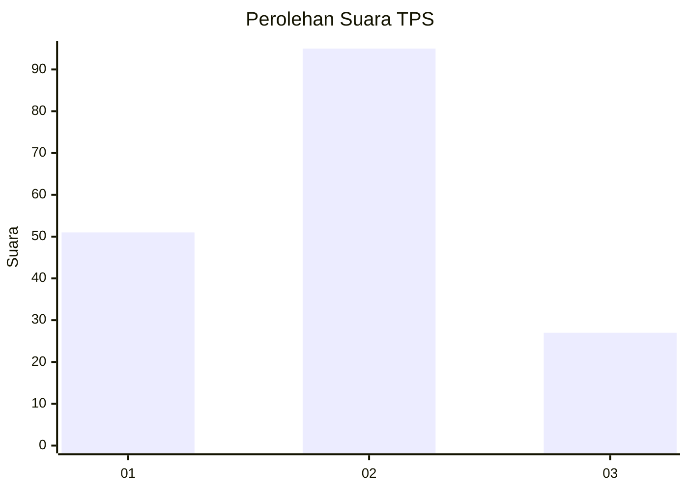
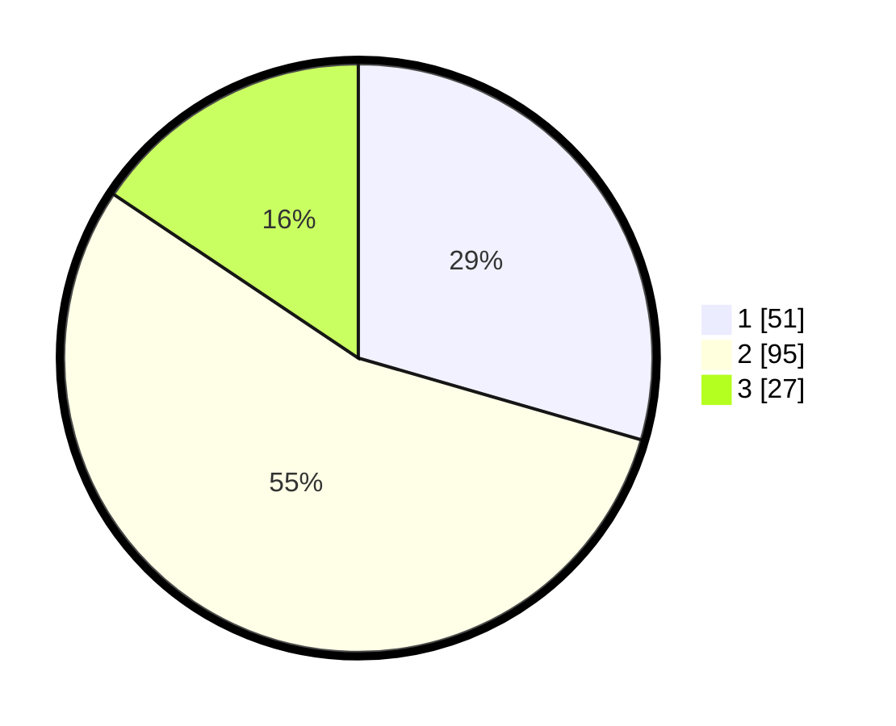

# Hasil

## Grafik

## Tabel

| No. | Nama Paslon    | Suara | Suara (raw) | Persentase |
|:--- |:-------------- | -----:| -----------:| ----------:|
| 1   | ANIES MUHAIMIN | 51    | [51][p-1]   | 29,48      |
| 2   | PRABOWO GIBRAN | 95    | [95][p-2]   | 54,91      |
| 3   | GANJAR MAHFUD  | 27    | [27][p-3]   | 15,61      |

[p-1]: https://github.com/gigit-pemilu/pemilu-2024/blob/main/pilpres/hitung-suara/sub/35-jawa-timur/sub/08-lumajang/sub/09-tekung/sub/2001-wonogriyo/sub/002-tps/sub/paslon-1.txt
[p-2]: https://github.com/gigit-pemilu/pemilu-2024/blob/main/pilpres/hitung-suara/sub/35-jawa-timur/sub/08-lumajang/sub/09-tekung/sub/2001-wonogriyo/sub/002-tps/sub/paslon-2.txt
[p-3]: https://github.com/gigit-pemilu/pemilu-2024/blob/main/pilpres/hitung-suara/sub/35-jawa-timur/sub/08-lumajang/sub/09-tekung/sub/2001-wonogriyo/sub/002-tps/sub/paslon-3.txt

## Foto C Plano

https://sirekap-obj-formc.kpu.go.id/849c/pemilu/ppwp/35/08/09/20/01/3508092001002-20240215-062332--3ab5459c-882e-41c8-9c85-0dc5d58547a2.jpg

https://sirekap-obj-formc.kpu.go.id/849c/pemilu/ppwp/35/08/09/20/01/3508092001002-20240215-004526--8c47a801-4634-4fc2-a95c-e245e0f22ce1.jpg

https://sirekap-obj-formc.kpu.go.id/849c/pemilu/ppwp/35/08/09/20/01/3508092001002-20240215-005308--54c8f885-388c-4f52-a587-2c0081b954e0.jpg

## Metadata

| Key        | Value               |
| ---------- | ------------------- |
| Time Stamp | 2024-02-17 09:30:03 |

