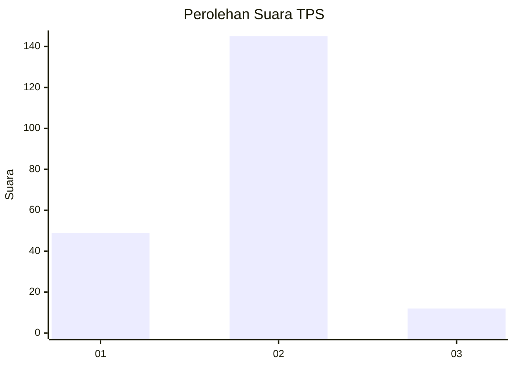

# Hasil

## Grafik

## Tabel

| No. | Nama Paslon    | Suara | Suara (raw) | Persentase |
|:--- |:-------------- | -----:| -----------:| ----------:|
| 1   | ANIES MUHAIMIN | 49    | [49][p-1]   | 23,79      |
| 2   | PRABOWO GIBRAN | 145   | [145][p-2]  | 70,39      |
| 3   | GANJAR MAHFUD  | 12    | [12][p-3]   | 5,83       |

[p-1]: https://github.com/gigit-pemilu/pemilu-2024/blob/main/pilpres/hitung-suara/sub/35-jawa-timur/sub/08-lumajang/sub/09-tekung/sub/2001-wonogriyo/sub/004-tps/sub/paslon-1.txt
[p-2]: https://github.com/gigit-pemilu/pemilu-2024/blob/main/pilpres/hitung-suara/sub/35-jawa-timur/sub/08-lumajang/sub/09-tekung/sub/2001-wonogriyo/sub/004-tps/sub/paslon-2.txt
[p-3]: https://github.com/gigit-pemilu/pemilu-2024/blob/main/pilpres/hitung-suara/sub/35-jawa-timur/sub/08-lumajang/sub/09-tekung/sub/2001-wonogriyo/sub/004-tps/sub/paslon-3.txt

## Foto C Plano

https://sirekap-obj-formc.kpu.go.id/1c31/pemilu/ppwp/35/08/09/20/01/3508092001004-20240217-193913--2b78f396-4ce2-4331-8007-b71ca6c221b7.jpg

https://sirekap-obj-formc.kpu.go.id/1c31/pemilu/ppwp/35/08/09/20/01/3508092001004-20240214-233557--13666197-6383-4045-940d-92660b825e9e.jpg

https://sirekap-obj-formc.kpu.go.id/1c31/pemilu/ppwp/35/08/09/20/01/3508092001004-20240214-233757--cc8f8f8d-4748-466c-a212-5f13d1efdce6.jpg

## Metadata

| Key        | Value               |
| ---------- | ------------------- |
| Time Stamp | 2024-02-19 06:16:00 |

