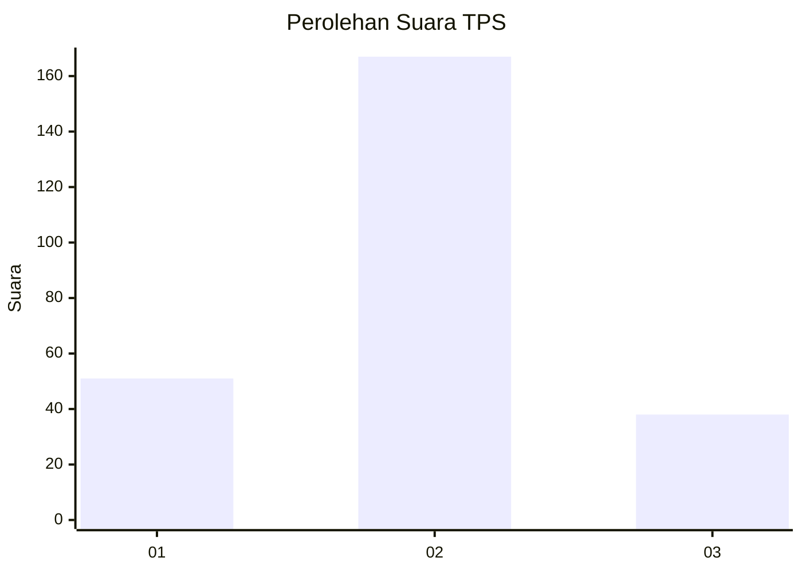
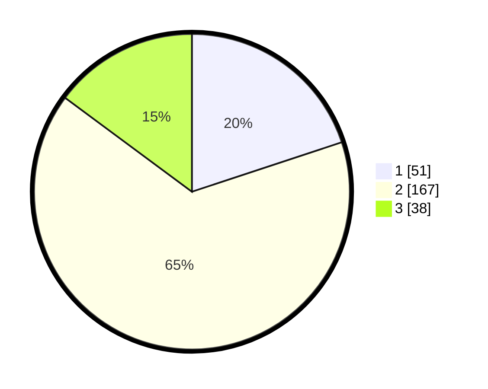

# Hasil

## Grafik

## Tabel

| No. | Nama Paslon    | Suara | Suara (raw) | Persentase |
|:--- |:-------------- | -----:| -----------:| ----------:|
| 1   | ANIES MUHAIMIN | 51    | [51][p-1]   | 19,92      |
| 2   | PRABOWO GIBRAN | 167   | [167][p-2]  | 65,23      |
| 3   | GANJAR MAHFUD  | 38    | [38][p-3]   | 14,84      |

[p-1]: https://github.com/gigit-pemilu/pemilu-2024/blob/main/pilpres/hitung-suara/sub/35-jawa-timur/sub/08-lumajang/sub/09-tekung/sub/2001-wonogriyo/sub/005-tps/sub/paslon-1.txt
[p-2]: https://github.com/gigit-pemilu/pemilu-2024/blob/main/pilpres/hitung-suara/sub/35-jawa-timur/sub/08-lumajang/sub/09-tekung/sub/2001-wonogriyo/sub/005-tps/sub/paslon-2.txt
[p-3]: https://github.com/gigit-pemilu/pemilu-2024/blob/main/pilpres/hitung-suara/sub/35-jawa-timur/sub/08-lumajang/sub/09-tekung/sub/2001-wonogriyo/sub/005-tps/sub/paslon-3.txt

## Foto C Plano

https://sirekap-obj-formc.kpu.go.id/2ecb/pemilu/ppwp/35/08/09/20/01/3508092001005-20240215-000929--e2eab5c7-68e4-447f-9491-1395835d6a32.jpg

https://sirekap-obj-formc.kpu.go.id/2ecb/pemilu/ppwp/35/08/09/20/01/3508092001005-20240215-001339--29cf0a75-e675-4ad2-b686-9ae86ea69831.jpg

https://sirekap-obj-formc.kpu.go.id/2ecb/pemilu/ppwp/35/08/09/20/01/3508092001005-20240215-001656--c568470e-d56e-406d-88dc-c134fcc2d02e.jpg

## Metadata

| Key        | Value               |
| ---------- | ------------------- |
| Time Stamp | 2024-02-17 09:30:03 |

## DATA PEMILIH TETAP

Jumlah pemilih dalam DPT: **299**.
 * L: **135**.
 * P: **164**.

## DATA PENGGUNA HAK PILIH

Jumlah pengguna hak pilih dalam DPT: **259**.
 * L: **117**.
 * P: **142**.

Jumlah pengguna hak pilih dalam DPTb: **0**.
 * L: **0**.
 * P: **0**.

Jumlah pengguna hak pilih dalam DPK: **1**.
 * L: **0**.
 * P: **1**.

Jumlah pengguna hak pilih: **260**.
 * L: **117**.
 * P: **143**.

## JUMLAH SUARA SAH DAN TIDAK SAH

JUMLAH SELURUH SUARA SAH: **256**.

JUMLAH SUARA TIDAK SAH: **4**.

JUMLAH SELURUH SUARA SAH DAN SUARA TIDAK SAH: **260**.

