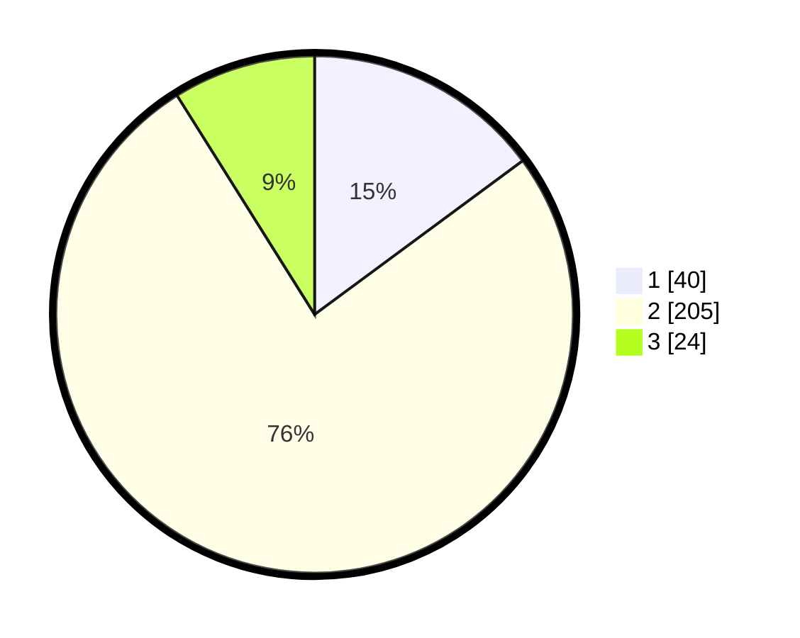

# Hasil

## Grafik

## Tabel

| No. | Nama Paslon    | Suara | Suara (raw) | Persentase |
|:--- |:-------------- | -----:| -----------:| ----------:|
| 1   | ANIES MUHAIMIN | 40    | [40][p-1]   | 14,87      |
| 2   | PRABOWO GIBRAN | 205   | [205][p-2]  | 76,21      |
| 3   | GANJAR MAHFUD  | 24    | [24][p-3]   | 8,92       |

[p-1]: https://github.com/gigit-pemilu/pemilu-2024-35-jawa-timur/blob/main/pilpres/hitung-suara/sub/35-jawa-timur/sub/08-lumajang/sub/09-tekung/sub/2002-wonosari/sub/001-tps/sub/paslon-1.txt
[p-2]: https://github.com/gigit-pemilu/pemilu-2024-35-jawa-timur/blob/main/pilpres/hitung-suara/sub/35-jawa-timur/sub/08-lumajang/sub/09-tekung/sub/2002-wonosari/sub/001-tps/sub/paslon-2.txt
[p-3]: https://github.com/gigit-pemilu/pemilu-2024-35-jawa-timur/blob/main/pilpres/hitung-suara/sub/35-jawa-timur/sub/08-lumajang/sub/09-tekung/sub/2002-wonosari/sub/001-tps/sub/paslon-3.txt

## Foto C Plano

https://sirekap-obj-formc.kpu.go.id/517b/pemilu/ppwp/35/08/09/20/02/3508092002001-20240227-133120--e07ec2fe-6961-449f-acdd-7b07a53d93f4.jpg

https://sirekap-obj-formc.kpu.go.id/517b/pemilu/ppwp/35/08/09/20/02/3508092002001-20240227-135457--1bd6cfa8-d994-4ad1-aa86-fc681e7f9619.jpg

## Metadata

| Key        | Value               |
| ---------- | ------------------- |
| Time Stamp | 2024-02-28 20:00:00 |

