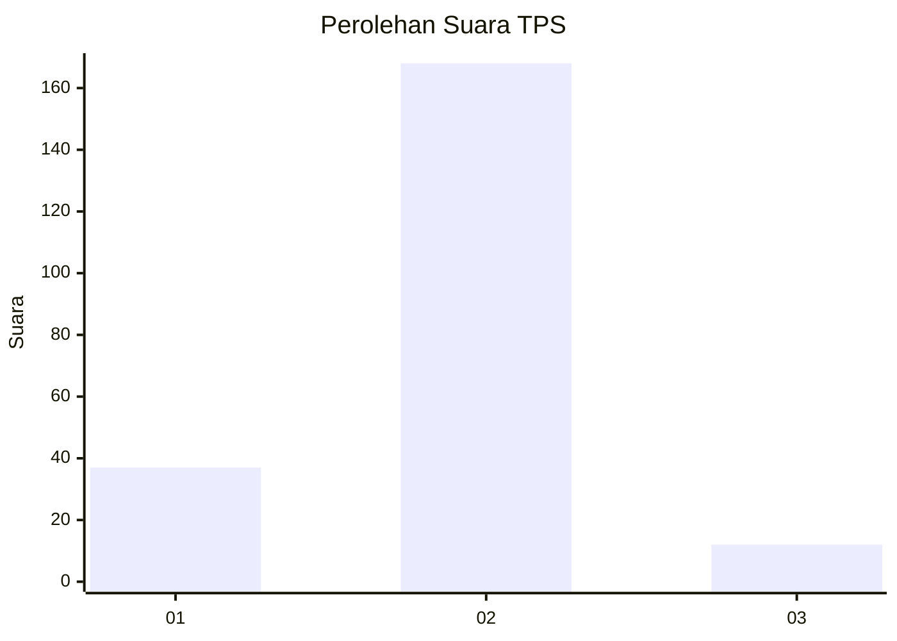
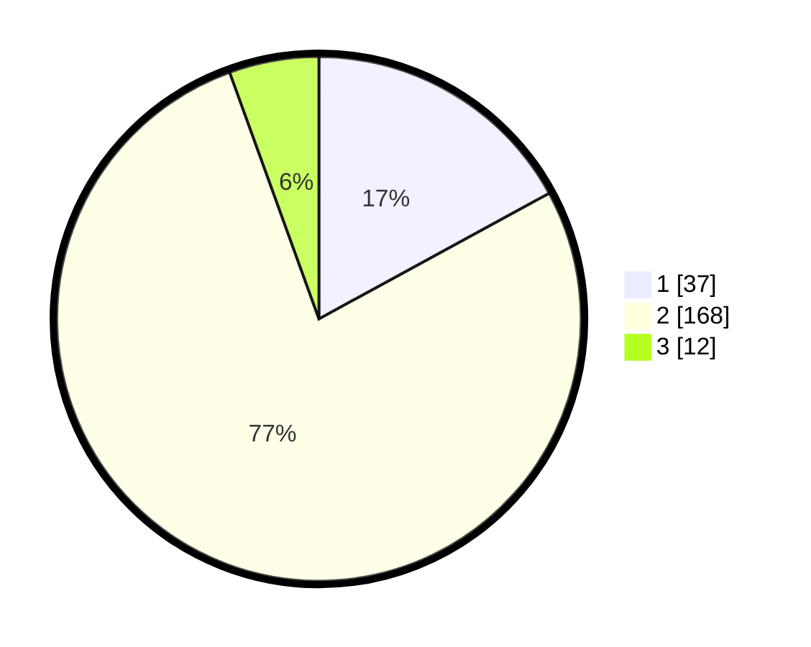

# Hasil

## Grafik

## Tabel

| No. | Nama Paslon    | Suara | Suara (raw) | Persentase |
|:--- |:-------------- | -----:| -----------:| ----------:|
| 1   | ANIES MUHAIMIN | 37    | [37][p-1]   | 17,05      |
| 2   | PRABOWO GIBRAN | 168   | [168][p-2]  | 77,42      |
| 3   | GANJAR MAHFUD  | 12    | [12][p-3]   | 5,53       |

[p-1]: https://github.com/gigit-pemilu/pemilu-2024-35-jawa-timur/blob/main/pilpres/hitung-suara/sub/35-jawa-timur/sub/08-lumajang/sub/09-tekung/sub/2003-mangunsari/sub/002-tps/sub/paslon-1.txt
[p-2]: https://github.com/gigit-pemilu/pemilu-2024-35-jawa-timur/blob/main/pilpres/hitung-suara/sub/35-jawa-timur/sub/08-lumajang/sub/09-tekung/sub/2003-mangunsari/sub/002-tps/sub/paslon-2.txt
[p-3]: https://github.com/gigit-pemilu/pemilu-2024-35-jawa-timur/blob/main/pilpres/hitung-suara/sub/35-jawa-timur/sub/08-lumajang/sub/09-tekung/sub/2003-mangunsari/sub/002-tps/sub/paslon-3.txt

## Foto C Plano

https://sirekap-obj-formc.kpu.go.id/b0bc/pemilu/ppwp/35/08/09/20/03/3508092003002-20240217-162420--79e06b78-9dd2-47ec-9375-7771a2d699df.jpg

https://sirekap-obj-formc.kpu.go.id/b0bc/pemilu/ppwp/35/08/09/20/03/3508092003002-20240214-155246--f0fce1f6-e099-45d1-ba0d-9f7451b3796b.jpg

https://sirekap-obj-formc.kpu.go.id/b0bc/pemilu/ppwp/35/08/09/20/03/3508092003002-20240214-155359--99fce11a-45f4-4689-9e83-6af142374415.jpg

## Metadata

| Key        | Value               |
| ---------- | ------------------- |
| Time Stamp | 2024-02-17 16:36:25 |

