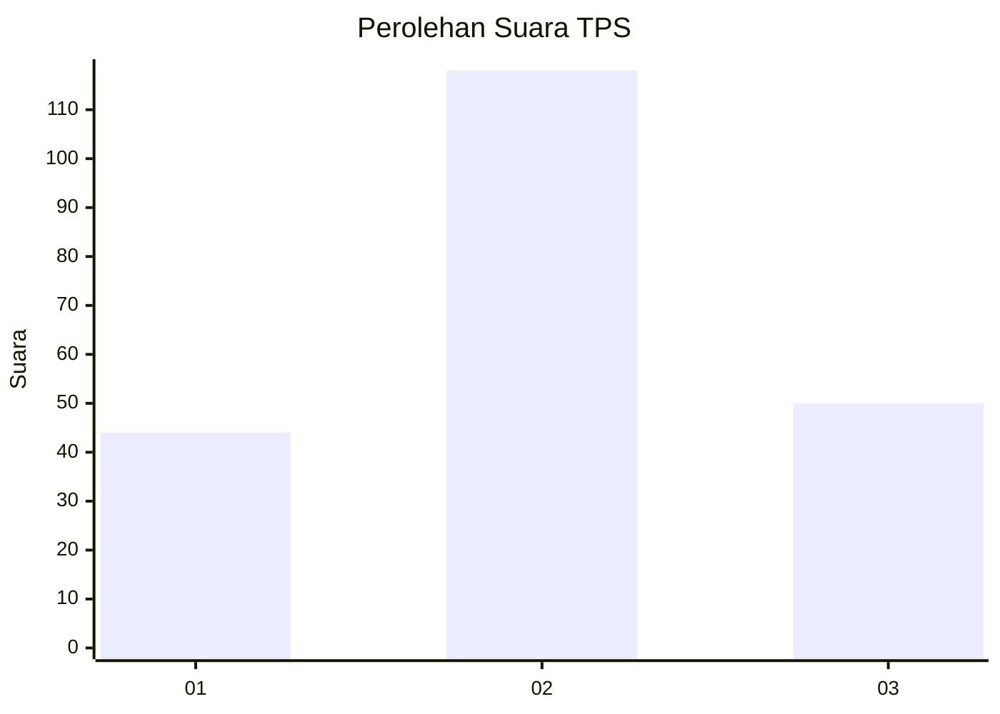
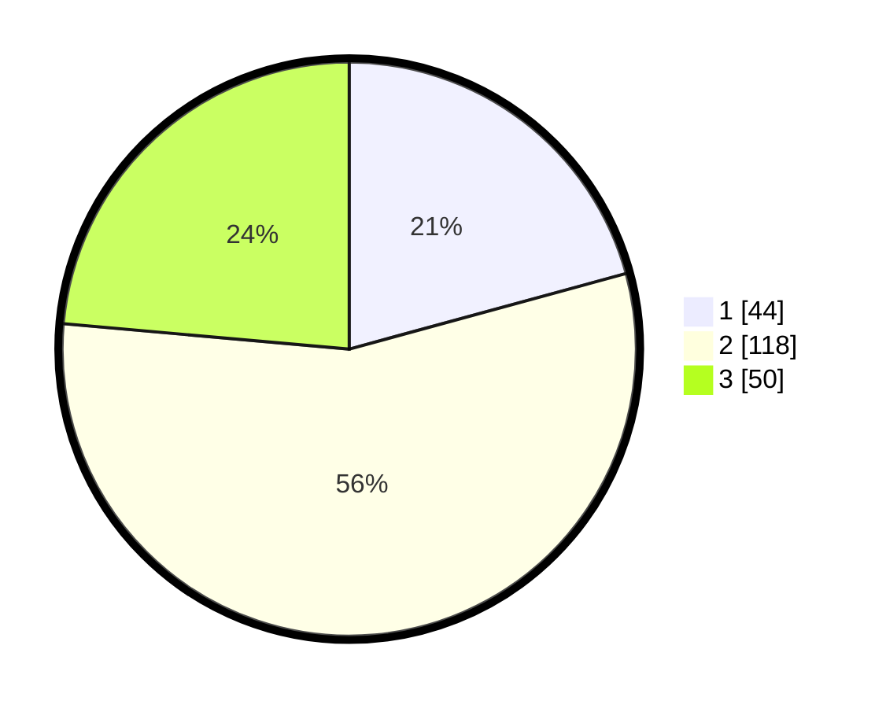

# Hasil

## Grafik

## Tabel

| No. | Nama Paslon    | Suara | Suara (raw) | Persentase |
|:--- |:-------------- | -----:| -----------:| ----------:|
| 1   | ANIES MUHAIMIN | 44    | [44][p-1]   | 20,75      |
| 2   | PRABOWO GIBRAN | 118   | [118][p-2]  | 55,66      |
| 3   | GANJAR MAHFUD  | 50    | [50][p-3]   | 23,58      |

[p-1]: https://github.com/gigit-pemilu/pemilu-2024/blob/main/pilpres/hitung-suara/sub/35-jawa-timur/sub/08-lumajang/sub/09-tekung/sub/2004-tekung/sub/006-tps/sub/paslon-1.txt
[p-2]: https://github.com/gigit-pemilu/pemilu-2024/blob/main/pilpres/hitung-suara/sub/35-jawa-timur/sub/08-lumajang/sub/09-tekung/sub/2004-tekung/sub/006-tps/sub/paslon-2.txt
[p-3]: https://github.com/gigit-pemilu/pemilu-2024/blob/main/pilpres/hitung-suara/sub/35-jawa-timur/sub/08-lumajang/sub/09-tekung/sub/2004-tekung/sub/006-tps/sub/paslon-3.txt

## Foto C Plano

https://sirekap-obj-formc.kpu.go.id/f4ae/pemilu/ppwp/35/08/09/20/04/3508092004006-20240215-043212--49aebfc5-e993-4d9b-81f2-2601a2dbac50.jpg

https://sirekap-obj-formc.kpu.go.id/f4ae/pemilu/ppwp/35/08/09/20/04/3508092004006-20240215-043445--79836123-aa5c-4134-b1fa-b5e3513f0792.jpg

https://sirekap-obj-formc.kpu.go.id/f4ae/pemilu/ppwp/35/08/09/20/04/3508092004006-20240215-043523--58bf5fb0-2453-43d5-8cb5-18c8e019ba39.jpg

## Metadata

| Key        | Value               |
| ---------- | ------------------- |
| Time Stamp | 2024-02-17 10:00:02 |

