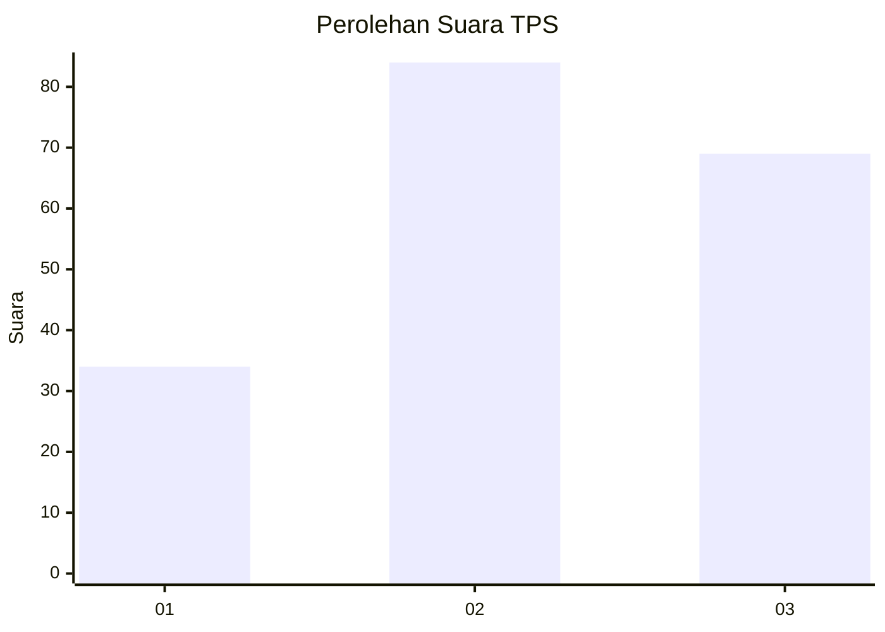
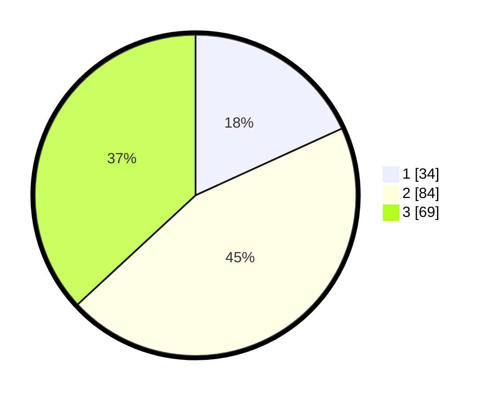

# Hasil

## Grafik

## Tabel

| No. | Nama Paslon    | Suara | Suara (raw) | Persentase |
|:--- |:-------------- | -----:| -----------:| ----------:|
| 1   | ANIES MUHAIMIN | 34    | [34][p-1]   | 18,18      |
| 2   | PRABOWO GIBRAN | 84    | [84][p-2]   | 44,92      |
| 3   | GANJAR MAHFUD  | 69    | [69][p-3]   | 36,90      |

[p-1]: https://github.com/gigit-pemilu/pemilu-2024-35-jawa-timur/blob/main/pilpres/hitung-suara/sub/35-jawa-timur/sub/08-lumajang/sub/09-tekung/sub/2004-tekung/sub/007-tps/sub/paslon-1.txt
[p-2]: https://github.com/gigit-pemilu/pemilu-2024-35-jawa-timur/blob/main/pilpres/hitung-suara/sub/35-jawa-timur/sub/08-lumajang/sub/09-tekung/sub/2004-tekung/sub/007-tps/sub/paslon-2.txt
[p-3]: https://github.com/gigit-pemilu/pemilu-2024-35-jawa-timur/blob/main/pilpres/hitung-suara/sub/35-jawa-timur/sub/08-lumajang/sub/09-tekung/sub/2004-tekung/sub/007-tps/sub/paslon-3.txt

## Foto C Plano

https://sirekap-obj-formc.kpu.go.id/3344/pemilu/ppwp/35/08/09/20/04/3508092004007-20240214-213640--e5de9a0f-ec52-4822-9c42-17423bba3a02.jpg

https://sirekap-obj-formc.kpu.go.id/3344/pemilu/ppwp/35/08/09/20/04/3508092004007-20240214-213259--9f86a2e3-5194-4936-9e53-67d6a7faa97d.jpg

https://sirekap-obj-formc.kpu.go.id/3344/pemilu/ppwp/35/08/09/20/04/3508092004007-20240214-212556--ddac0b7e-8bf2-489d-9530-fb985cdbad3b.jpg

## Metadata

| Key        | Value               |
| ---------- | ------------------- |
| Time Stamp | 2024-02-17 10:00:02 |

