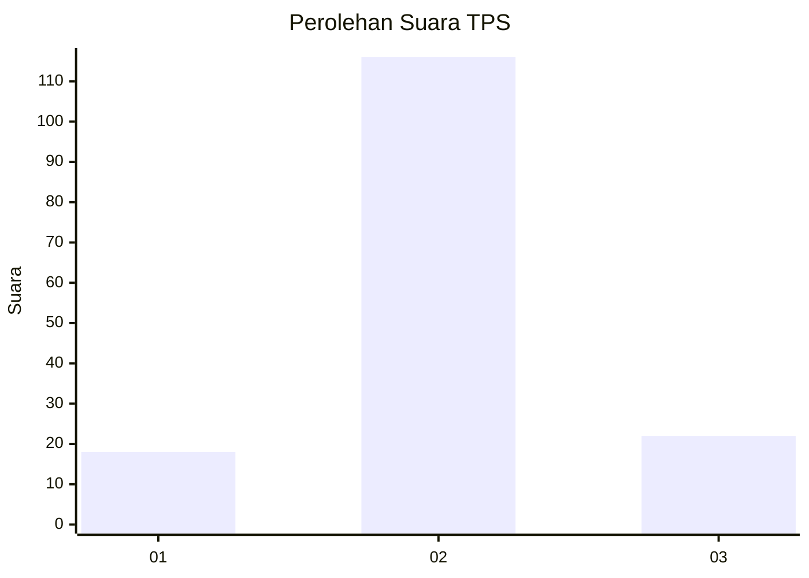
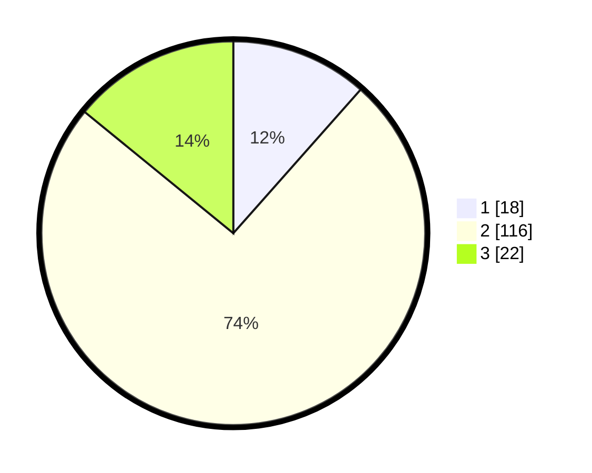

# Hasil

## Grafik

## Tabel

| No. | Nama Paslon    | Suara | Suara (raw) | Persentase |
|:--- |:-------------- | -----:| -----------:| ----------:|
| 1   | ANIES MUHAIMIN | 18    | [18][p-1]   | 11,54      |
| 2   | PRABOWO GIBRAN | 116   | [116][p-2]  | 74,36      |
| 3   | GANJAR MAHFUD  | 22    | [22][p-3]   | 14,10      |

[p-1]: https://github.com/gigit-pemilu/pemilu-2024/blob/main/pilpres/hitung-suara/sub/35-jawa-timur/sub/08-lumajang/sub/09-tekung/sub/2004-tekung/sub/012-tps/sub/paslon-1.txt
[p-2]: https://github.com/gigit-pemilu/pemilu-2024/blob/main/pilpres/hitung-suara/sub/35-jawa-timur/sub/08-lumajang/sub/09-tekung/sub/2004-tekung/sub/012-tps/sub/paslon-2.txt
[p-3]: https://github.com/gigit-pemilu/pemilu-2024/blob/main/pilpres/hitung-suara/sub/35-jawa-timur/sub/08-lumajang/sub/09-tekung/sub/2004-tekung/sub/012-tps/sub/paslon-3.txt

## Foto C Plano

https://sirekap-obj-formc.kpu.go.id/37eb/pemilu/ppwp/35/08/09/20/04/3508092004012-20240214-194619--dc8eb19d-2102-4b7c-bb46-1f7e184f7097.jpg

https://sirekap-obj-formc.kpu.go.id/37eb/pemilu/ppwp/35/08/09/20/04/3508092004012-20240214-230648--ff3118da-e0c7-4377-8010-76b5e37fd3ab.jpg

https://sirekap-obj-formc.kpu.go.id/37eb/pemilu/ppwp/35/08/09/20/04/3508092004012-20240215-020433--22d245c1-c352-4fb7-9abe-f94e01fa9491.jpg

## Metadata

| Key        | Value               |
| ---------- | ------------------- |
| Time Stamp | 2024-02-15 12:00:28 |

