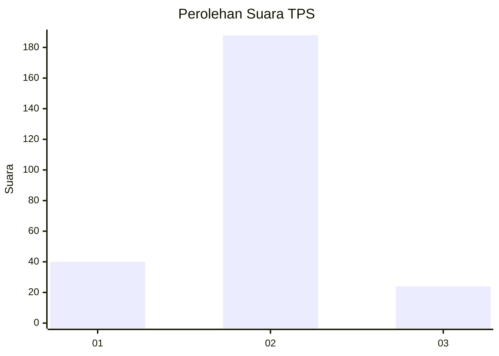
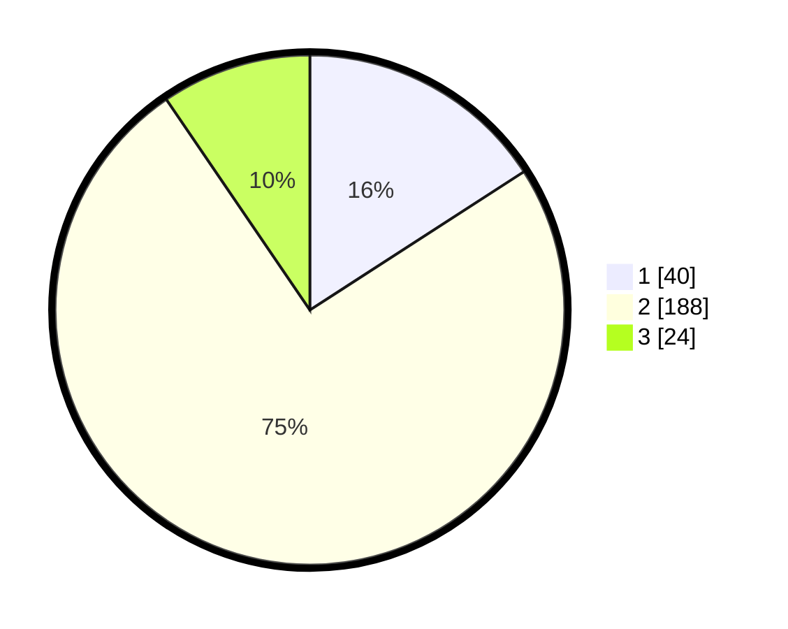

# Hasil

## Grafik

## Tabel

| No. | Nama Paslon    | Suara | Suara (raw) | Persentase |
|:--- |:-------------- | -----:| -----------:| ----------:|
| 1   | ANIES MUHAIMIN | 40    | [40][p-1]   | 15,87      |
| 2   | PRABOWO GIBRAN | 188   | [188][p-2]  | 74,60      |
| 3   | GANJAR MAHFUD  | 24    | [24][p-3]   | 9,52       |

[p-1]: https://github.com/gigit-pemilu/pemilu-2024-35-jawa-timur/blob/main/pilpres/hitung-suara/sub/35-jawa-timur/sub/08-lumajang/sub/09-tekung/sub/2006-tukum/sub/003-tps/sub/paslon-1.txt
[p-2]: https://github.com/gigit-pemilu/pemilu-2024-35-jawa-timur/blob/main/pilpres/hitung-suara/sub/35-jawa-timur/sub/08-lumajang/sub/09-tekung/sub/2006-tukum/sub/003-tps/sub/paslon-2.txt
[p-3]: https://github.com/gigit-pemilu/pemilu-2024-35-jawa-timur/blob/main/pilpres/hitung-suara/sub/35-jawa-timur/sub/08-lumajang/sub/09-tekung/sub/2006-tukum/sub/003-tps/sub/paslon-3.txt

## Foto C Plano

https://sirekap-obj-formc.kpu.go.id/601e/pemilu/ppwp/35/08/09/20/06/3508092006003-20240214-233806--c7e669e5-ac73-49b2-a9bf-0976c8aa281a.jpg

https://sirekap-obj-formc.kpu.go.id/601e/pemilu/ppwp/35/08/09/20/06/3508092006003-20240214-233915--5c0c56d9-f853-4598-a20b-9a69952e5aa1.jpg

https://sirekap-obj-formc.kpu.go.id/601e/pemilu/ppwp/35/08/09/20/06/3508092006003-20240214-234008--927bbbaa-f4ba-42fe-8212-f7484feb4c44.jpg

## Metadata

| Key        | Value               |
| ---------- | ------------------- |
| Time Stamp | 2024-02-16 14:00:34 |

