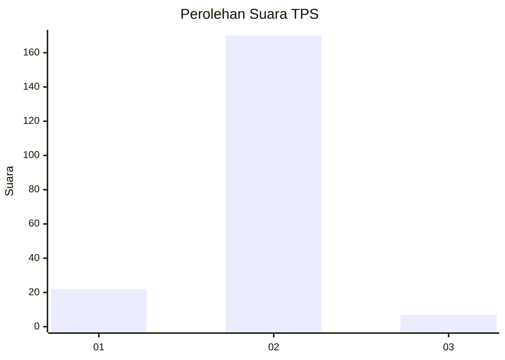
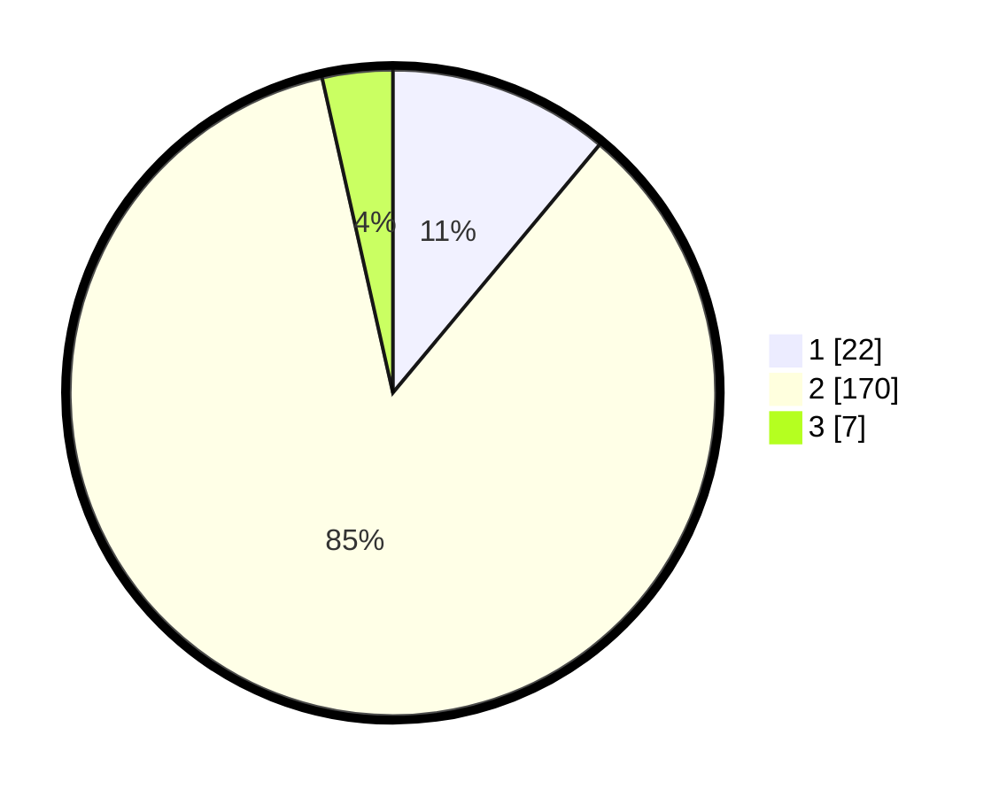

# Hasil

## Grafik

## Tabel

| No. | Nama Paslon    | Suara | Suara (raw) | Persentase |
|:--- |:-------------- | -----:| -----------:| ----------:|
| 1   | ANIES MUHAIMIN | 22    | [22][p-1]   | 11,06      |
| 2   | PRABOWO GIBRAN | 170   | [170][p-2]  | 85,43      |
| 3   | GANJAR MAHFUD  | 7     | [7][p-3]    | 3,52       |

[p-1]: https://github.com/gigit-pemilu/pemilu-2024/blob/main/pilpres/hitung-suara/sub/35-jawa-timur/sub/08-lumajang/sub/09-tekung/sub/2006-tukum/sub/025-tps/sub/paslon-1.txt
[p-2]: https://github.com/gigit-pemilu/pemilu-2024/blob/main/pilpres/hitung-suara/sub/35-jawa-timur/sub/08-lumajang/sub/09-tekung/sub/2006-tukum/sub/025-tps/sub/paslon-2.txt
[p-3]: https://github.com/gigit-pemilu/pemilu-2024/blob/main/pilpres/hitung-suara/sub/35-jawa-timur/sub/08-lumajang/sub/09-tekung/sub/2006-tukum/sub/025-tps/sub/paslon-3.txt

## Foto C Plano

https://sirekap-obj-formc.kpu.go.id/ad97/pemilu/ppwp/35/08/09/20/06/3508092006025-20240215-003528--fdade5cf-70db-461c-a2fa-80677f2ae796.jpg

https://sirekap-obj-formc.kpu.go.id/ad97/pemilu/ppwp/35/08/09/20/06/3508092006025-20240215-013919--ab918f1d-467c-4d02-996a-9e0213aae774.jpg

https://sirekap-obj-formc.kpu.go.id/ad97/pemilu/ppwp/35/08/09/20/06/3508092006025-20240215-014140--c5def46a-5036-4415-a7e4-19a9bc6a1663.jpg

## Metadata

| Key        | Value               |
| ---------- | ------------------- |
| Time Stamp | 2024-02-16 14:00:34 |

