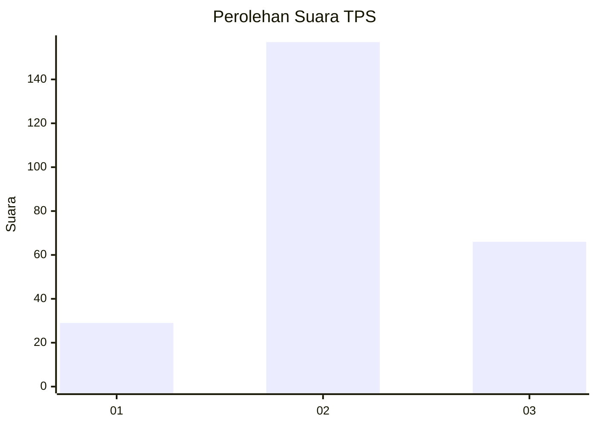
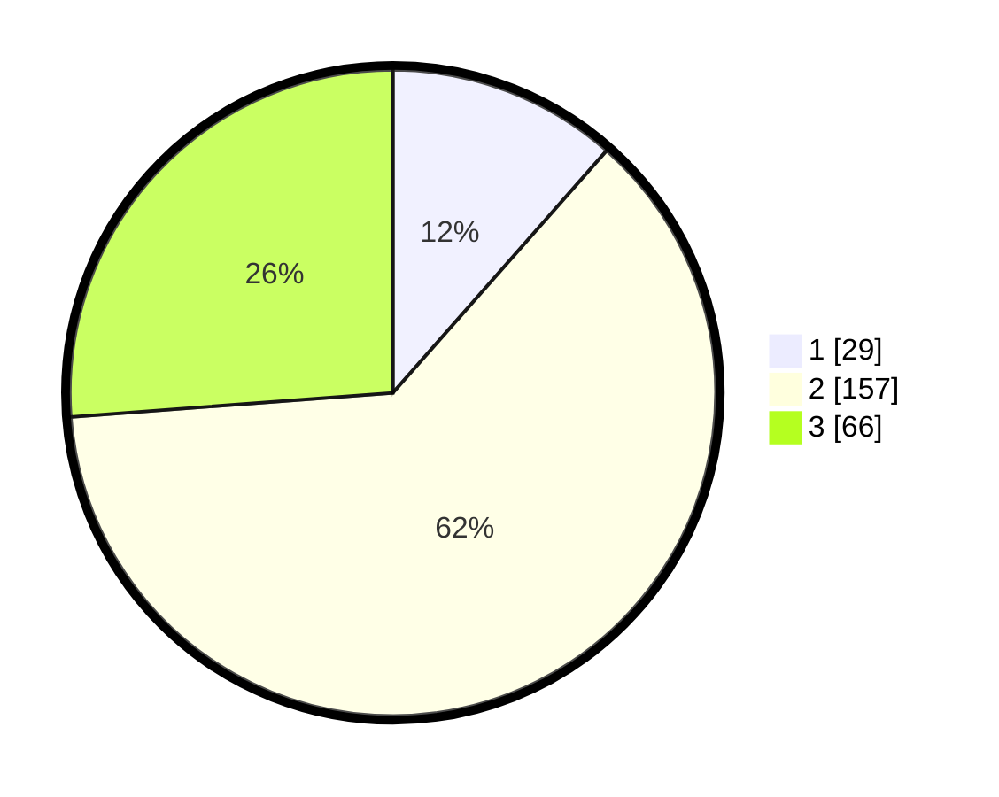

# Hasil

## Grafik

## Tabel

| No. | Nama Paslon    | Suara | Suara (raw) | Persentase |
|:--- |:-------------- | -----:| -----------:| ----------:|
| 1   | ANIES MUHAIMIN | 29    | [29][p-1]   | 11,51      |
| 2   | PRABOWO GIBRAN | 157   | [157][p-2]  | 62,30      |
| 3   | GANJAR MAHFUD  | 66    | [66][p-3]   | 26,19      |

[p-1]: https://github.com/gigit-pemilu/pemilu-2024-35-jawa-timur/blob/main/pilpres/hitung-suara/sub/35-jawa-timur/sub/08-lumajang/sub/09-tekung/sub/2007-karangbendo/sub/008-tps/sub/paslon-1.txt
[p-2]: https://github.com/gigit-pemilu/pemilu-2024-35-jawa-timur/blob/main/pilpres/hitung-suara/sub/35-jawa-timur/sub/08-lumajang/sub/09-tekung/sub/2007-karangbendo/sub/008-tps/sub/paslon-2.txt
[p-3]: https://github.com/gigit-pemilu/pemilu-2024-35-jawa-timur/blob/main/pilpres/hitung-suara/sub/35-jawa-timur/sub/08-lumajang/sub/09-tekung/sub/2007-karangbendo/sub/008-tps/sub/paslon-3.txt

## Foto C Plano

https://sirekap-obj-formc.kpu.go.id/b287/pemilu/ppwp/35/08/09/20/07/3508092007008-20240214-192919--d35601fa-e193-4ff7-b5b8-dbf392cf55fe.jpg

https://sirekap-obj-formc.kpu.go.id/b287/pemilu/ppwp/35/08/09/20/07/3508092007008-20240216-222404--f7780316-d547-45dd-84c6-4888c0a368bd.jpg

https://sirekap-obj-formc.kpu.go.id/b287/pemilu/ppwp/35/08/09/20/07/3508092007008-20240214-193604--d71aa61c-5257-4be4-b36b-d38c3bbcd8db.jpg

## Metadata

| Key        | Value               |
| ---------- | ------------------- |
| Time Stamp | 2024-02-16 23:30:00 |

