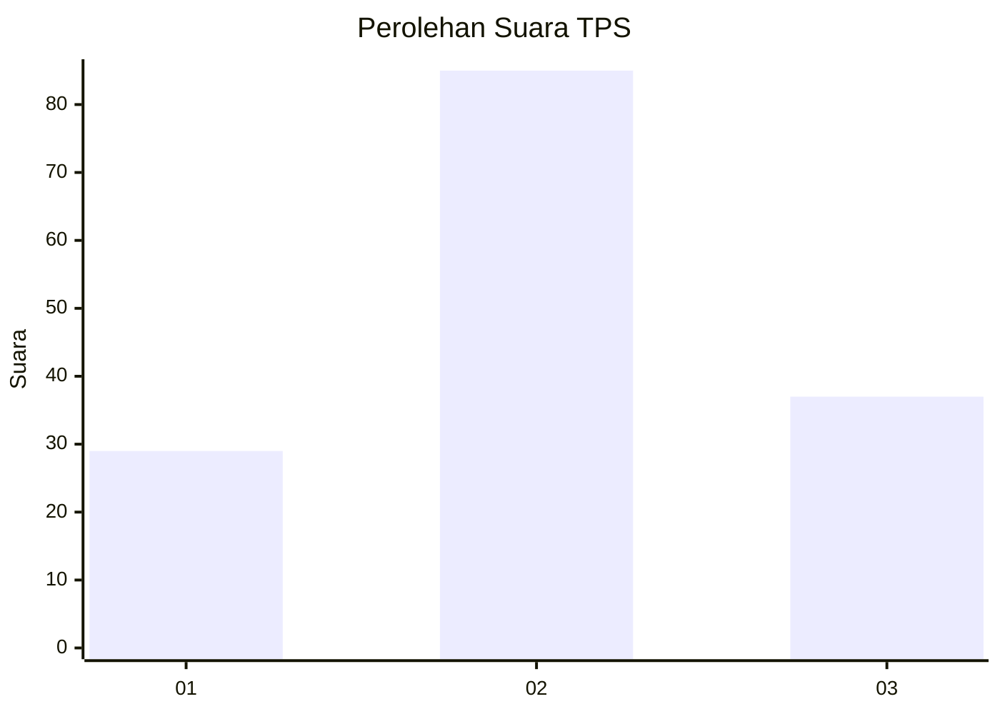
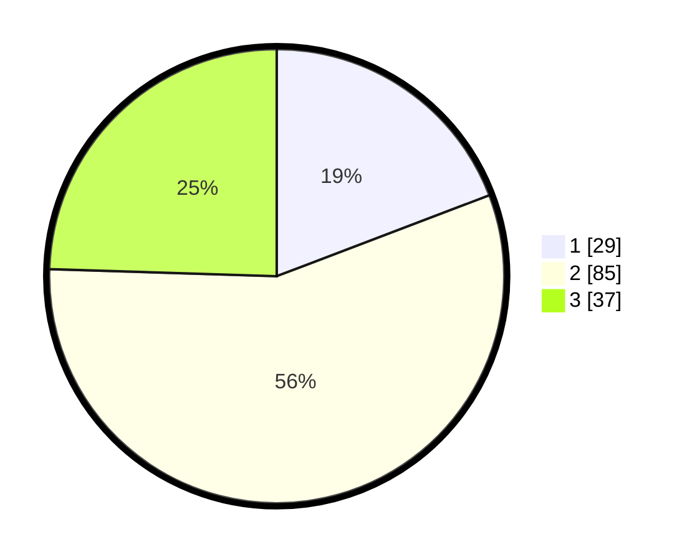

# Hasil

## Grafik

## Tabel

| No. | Nama Paslon    | Suara | Suara (raw) | Persentase |
|:--- |:-------------- | -----:| -----------:| ----------:|
| 1   | ANIES MUHAIMIN | 29    | [29][p-1]   | 19,21      |
| 2   | PRABOWO GIBRAN | 85    | [85][p-2]   | 56,29      |
| 3   | GANJAR MAHFUD  | 37    | [37][p-3]   | 24,50      |

[p-1]: https://github.com/gigit-pemilu/pemilu-2024/blob/main/pilpres/hitung-suara/sub/35-jawa-timur/sub/08-lumajang/sub/09-tekung/sub/2007-karangbendo/sub/021-tps/sub/paslon-1.txt
[p-2]: https://github.com/gigit-pemilu/pemilu-2024/blob/main/pilpres/hitung-suara/sub/35-jawa-timur/sub/08-lumajang/sub/09-tekung/sub/2007-karangbendo/sub/021-tps/sub/paslon-2.txt
[p-3]: https://github.com/gigit-pemilu/pemilu-2024/blob/main/pilpres/hitung-suara/sub/35-jawa-timur/sub/08-lumajang/sub/09-tekung/sub/2007-karangbendo/sub/021-tps/sub/paslon-3.txt

## Foto C Plano

https://sirekap-obj-formc.kpu.go.id/7a5b/pemilu/ppwp/35/08/09/20/07/3508092007021-20240215-000808--76926983-b959-4bfe-92de-631750720c92.jpg

https://sirekap-obj-formc.kpu.go.id/7a5b/pemilu/ppwp/35/08/09/20/07/3508092007021-20240215-000917--2eec9f17-f336-4bf0-9bd6-895d84bd1757.jpg

https://sirekap-obj-formc.kpu.go.id/7a5b/pemilu/ppwp/35/08/09/20/07/3508092007021-20240215-001304--e6757d6f-76b8-4d0b-9eb3-482bd83a1c14.jpg

## Metadata

| Key        | Value               |
| ---------- | ------------------- |
| Time Stamp | 2024-02-19 23:00:00 |

