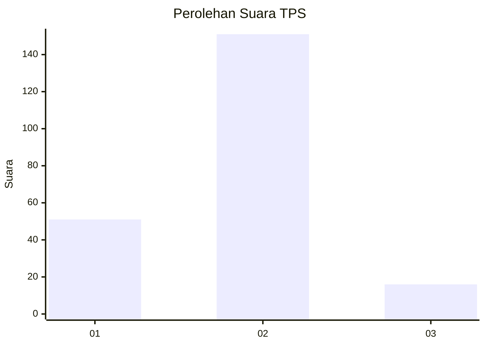
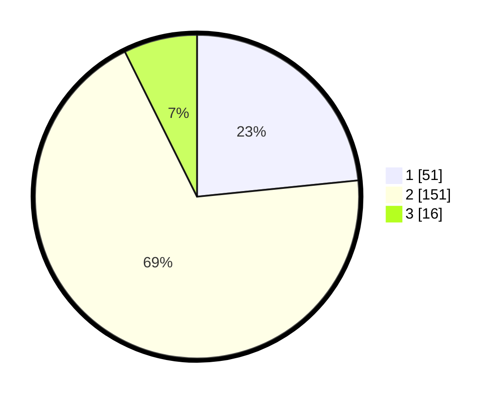

# Hasil

## Grafik

## Tabel

| No. | Nama Paslon    | Suara | Suara (raw) | Persentase |
|:--- |:-------------- | -----:| -----------:| ----------:|
| 1   | ANIES MUHAIMIN | 51    | [51][p-1]   | 23,39      |
| 2   | PRABOWO GIBRAN | 151   | [151][p-2]  | 69,27      |
| 3   | GANJAR MAHFUD  | 16    | [16][p-3]   | 7,34       |

[p-1]: https://github.com/gigit-pemilu/pemilu-2024/blob/main/pilpres/hitung-suara/sub/35-jawa-timur/sub/08-lumajang/sub/09-tekung/sub/2008-klampokarum/sub/003-tps/sub/paslon-1.txt
[p-2]: https://github.com/gigit-pemilu/pemilu-2024/blob/main/pilpres/hitung-suara/sub/35-jawa-timur/sub/08-lumajang/sub/09-tekung/sub/2008-klampokarum/sub/003-tps/sub/paslon-2.txt
[p-3]: https://github.com/gigit-pemilu/pemilu-2024/blob/main/pilpres/hitung-suara/sub/35-jawa-timur/sub/08-lumajang/sub/09-tekung/sub/2008-klampokarum/sub/003-tps/sub/paslon-3.txt

## Foto C Plano

https://sirekap-obj-formc.kpu.go.id/6a97/pemilu/ppwp/35/08/09/20/08/3508092008003-20240214-220459--baaa5a11-cb91-4dd7-900b-756b7b13a5a1.jpg

https://sirekap-obj-formc.kpu.go.id/6a97/pemilu/ppwp/35/08/09/20/08/3508092008003-20240214-195044--d89829eb-deab-4afe-9b3d-a8914f644383.jpg

https://sirekap-obj-formc.kpu.go.id/6a97/pemilu/ppwp/35/08/09/20/08/3508092008003-20240214-195358--655b6b62-9abf-4f19-a19d-a75a1002c493.jpg

## Metadata

| Key        | Value               |
| ---------- | ------------------- |
| Time Stamp | 2024-02-15 04:00:24 |

