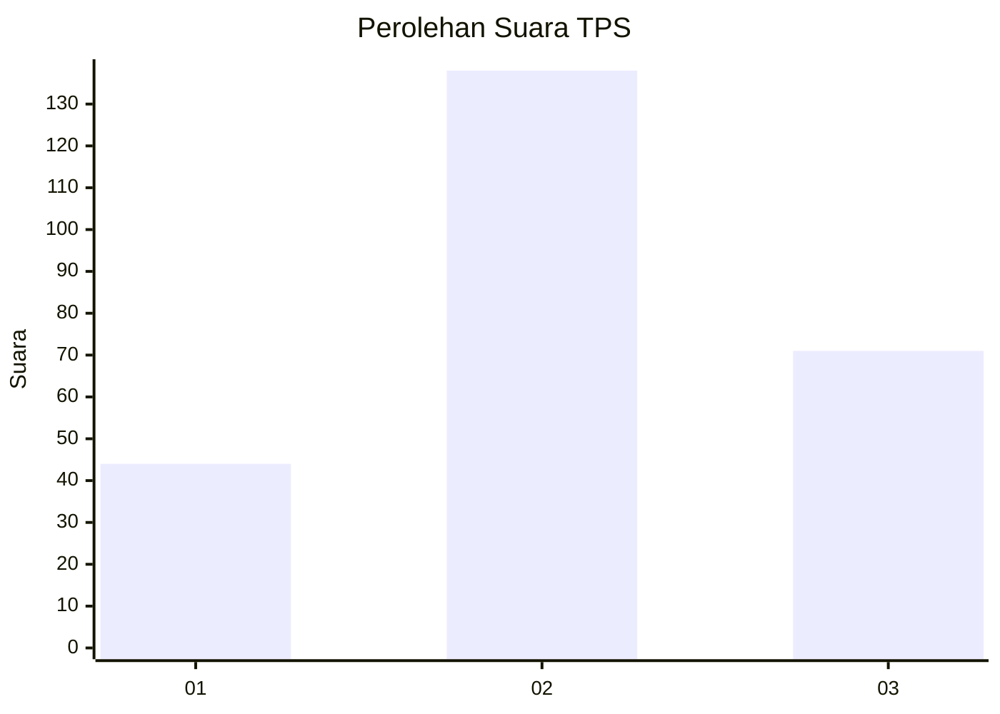
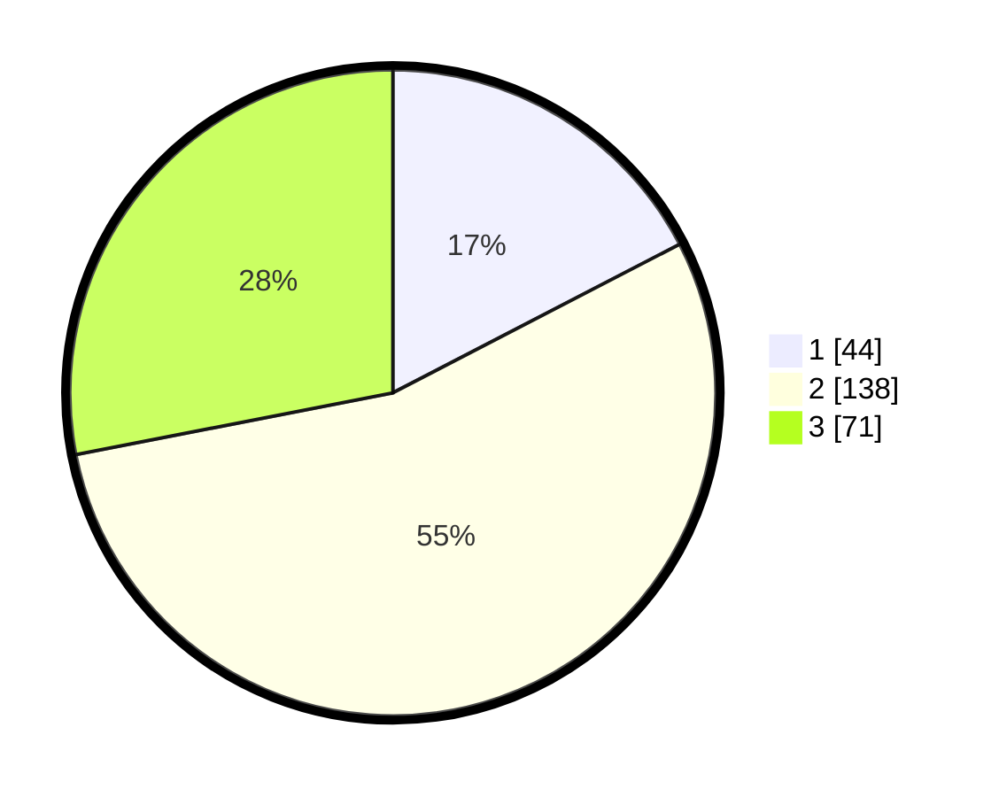

# Hasil

## Grafik

## Tabel

| No. | Nama Paslon    | Suara | Suara (raw) | Persentase |
|:--- |:-------------- | -----:| -----------:| ----------:|
| 1   | ANIES MUHAIMIN | 44    | [44][p-1]   | 17,39      |
| 2   | PRABOWO GIBRAN | 138   | [138][p-2]  | 54,55      |
| 3   | GANJAR MAHFUD  | 71    | [71][p-3]   | 28,06      |

[p-1]: https://github.com/gigit-pemilu/pemilu-2024/blob/main/pilpres/hitung-suara/sub/35-jawa-timur/sub/08-lumajang/sub/10-lumajang/sub/1003-citrodiwangsan/sub/003-tps/sub/paslon-1.txt
[p-2]: https://github.com/gigit-pemilu/pemilu-2024/blob/main/pilpres/hitung-suara/sub/35-jawa-timur/sub/08-lumajang/sub/10-lumajang/sub/1003-citrodiwangsan/sub/003-tps/sub/paslon-2.txt
[p-3]: https://github.com/gigit-pemilu/pemilu-2024/blob/main/pilpres/hitung-suara/sub/35-jawa-timur/sub/08-lumajang/sub/10-lumajang/sub/1003-citrodiwangsan/sub/003-tps/sub/paslon-3.txt

## Foto C Plano

https://sirekap-obj-formc.kpu.go.id/7706/pemilu/ppwp/35/08/10/10/03/3508101003003-20240221-184236--19494029-b564-4803-acab-7d6b1b0fc3f4.jpg

https://sirekap-obj-formc.kpu.go.id/7706/pemilu/ppwp/35/08/10/10/03/3508101003003-20240221-184238--0e3f7fae-e493-43d7-90f8-f4d6ae1965c0.jpg

https://sirekap-obj-formc.kpu.go.id/7706/pemilu/ppwp/35/08/10/10/03/3508101003003-20240221-184237--bbe2651b-5b95-4b6b-9e81-0e23a55da806.jpg

## Metadata

| Key        | Value               |
| ---------- | ------------------- |
| Time Stamp | 2024-02-22 19:00:00 |

## DATA PEMILIH TETAP

Jumlah pemilih dalam DPT: **297**.
 * L: **138**.
 * P: **159**.

## DATA PENGGUNA HAK PILIH

Jumlah pengguna hak pilih dalam DPT: **256**.
 * L: **114**.
 * P: **142**.

Jumlah pengguna hak pilih dalam DPTb: **0**.
 * L: **0**.
 * P: **0**.

Jumlah pengguna hak pilih dalam DPK: **0**.
 * L: **0**.
 * P: **0**.

Jumlah pengguna hak pilih: **256**.
 * L: **114**.
 * P: **142**.

## JUMLAH SUARA SAH DAN TIDAK SAH

JUMLAH SELURUH SUARA SAH: **253**.

JUMLAH SUARA TIDAK SAH: **3**.

JUMLAH SELURUH SUARA SAH DAN SUARA TIDAK SAH: **256**.

