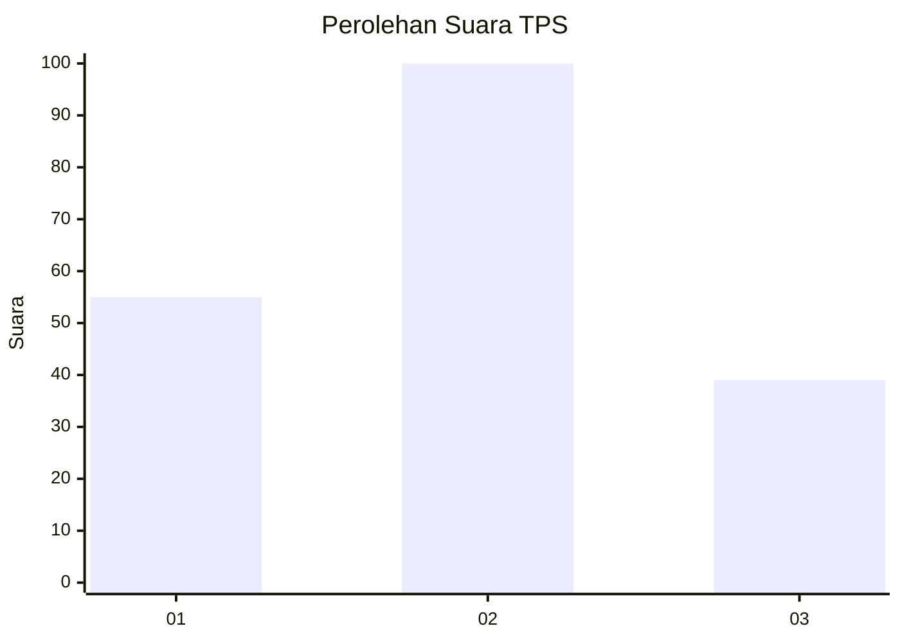
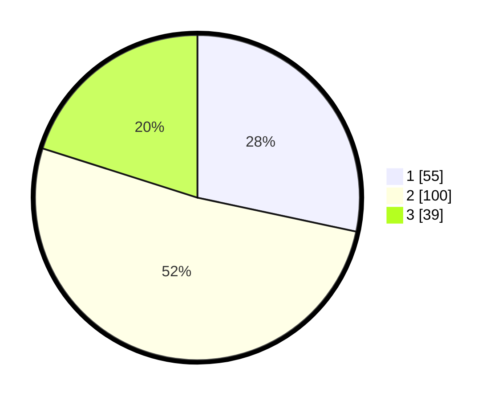

# Hasil

## Grafik

## Tabel

| No. | Nama Paslon    | Suara | Suara (raw) | Persentase |
|:--- |:-------------- | -----:| -----------:| ----------:|
| 1   | ANIES MUHAIMIN | 55    | [55][p-1]   | 28,35      |
| 2   | PRABOWO GIBRAN | 100   | [100][p-2]  | 51,55      |
| 3   | GANJAR MAHFUD  | 39    | [39][p-3]   | 20,10      |

[p-1]: https://github.com/gigit-pemilu/pemilu-2024/blob/main/pilpres/hitung-suara/sub/35-jawa-timur/sub/08-lumajang/sub/10-lumajang/sub/1004-ditotrunan/sub/001-tps/sub/paslon-1.txt
[p-2]: https://github.com/gigit-pemilu/pemilu-2024/blob/main/pilpres/hitung-suara/sub/35-jawa-timur/sub/08-lumajang/sub/10-lumajang/sub/1004-ditotrunan/sub/001-tps/sub/paslon-2.txt
[p-3]: https://github.com/gigit-pemilu/pemilu-2024/blob/main/pilpres/hitung-suara/sub/35-jawa-timur/sub/08-lumajang/sub/10-lumajang/sub/1004-ditotrunan/sub/001-tps/sub/paslon-3.txt

## Foto C Plano

https://sirekap-obj-formc.kpu.go.id/de3c/pemilu/ppwp/35/08/10/10/04/3508101004001-20240215-035502--6499f090-3999-45f7-b98a-ba3f72aee502.jpg

https://sirekap-obj-formc.kpu.go.id/de3c/pemilu/ppwp/35/08/10/10/04/3508101004001-20240215-035612--6d919a27-7976-4fa0-8a3a-4c27d0c63d21.jpg

https://sirekap-obj-formc.kpu.go.id/de3c/pemilu/ppwp/35/08/10/10/04/3508101004001-20240215-035640--5acaeb15-7e15-4186-9bde-c752f2930089.jpg

## Metadata

| Key        | Value               |
| ---------- | ------------------- |
| Time Stamp | 2024-02-15 21:30:27 |

