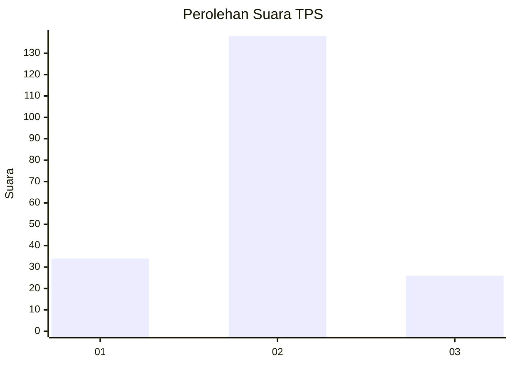
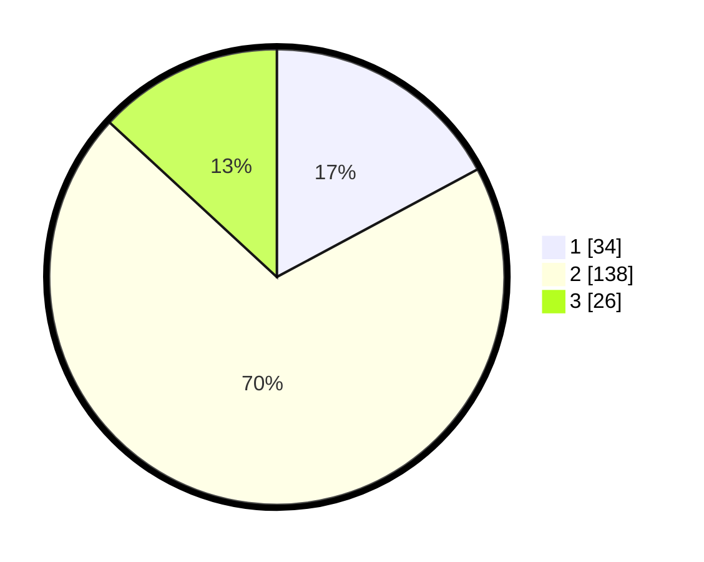

# Hasil

## Grafik

## Tabel

| No. | Nama Paslon    | Suara | Suara (raw) | Persentase |
|:--- |:-------------- | -----:| -----------:| ----------:|
| 1   | ANIES MUHAIMIN | 34    | [34][p-1]   | 17,17      |
| 2   | PRABOWO GIBRAN | 138   | [138][p-2]  | 69,70      |
| 3   | GANJAR MAHFUD  | 26    | [26][p-3]   | 13,13      |

[p-1]: https://github.com/gigit-pemilu/pemilu-2024-35-jawa-timur/blob/main/pilpres/hitung-suara/sub/35-jawa-timur/sub/08-lumajang/sub/10-lumajang/sub/1004-ditotrunan/sub/002-tps/sub/paslon-1.txt
[p-2]: https://github.com/gigit-pemilu/pemilu-2024-35-jawa-timur/blob/main/pilpres/hitung-suara/sub/35-jawa-timur/sub/08-lumajang/sub/10-lumajang/sub/1004-ditotrunan/sub/002-tps/sub/paslon-2.txt
[p-3]: https://github.com/gigit-pemilu/pemilu-2024-35-jawa-timur/blob/main/pilpres/hitung-suara/sub/35-jawa-timur/sub/08-lumajang/sub/10-lumajang/sub/1004-ditotrunan/sub/002-tps/sub/paslon-3.txt

## Foto C Plano

https://sirekap-obj-formc.kpu.go.id/1aaa/pemilu/ppwp/35/08/10/10/04/3508101004002-20240215-004611--38ab4f59-8020-49d7-9f10-56cd52e61906.jpg

https://sirekap-obj-formc.kpu.go.id/1aaa/pemilu/ppwp/35/08/10/10/04/3508101004002-20240215-005037--9ca19029-20db-4f6d-8e02-dc14b0bb2fc0.jpg

https://sirekap-obj-formc.kpu.go.id/1aaa/pemilu/ppwp/35/08/10/10/04/3508101004002-20240215-005236--95274d50-6173-42fb-8376-6ebbc2c472e9.jpg

## Metadata

| Key        | Value               |
| ---------- | ------------------- |
| Time Stamp | 2024-02-15 22:00:27 |

