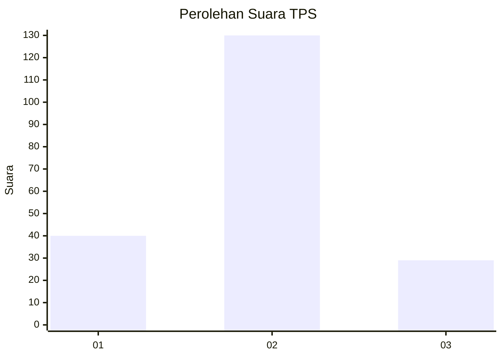
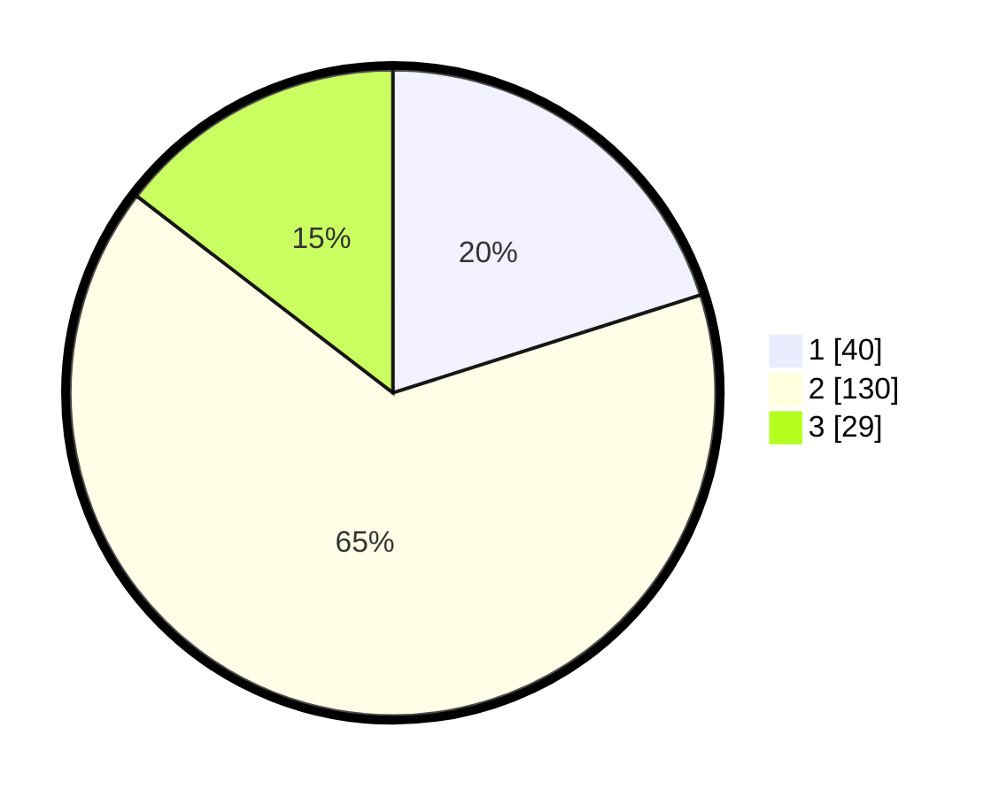

# Hasil

## Grafik

## Tabel

| No. | Nama Paslon    | Suara | Suara (raw) | Persentase |
|:--- |:-------------- | -----:| -----------:| ----------:|
| 1   | ANIES MUHAIMIN | 40    | [40][p-1]   | 20,10      |
| 2   | PRABOWO GIBRAN | 130   | [130][p-2]  | 65,33      |
| 3   | GANJAR MAHFUD  | 29    | [29][p-3]   | 14,57      |

[p-1]: https://github.com/gigit-pemilu/pemilu-2024/blob/main/pilpres/hitung-suara/sub/35-jawa-timur/sub/08-lumajang/sub/10-lumajang/sub/1004-ditotrunan/sub/004-tps/sub/paslon-1.txt
[p-2]: https://github.com/gigit-pemilu/pemilu-2024/blob/main/pilpres/hitung-suara/sub/35-jawa-timur/sub/08-lumajang/sub/10-lumajang/sub/1004-ditotrunan/sub/004-tps/sub/paslon-2.txt
[p-3]: https://github.com/gigit-pemilu/pemilu-2024/blob/main/pilpres/hitung-suara/sub/35-jawa-timur/sub/08-lumajang/sub/10-lumajang/sub/1004-ditotrunan/sub/004-tps/sub/paslon-3.txt

## Foto C Plano

https://sirekap-obj-formc.kpu.go.id/e9d5/pemilu/ppwp/35/08/10/10/04/3508101004004-20240215-042831--947ecd57-5740-406b-9878-dccef29737c5.jpg

https://sirekap-obj-formc.kpu.go.id/e9d5/pemilu/ppwp/35/08/10/10/04/3508101004004-20240215-043407--1e3c79c3-3cf2-49f4-aa4c-776fb7f2c14b.jpg

https://sirekap-obj-formc.kpu.go.id/e9d5/pemilu/ppwp/35/08/10/10/04/3508101004004-20240215-043847--654aec77-7f92-4136-b8a5-9d4c5488254c.jpg

## Metadata

| Key        | Value               |
| ---------- | ------------------- |
| Time Stamp | 2024-02-15 22:30:27 |

