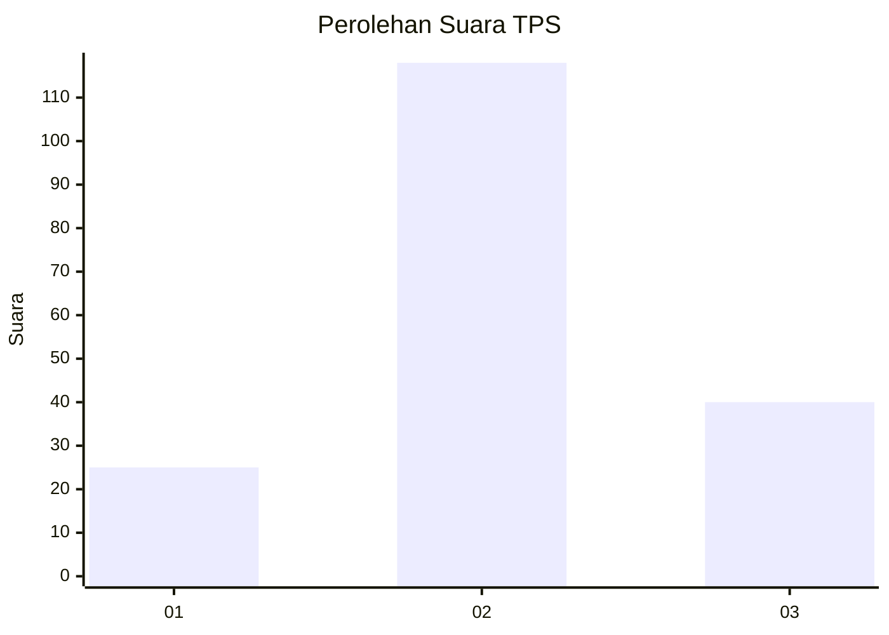
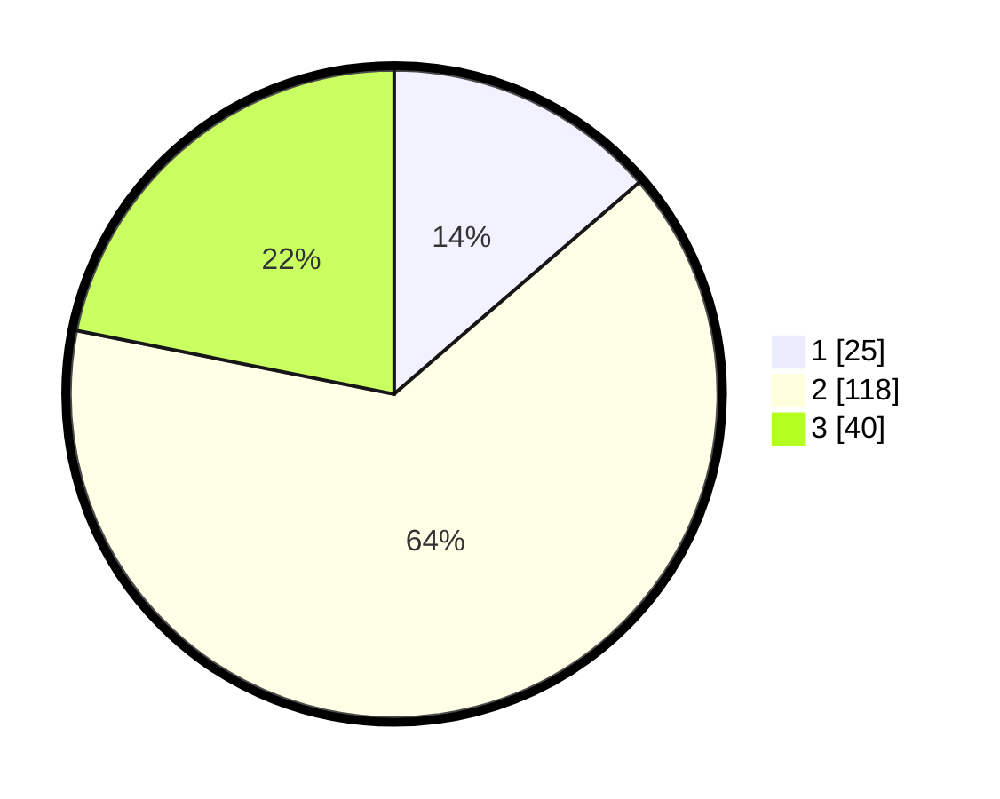

# Hasil

## Grafik

## Tabel

| No. | Nama Paslon    | Suara | Suara (raw) | Persentase |
|:--- |:-------------- | -----:| -----------:| ----------:|
| 1   | ANIES MUHAIMIN | 25    | [25][p-1]   | 13,66      |
| 2   | PRABOWO GIBRAN | 118   | [118][p-2]  | 64,48      |
| 3   | GANJAR MAHFUD  | 40    | [40][p-3]   | 21,86      |

[p-1]: https://github.com/gigit-pemilu/pemilu-2024-35-jawa-timur/blob/main/pilpres/hitung-suara/sub/35-jawa-timur/sub/08-lumajang/sub/10-lumajang/sub/1004-ditotrunan/sub/006-tps/sub/paslon-1.txt
[p-2]: https://github.com/gigit-pemilu/pemilu-2024-35-jawa-timur/blob/main/pilpres/hitung-suara/sub/35-jawa-timur/sub/08-lumajang/sub/10-lumajang/sub/1004-ditotrunan/sub/006-tps/sub/paslon-2.txt
[p-3]: https://github.com/gigit-pemilu/pemilu-2024-35-jawa-timur/blob/main/pilpres/hitung-suara/sub/35-jawa-timur/sub/08-lumajang/sub/10-lumajang/sub/1004-ditotrunan/sub/006-tps/sub/paslon-3.txt

## Foto C Plano

https://sirekap-obj-formc.kpu.go.id/8a82/pemilu/ppwp/35/08/10/10/04/3508101004006-20240214-222918--f119409c-fc61-43f8-aeb4-52d866ac0e37.jpg

https://sirekap-obj-formc.kpu.go.id/8a82/pemilu/ppwp/35/08/10/10/04/3508101004006-20240214-205940--8982a1f3-ff6f-4886-8af1-898639957619.jpg

https://sirekap-obj-formc.kpu.go.id/8a82/pemilu/ppwp/35/08/10/10/04/3508101004006-20240214-210034--d2ab406a-bf3b-4442-9938-b5b5ff5d7e35.jpg

## Metadata

| Key        | Value               |
| ---------- | ------------------- |
| Time Stamp | 2024-02-15 15:00:29 |

