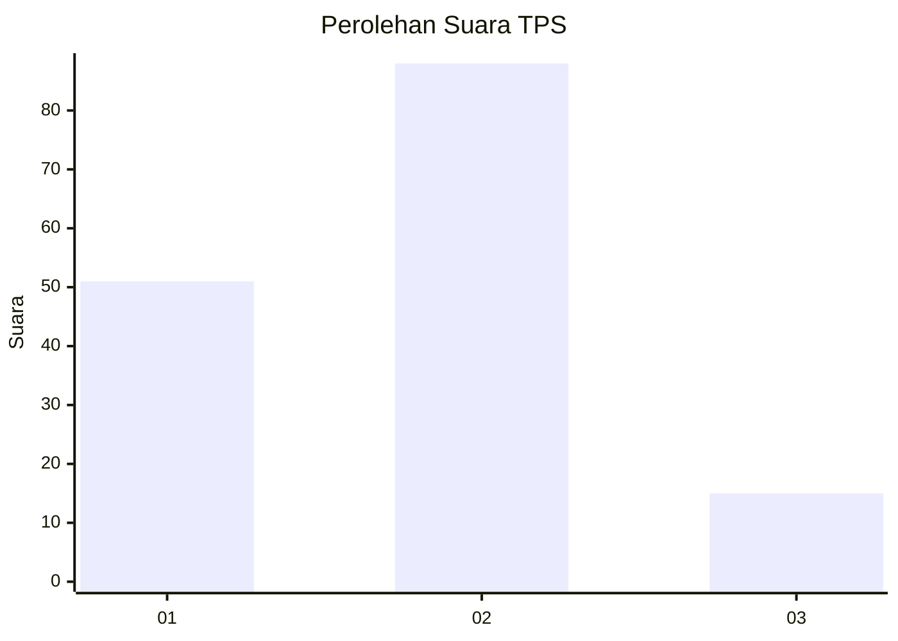
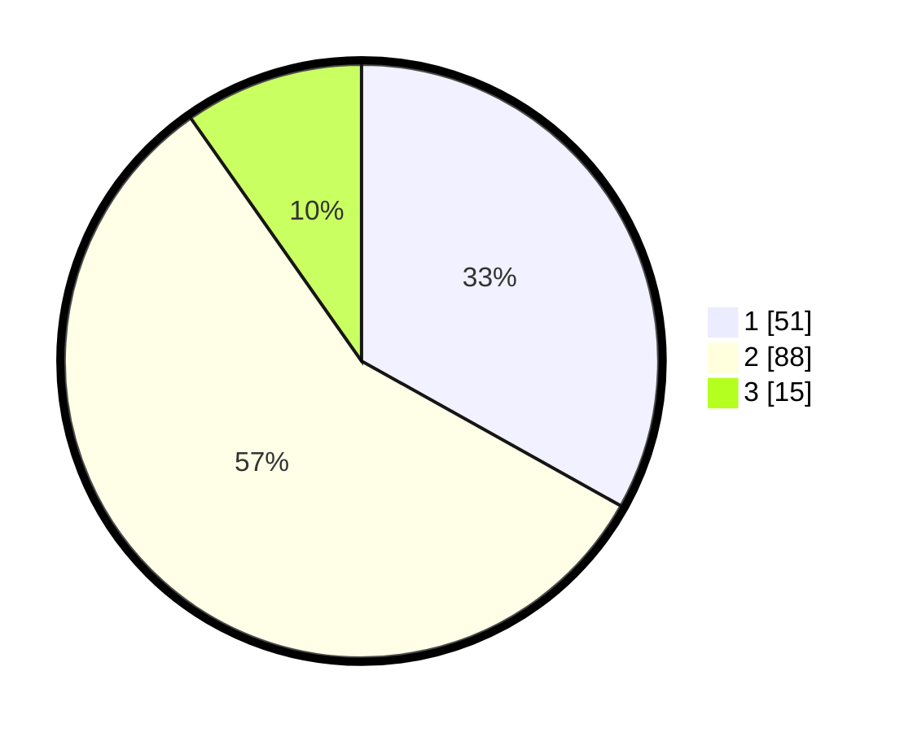

# Hasil

## Grafik

## Tabel

| No. | Nama Paslon    | Suara | Suara (raw) | Persentase |
|:--- |:-------------- | -----:| -----------:| ----------:|
| 1   | ANIES MUHAIMIN | 51    | [51][p-1]   | 33,12      |
| 2   | PRABOWO GIBRAN | 88    | [88][p-2]   | 57,14      |
| 3   | GANJAR MAHFUD  | 15    | [15][p-3]   | 9,74       |

[p-1]: https://github.com/gigit-pemilu/pemilu-2024-35-jawa-timur/blob/main/pilpres/hitung-suara/sub/35-jawa-timur/sub/08-lumajang/sub/10-lumajang/sub/1004-ditotrunan/sub/007-tps/sub/paslon-1.txt
[p-2]: https://github.com/gigit-pemilu/pemilu-2024-35-jawa-timur/blob/main/pilpres/hitung-suara/sub/35-jawa-timur/sub/08-lumajang/sub/10-lumajang/sub/1004-ditotrunan/sub/007-tps/sub/paslon-2.txt
[p-3]: https://github.com/gigit-pemilu/pemilu-2024-35-jawa-timur/blob/main/pilpres/hitung-suara/sub/35-jawa-timur/sub/08-lumajang/sub/10-lumajang/sub/1004-ditotrunan/sub/007-tps/sub/paslon-3.txt

## Foto C Plano

https://sirekap-obj-formc.kpu.go.id/ab84/pemilu/ppwp/35/08/10/10/04/3508101004007-20240214-225930--db777357-e36b-4ee4-8627-70fb31d902c1.jpg

https://sirekap-obj-formc.kpu.go.id/ab84/pemilu/ppwp/35/08/10/10/04/3508101004007-20240214-225945--c5085d39-b224-40e8-9314-7c10ba3d2dbb.jpg

https://sirekap-obj-formc.kpu.go.id/ab84/pemilu/ppwp/35/08/10/10/04/3508101004007-20240214-230000--daa3ee2d-df14-411b-a6a9-e880c568403b.jpg

## Metadata

| Key        | Value               |
| ---------- | ------------------- |
| Time Stamp | 2024-02-15 22:30:27 |

