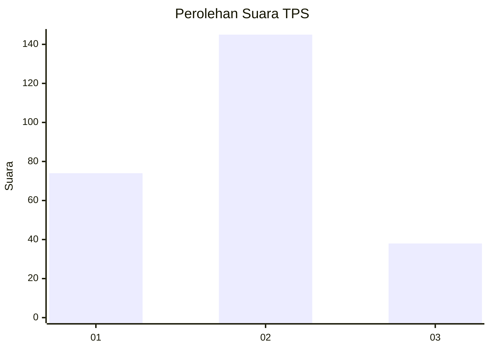
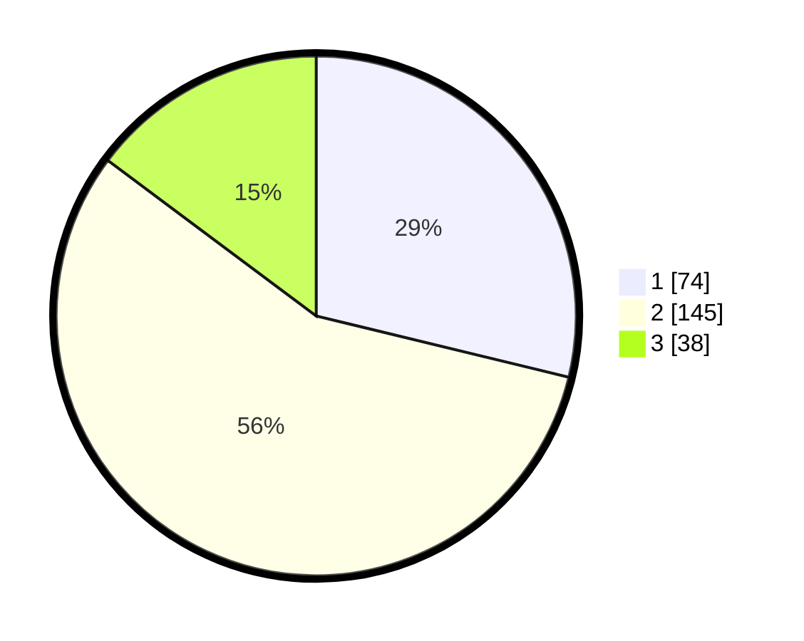

# Hasil

## Grafik

## Tabel

| No. | Nama Paslon    | Suara | Suara (raw) | Persentase |
|:--- |:-------------- | -----:| -----------:| ----------:|
| 1   | ANIES MUHAIMIN | 74    | [74][p-1]   | 28,79      |
| 2   | PRABOWO GIBRAN | 145   | [145][p-2]  | 56,42      |
| 3   | GANJAR MAHFUD  | 38    | [38][p-3]   | 14,79      |

[p-1]: https://github.com/gigit-pemilu/pemilu-2024-35-jawa-timur/blob/main/pilpres/hitung-suara/sub/35-jawa-timur/sub/08-lumajang/sub/10-lumajang/sub/1005-jogotrunan/sub/029-tps/sub/paslon-1.txt
[p-2]: https://github.com/gigit-pemilu/pemilu-2024-35-jawa-timur/blob/main/pilpres/hitung-suara/sub/35-jawa-timur/sub/08-lumajang/sub/10-lumajang/sub/1005-jogotrunan/sub/029-tps/sub/paslon-2.txt
[p-3]: https://github.com/gigit-pemilu/pemilu-2024-35-jawa-timur/blob/main/pilpres/hitung-suara/sub/35-jawa-timur/sub/08-lumajang/sub/10-lumajang/sub/1005-jogotrunan/sub/029-tps/sub/paslon-3.txt

## Foto C Plano

https://sirekap-obj-formc.kpu.go.id/ff86/pemilu/ppwp/35/08/10/10/05/3508101005029-20240214-233416--a8333925-c906-4884-b3a1-9f0f4614d002.jpg

https://sirekap-obj-formc.kpu.go.id/ff86/pemilu/ppwp/35/08/10/10/05/3508101005029-20240214-233521--b0fb0354-1061-47bb-9b32-e3f60cfb059d.jpg

https://sirekap-obj-formc.kpu.go.id/ff86/pemilu/ppwp/35/08/10/10/05/3508101005029-20240214-233639--44a6f675-9946-461e-8e1c-9cd71c548a28.jpg

## Metadata

| Key        | Value               |
| ---------- | ------------------- |
| Time Stamp | 2024-02-21 00:00:00 |

## DATA PEMILIH TETAP

Jumlah pemilih dalam DPT: **0**.
 * L: **0**.
 * P: **0**.

## DATA PENGGUNA HAK PILIH

Jumlah pengguna hak pilih dalam DPT: **285**.
 * L: **138**.
 * P: **147**.

Jumlah pengguna hak pilih dalam DPTb: **256**.
 * L: **117**.
 * P: **139**.

Jumlah pengguna hak pilih dalam DPK: **2**.
 * L: **0**.
 * P: **2**.

Jumlah pengguna hak pilih: **262**.
 * L: **118**.
 * P: **144**.

## JUMLAH SUARA SAH DAN TIDAK SAH

JUMLAH SELURUH SUARA SAH: **257**.

JUMLAH SUARA TIDAK SAH: **5**.

JUMLAH SELURUH SUARA SAH DAN SUARA TIDAK SAH: **262**.

