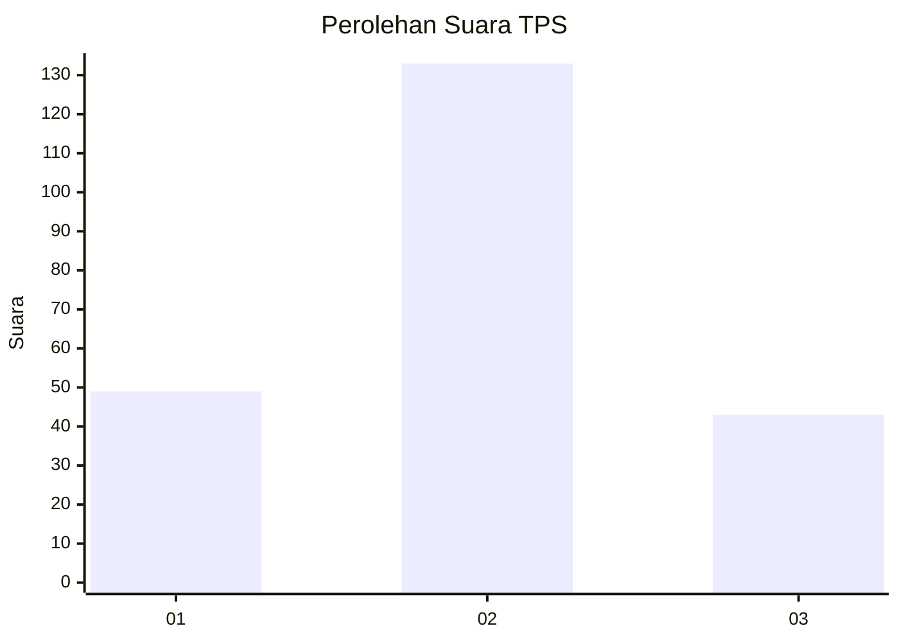
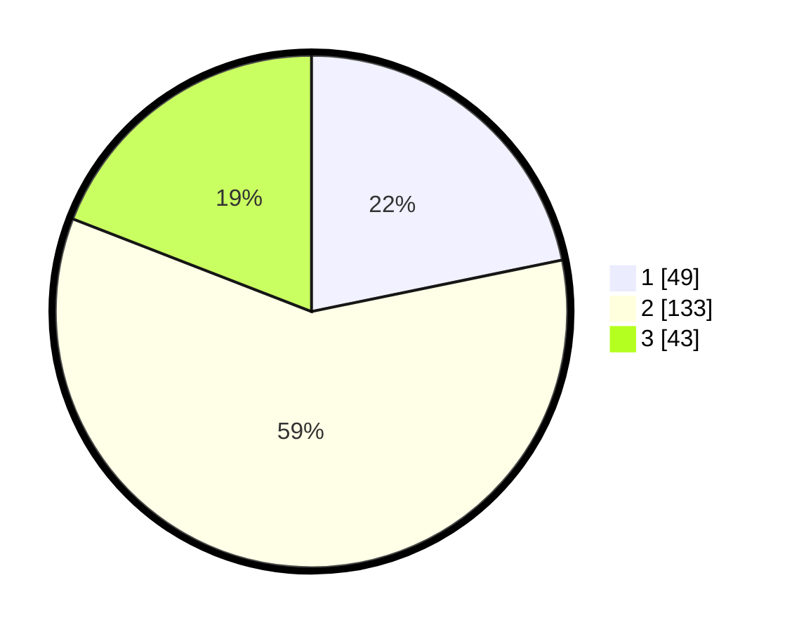

# Hasil

## Grafik

## Tabel

| No. | Nama Paslon    | Suara | Suara (raw) | Persentase |
|:--- |:-------------- | -----:| -----------:| ----------:|
| 1   | ANIES MUHAIMIN | 49    | [49][p-1]   | 21,78      |
| 2   | PRABOWO GIBRAN | 133   | [133][p-2]  | 59,11      |
| 3   | GANJAR MAHFUD  | 43    | [43][p-3]   | 19,11      |

[p-1]: https://github.com/gigit-pemilu/pemilu-2024/blob/main/pilpres/hitung-suara/sub/35-jawa-timur/sub/08-lumajang/sub/10-lumajang/sub/1009-jogoyudan/sub/004-tps/sub/paslon-1.txt
[p-2]: https://github.com/gigit-pemilu/pemilu-2024/blob/main/pilpres/hitung-suara/sub/35-jawa-timur/sub/08-lumajang/sub/10-lumajang/sub/1009-jogoyudan/sub/004-tps/sub/paslon-2.txt
[p-3]: https://github.com/gigit-pemilu/pemilu-2024/blob/main/pilpres/hitung-suara/sub/35-jawa-timur/sub/08-lumajang/sub/10-lumajang/sub/1009-jogoyudan/sub/004-tps/sub/paslon-3.txt

## Foto C Plano

https://sirekap-obj-formc.kpu.go.id/30e4/pemilu/ppwp/35/08/10/10/09/3508101009004-20240215-002422--fe4b6614-cced-4d91-8bc1-6a1f81605b04.jpg

https://sirekap-obj-formc.kpu.go.id/30e4/pemilu/ppwp/35/08/10/10/09/3508101009004-20240215-002753--f893115a-1ef5-41e2-bd20-e0795425f8f1.jpg

https://sirekap-obj-formc.kpu.go.id/30e4/pemilu/ppwp/35/08/10/10/09/3508101009004-20240215-002834--4353e8fe-7cb3-4d41-b9dd-551da1959eb6.jpg

## Metadata

| Key        | Value               |
| ---------- | ------------------- |
| Time Stamp | 2024-02-15 22:30:27 |

