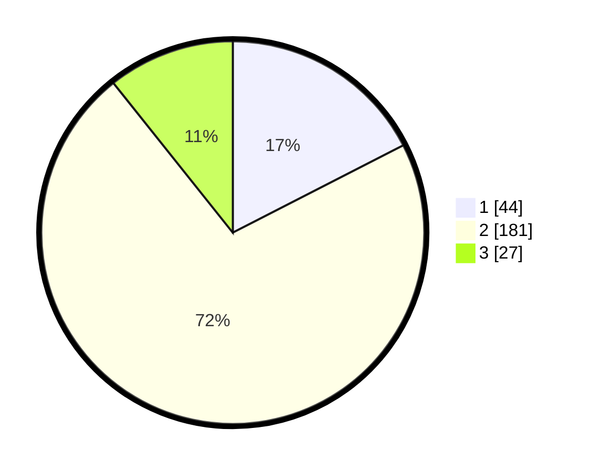

# Hasil

## Grafik

## Tabel

| No. | Nama Paslon    | Suara | Suara (raw) | Persentase |
|:--- |:-------------- | -----:| -----------:| ----------:|
| 1   | ANIES MUHAIMIN | 44    | [44][p-1]   | 17,46      |
| 2   | PRABOWO GIBRAN | 181   | [181][p-2]  | 71,83      |
| 3   | GANJAR MAHFUD  | 27    | [27][p-3]   | 10,71      |

[p-1]: https://github.com/gigit-pemilu/pemilu-2024/blob/main/pilpres/hitung-suara/sub/35-jawa-timur/sub/08-lumajang/sub/10-lumajang/sub/1009-jogoyudan/sub/016-tps/sub/paslon-1.txt
[p-2]: https://github.com/gigit-pemilu/pemilu-2024/blob/main/pilpres/hitung-suara/sub/35-jawa-timur/sub/08-lumajang/sub/10-lumajang/sub/1009-jogoyudan/sub/016-tps/sub/paslon-2.txt
[p-3]: https://github.com/gigit-pemilu/pemilu-2024/blob/main/pilpres/hitung-suara/sub/35-jawa-timur/sub/08-lumajang/sub/10-lumajang/sub/1009-jogoyudan/sub/016-tps/sub/paslon-3.txt

## Foto C Plano

https://sirekap-obj-formc.kpu.go.id/4128/pemilu/ppwp/35/08/10/10/09/3508101009016-20240215-014307--a727387e-545d-4ac0-a460-d1ca8de79258.jpg

https://sirekap-obj-formc.kpu.go.id/4128/pemilu/ppwp/35/08/10/10/09/3508101009016-20240215-014351--b0b0a734-c077-47e2-91c2-c901d34377f2.jpg

https://sirekap-obj-formc.kpu.go.id/4128/pemilu/ppwp/35/08/10/10/09/3508101009016-20240215-014545--a5375bba-c3ec-4631-8a52-9ada3e484d27.jpg

## Metadata

| Key        | Value               |
| ---------- | ------------------- |
| Time Stamp | 2024-02-15 22:30:27 |

