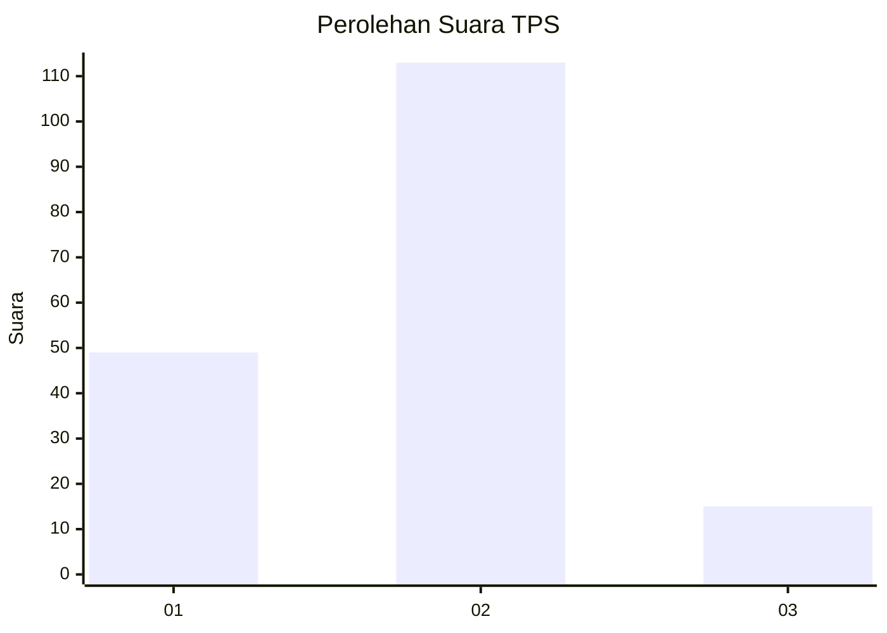
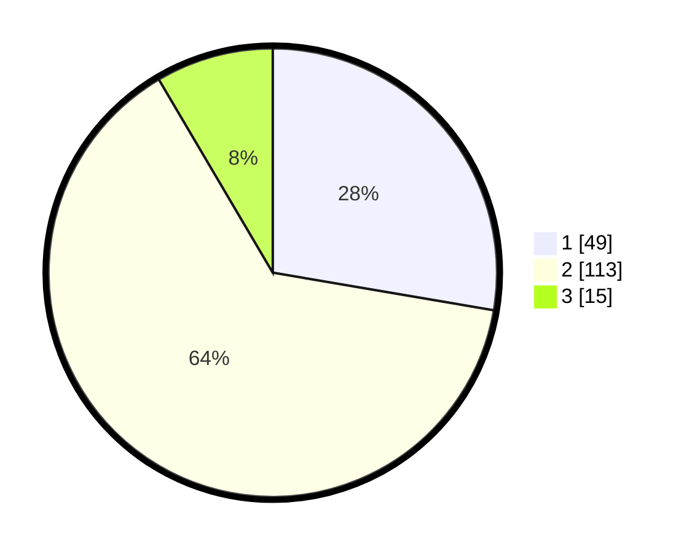

# Hasil

## Grafik

## Tabel

| No. | Nama Paslon    | Suara | Suara (raw) | Persentase |
|:--- |:-------------- | -----:| -----------:| ----------:|
| 1   | ANIES MUHAIMIN | 49    | [49][p-1]   | 27,68      |
| 2   | PRABOWO GIBRAN | 113   | [113][p-2]  | 63,84      |
| 3   | GANJAR MAHFUD  | 15    | [15][p-3]   | 8,47       |

[p-1]: https://github.com/gigit-pemilu/pemilu-2024-35-jawa-timur/blob/main/pilpres/hitung-suara/sub/35-jawa-timur/sub/08-lumajang/sub/10-lumajang/sub/1011-tompokersan/sub/006-tps/sub/paslon-1.txt
[p-2]: https://github.com/gigit-pemilu/pemilu-2024-35-jawa-timur/blob/main/pilpres/hitung-suara/sub/35-jawa-timur/sub/08-lumajang/sub/10-lumajang/sub/1011-tompokersan/sub/006-tps/sub/paslon-2.txt
[p-3]: https://github.com/gigit-pemilu/pemilu-2024-35-jawa-timur/blob/main/pilpres/hitung-suara/sub/35-jawa-timur/sub/08-lumajang/sub/10-lumajang/sub/1011-tompokersan/sub/006-tps/sub/paslon-3.txt

## Foto C Plano

https://sirekap-obj-formc.kpu.go.id/0bd8/pemilu/ppwp/35/08/10/10/11/3508101011006-20240214-233941--9c2bad87-2db9-4f3c-a720-6933f9d8523b.jpg

https://sirekap-obj-formc.kpu.go.id/0bd8/pemilu/ppwp/35/08/10/10/11/3508101011006-20240214-234124--652a55fd-4240-4b3c-8f2a-da839bba618f.jpg

https://sirekap-obj-formc.kpu.go.id/0bd8/pemilu/ppwp/35/08/10/10/11/3508101011006-20240215-000811--434fb94c-609d-4e29-a788-b0acac04b494.jpg

## Metadata

| Key        | Value               |
| ---------- | ------------------- |
| Time Stamp | 2024-02-15 22:00:27 |

