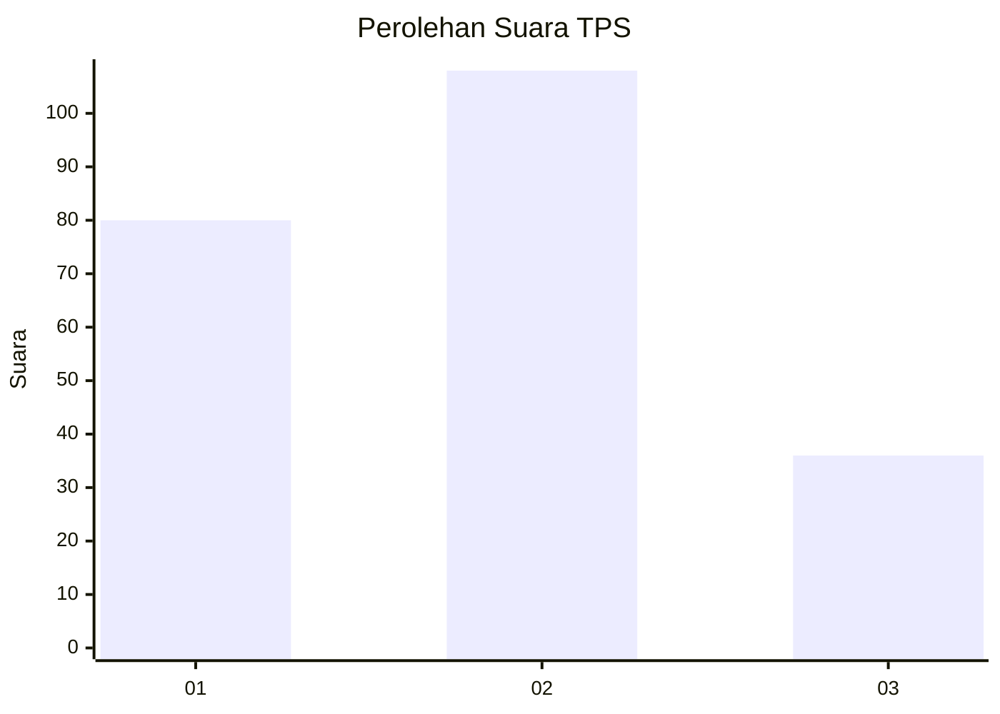
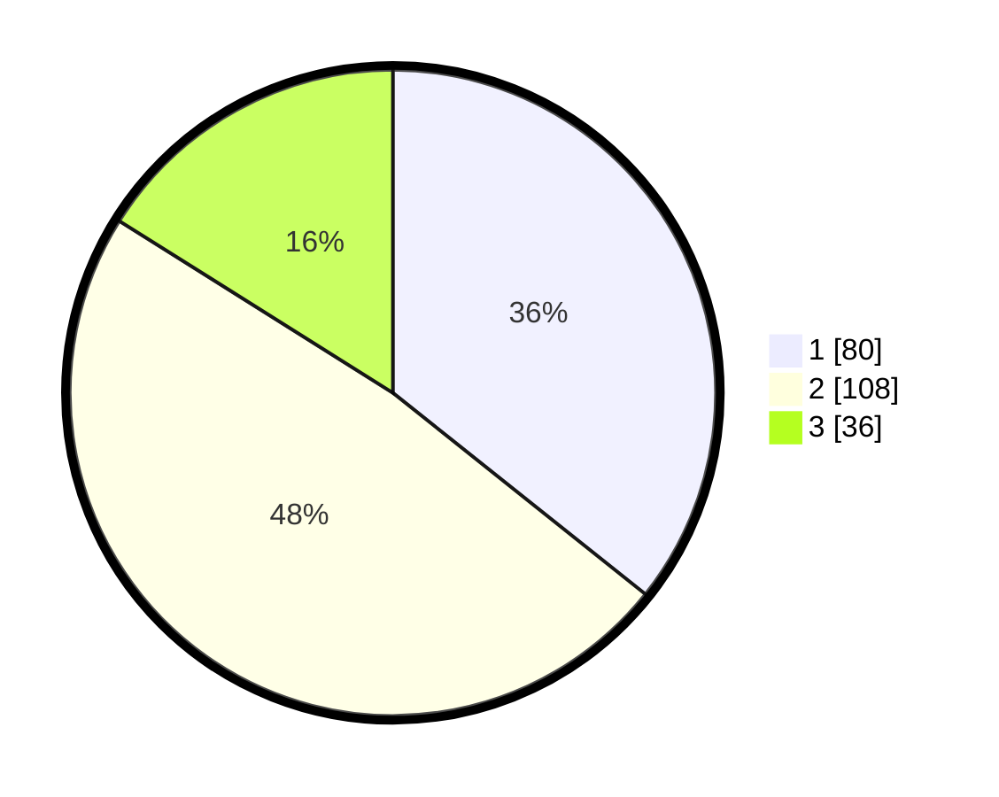

# Hasil

## Grafik

## Tabel

| No. | Nama Paslon    | Suara | Suara (raw) | Persentase |
|:--- |:-------------- | -----:| -----------:| ----------:|
| 1   | ANIES MUHAIMIN | 80    | [80][p-1]   | 35,71      |
| 2   | PRABOWO GIBRAN | 108   | [108][p-2]  | 48,21      |
| 3   | GANJAR MAHFUD  | 36    | [36][p-3]   | 16,07      |

[p-1]: https://github.com/gigit-pemilu/pemilu-2024-35-jawa-timur/blob/main/pilpres/hitung-suara/sub/35-jawa-timur/sub/08-lumajang/sub/10-lumajang/sub/1011-tompokersan/sub/011-tps/sub/paslon-1.txt
[p-2]: https://github.com/gigit-pemilu/pemilu-2024-35-jawa-timur/blob/main/pilpres/hitung-suara/sub/35-jawa-timur/sub/08-lumajang/sub/10-lumajang/sub/1011-tompokersan/sub/011-tps/sub/paslon-2.txt
[p-3]: https://github.com/gigit-pemilu/pemilu-2024-35-jawa-timur/blob/main/pilpres/hitung-suara/sub/35-jawa-timur/sub/08-lumajang/sub/10-lumajang/sub/1011-tompokersan/sub/011-tps/sub/paslon-3.txt

## Foto C Plano

https://sirekap-obj-formc.kpu.go.id/461f/pemilu/ppwp/35/08/10/10/11/3508101011011-20240214-221233--93012ec2-ac18-4a34-9897-5e3163b5a903.jpg

https://sirekap-obj-formc.kpu.go.id/461f/pemilu/ppwp/35/08/10/10/11/3508101011011-20240214-203548--a3dd616d-d6d1-459f-baeb-a585d79af7c0.jpg

https://sirekap-obj-formc.kpu.go.id/461f/pemilu/ppwp/35/08/10/10/11/3508101011011-20240214-203813--f9e67249-1608-4ff2-9e04-0b9a15c32de3.jpg

## Metadata

| Key        | Value               |
| ---------- | ------------------- |
| Time Stamp | 2024-02-15 15:00:29 |

