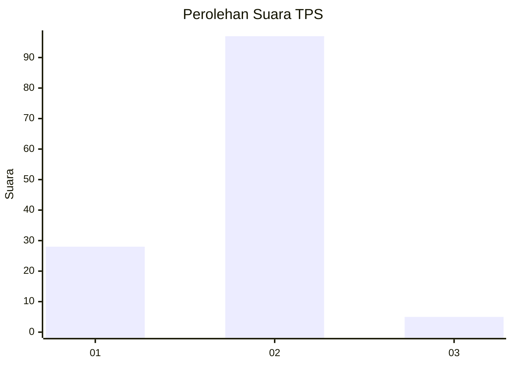

# Hasil

## Grafik

## Tabel

| No. | Nama Paslon    | Suara | Suara (raw) | Persentase |
|:--- |:-------------- | -----:| -----------:| ----------:|
| 1   | ANIES MUHAIMIN | 28    | [28][p-1]   | 21,54      |
| 2   | PRABOWO GIBRAN | 97    | [97][p-2]   | 74,62      |
| 3   | GANJAR MAHFUD  | 5     | [5][p-3]    | 3,85       |

[p-1]: https://github.com/gigit-pemilu/pemilu-2024/blob/main/pilpres/hitung-suara/sub/35-jawa-timur/sub/08-lumajang/sub/10-lumajang/sub/1011-tompokersan/sub/025-tps/sub/paslon-1.txt
[p-2]: https://github.com/gigit-pemilu/pemilu-2024/blob/main/pilpres/hitung-suara/sub/35-jawa-timur/sub/08-lumajang/sub/10-lumajang/sub/1011-tompokersan/sub/025-tps/sub/paslon-2.txt
[p-3]: https://github.com/gigit-pemilu/pemilu-2024/blob/main/pilpres/hitung-suara/sub/35-jawa-timur/sub/08-lumajang/sub/10-lumajang/sub/1011-tompokersan/sub/025-tps/sub/paslon-3.txt

## Foto C Plano

https://sirekap-obj-formc.kpu.go.id/b18b/pemilu/ppwp/35/08/10/10/11/3508101011025-20240215-013557--8b2aeb1f-c2a7-4d90-b606-b214c8767f51.jpg

https://sirekap-obj-formc.kpu.go.id/b18b/pemilu/ppwp/35/08/10/10/11/3508101011025-20240215-030741--ffc853fc-80e4-46ed-83f1-58c133e914a9.jpg

https://sirekap-obj-formc.kpu.go.id/b18b/pemilu/ppwp/35/08/10/10/11/3508101011025-20240215-020559--a34d3bef-9fb4-4094-ae59-2ed147e94f75.jpg

## Metadata

| Key        | Value               |
| ---------- | ------------------- |
| Time Stamp | 2024-02-15 21:30:27 |

