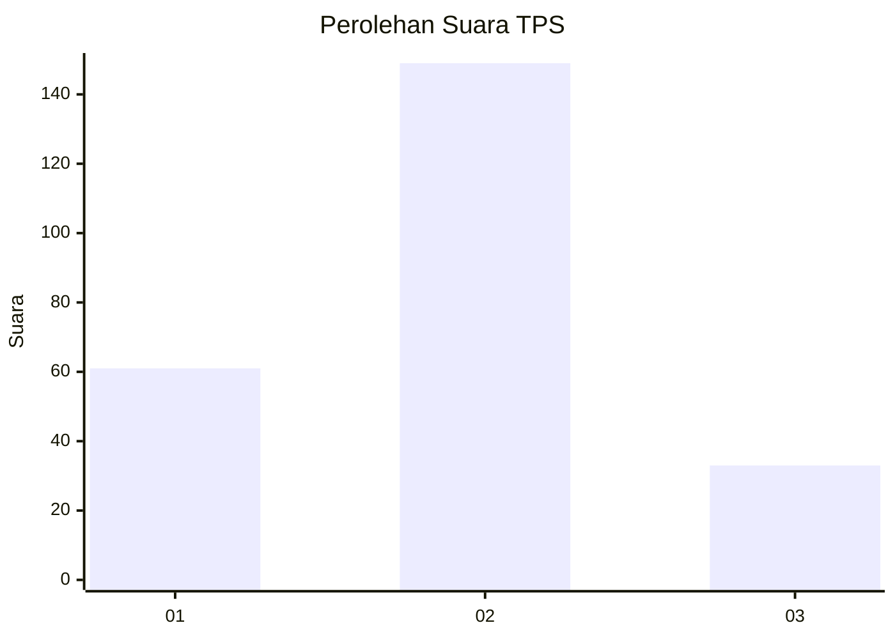
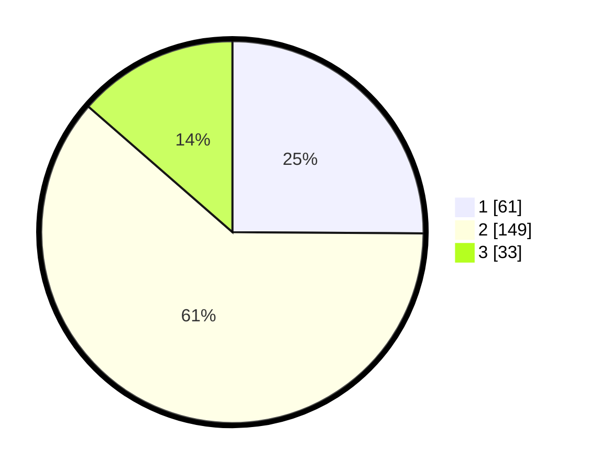

# Hasil

## Grafik

## Tabel

| No. | Nama Paslon    | Suara | Suara (raw) | Persentase |
|:--- |:-------------- | -----:| -----------:| ----------:|
| 1   | ANIES MUHAIMIN | 61    | [61][p-1]   | 25,10      |
| 2   | PRABOWO GIBRAN | 149   | [149][p-2]  | 61,32      |
| 3   | GANJAR MAHFUD  | 33    | [33][p-3]   | 13,58      |

[p-1]: https://github.com/gigit-pemilu/pemilu-2024-35-jawa-timur/blob/main/pilpres/hitung-suara/sub/35-jawa-timur/sub/08-lumajang/sub/10-lumajang/sub/2001-banjarwaru/sub/001-tps/sub/paslon-1.txt
[p-2]: https://github.com/gigit-pemilu/pemilu-2024-35-jawa-timur/blob/main/pilpres/hitung-suara/sub/35-jawa-timur/sub/08-lumajang/sub/10-lumajang/sub/2001-banjarwaru/sub/001-tps/sub/paslon-2.txt
[p-3]: https://github.com/gigit-pemilu/pemilu-2024-35-jawa-timur/blob/main/pilpres/hitung-suara/sub/35-jawa-timur/sub/08-lumajang/sub/10-lumajang/sub/2001-banjarwaru/sub/001-tps/sub/paslon-3.txt

## Foto C Plano

https://sirekap-obj-formc.kpu.go.id/cc70/pemilu/ppwp/35/08/10/20/01/3508102001001-20240214-225319--011d1e5d-31c3-4429-85ef-7ffe87788cc4.jpg

https://sirekap-obj-formc.kpu.go.id/cc70/pemilu/ppwp/35/08/10/20/01/3508102001001-20240214-225839--b9a977eb-641c-4c39-8f6f-4c2897c70b8d.jpg

https://sirekap-obj-formc.kpu.go.id/cc70/pemilu/ppwp/35/08/10/20/01/3508102001001-20240214-225943--81313172-92f0-4684-944d-da26a692537e.jpg

## Metadata

| Key        | Value               |
| ---------- | ------------------- |
| Time Stamp | 2024-02-15 21:30:27 |

